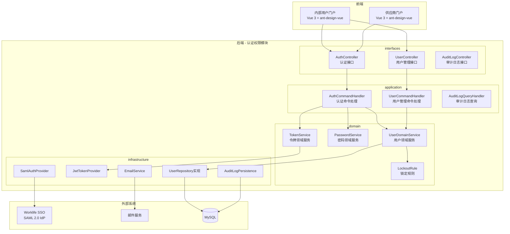
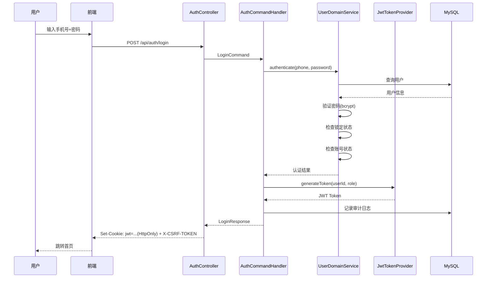
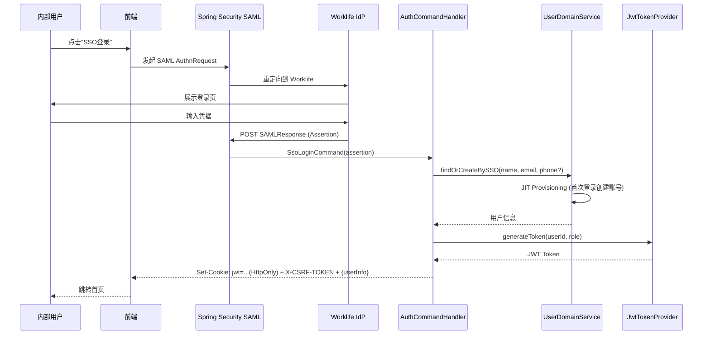
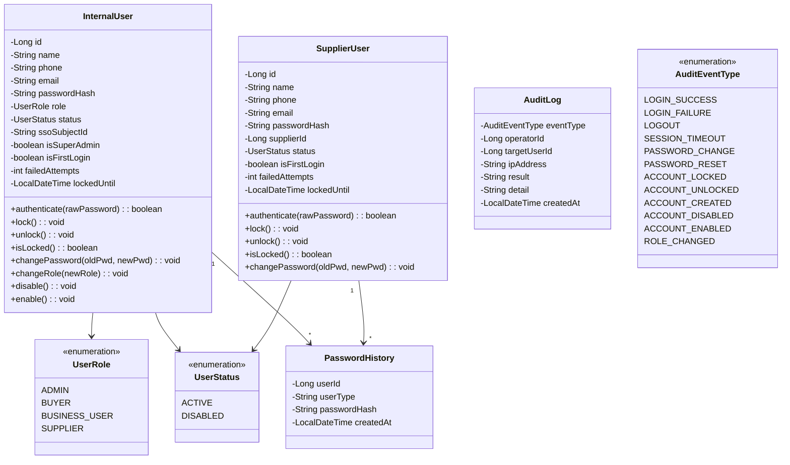

# 设计文档：用户认证与权限管理模块

## Overview

概述

本模块是采购平台的基础设施模块，负责用户认证、角色权限管理、会话管理和安全审计。系统采用双账号体系设计：内部用户（业务人员、采购员、管理员）和供应商使用独立的用户表和登录入口。

核心设计决策：
- **双登录入口**：内部用户门户支持 Worklife SSO（SAML 2.0）+ 手机号密码；供应商门户仅支持手机号密码
- **JWT 无状态认证**：使用 JJWT 0.12.6（jjwt-api + jjwt-impl + jjwt-jackson）生成 Access Token，支持多设备同时登录
- **Token 存储策略**：JWT 通过 httpOnly + Secure + SameSite=Lax Cookie 下发，前端不接触 Token 明文；配合 CSRF Token（Double Submit Cookie 模式）防御 CSRF 攻击；不使用 localStorage 存储 Token（符合前端规范 12.2 节要求）
- **RBAC 权限模型**：基于四种固定角色的权限控制，Admin 继承 Buyer 全部权限且数据范围为全量
- **bcrypt 密码加密**：所有密码使用 bcrypt 哈希存储
- **账号锁定机制**：连续5次失败锁定30分钟，自动解锁

## Architecture

架构

### 系统架构图



### 认证流程



### SSO 登录流程



## Components and Interfaces

组件与接口

### 后端模块结构

```
src/main/java/com/cdp/ecosaas/procurement/auth/
├── domain/
│   ├── model/
│   │   ├── InternalUser.java          # 内部用户聚合根
│   │   ├── SupplierUser.java          # 供应商用户聚合根
│   │   ├── UserRole.java              # 角色枚举
│   │   ├── UserStatus.java            # 账号状态枚举
│   │   ├── PasswordHistory.java       # 密码历史值对象
│   │   └── LoginAttempt.java          # 登录尝试值对象
│   ├── service/
│   │   ├── PasswordDomainService.java # 密码领域服务
│   │   └── LockoutDomainService.java  # 锁定领域服务
│   ├── repository/
│   │   ├── InternalUserRepository.java
│   │   └── SupplierUserRepository.java
│   ├── port/
│   │   ├── TokenPort.java            # 令牌生成端口
│   │   ├── EmailPort.java            # 邮件发送端口
│   │   └── SamlPort.java             # SAML 认证端口
│   └── event/
│       ├── UserCreatedEvent.java
│       ├── UserLockedEvent.java
│       └── PasswordChangedEvent.java
│
├── application/
│   ├── command/
│   │   ├── LoginCommand.java
│   │   ├── SsoLoginCommand.java
│   │   ├── ChangePasswordCommand.java
│   │   ├── ResetPasswordCommand.java
│   │   ├── ForgotPasswordCommand.java
│   │   ├── CreateInternalUserCommand.java
│   │   └── UpdateUserRoleCommand.java
│   ├── query/
│   │   ├── UserListQuery.java
│   │   └── AuditLogQuery.java
│   ├── handler/
│   │   ├── AuthCommandHandler.java
│   │   ├── UserCommandHandler.java
│   │   └── AuditLogQueryHandler.java
│   └── service/
│       └── AuthApplicationService.java
│
├── infrastructure/
│   ├── persistence/
│   │   ├── entity/
│   │   │   ├── InternalUserEntity.java
│   │   │   ├── SupplierUserEntity.java
│   │   │   ├── PasswordHistoryEntity.java
│   │   │   └── AuditLogEntity.java
│   │   ├── repository/
│   │   │   ├── JpaInternalUserRepository.java
│   │   │   └── JpaSupplierUserRepository.java
│   │   └── mapper/
│   │       ├── InternalUserMapper.java
│   │       └── SupplierUserMapper.java
│   ├── security/
│   │   ├── JwtTokenProvider.java
│   │   ├── JwtAuthenticationFilter.java
│   │   ├── SamlAuthProvider.java
│   │   └── SecurityConfig.java
│   ├── config/
│   │   └── AuthModuleConfig.java
│   └── external/
│       └── EmailServiceAdapter.java
│
├── interfaces/
│   ├── rest/
│   │   ├── AuthController.java
│   │   ├── InternalUserController.java
│   │   ├── SupplierAuthController.java
│   │   └── AuditLogController.java
│   ├── dto/
│   │   ├── LoginRequest.java
│   │   ├── LoginResponse.java
│   │   ├── ChangePasswordRequest.java
│   │   ├── ForgotPasswordRequest.java
│   │   ├── ResetPasswordRequest.java
│   │   ├── CreateUserRequest.java
│   │   └── UserListResponse.java
│   └── converter/
│       └── UserDtoConverter.java
│
└── shared/
    ├── constants/
    │   └── AuthConstants.java
    ├── enums/
    │   └── AuditEventType.java
    ├── exception/
    │   ├── AuthenticationException.java
    │   ├── AccountLockedException.java
    │   └── PasswordPolicyViolationException.java
    └── utils/
        └── PasswordGenerator.java
```

### 前端模块结构

```
src/modules/auth/
├── application/
│   ├── login.usecase.ts
│   ├── sso-login.usecase.ts
│   ├── change-password.usecase.ts
│   ├── forgot-password.usecase.ts
│   └── manage-users.usecase.ts
├── domain/
│   ├── entities/
│   │   └── user.entity.ts
│   ├── value-objects/
│   │   └── password-policy.vo.ts
│   └── rules/
│       └── password-validation.rule.ts
├── infrastructure/
│   ├── services/
│   │   ├── auth.service.ts
│   │   └── user-management.service.ts
│   ├── mappers/
│   │   └── user.mapper.ts
│   └── adapters/
│       └── csrf-token.adapter.ts
├── presentation/
│   ├── views/
│   │   ├── InternalLoginView.vue
│   │   ├── SupplierLoginView.vue
│   │   ├── ForgotPasswordView.vue
│   │   ├── ResetPasswordView.vue
│   │   └── UserManagementView.vue
│   ├── components/
│   │   ├── LoginForm.vue
│   │   ├── SsoLoginButton.vue
│   │   ├── ChangePasswordDialog.vue
│   │   └── UserListTable.vue
│   ├── composables/
│   │   ├── useAuth.ts
│   │   └── usePasswordValidation.ts
│   ├── stores/
│   │   └── auth.store.ts
│   └── routes/
│       └── auth.routes.ts
└── types/
    ├── dto/
    │   ├── login.dto.ts
    │   └── user.dto.ts
    ├── vo/
    │   └── user-info.vo.ts
    └── command/
        ├── login.command.ts
        └── change-password.command.ts
```

### REST API 设计

#### 认证接口

| 方法 | 路径 | 说明 | 认证要求 |
|------|------|------|----------|
| POST | `/api/internal/auth/login` | 内部用户手机号密码登录 | 无 |
| POST | `/api/internal/auth/sso/callback` | SSO SAML 回调 | 无 |
| POST | `/api/supplier/auth/login` | 供应商手机号密码登录 | 无 |
| POST | `/api/auth/logout` | 登出 | JWT |
| POST | `/api/auth/change-password` | 修改密码 | JWT |
| POST | `/api/auth/forgot-password` | 忘记密码（发送重置邮件） | 无 |
| POST | `/api/auth/reset-password` | 重置密码（通过链接） | 无（token验证） |

#### 用户管理接口（仅管理员）

| 方法 | 路径 | 说明 | 认证要求 |
|------|------|------|----------|
| GET | `/api/admin/users` | 查询内部用户列表 | JWT + Admin |
| POST | `/api/admin/users` | 创建内部用户 | JWT + Admin |
| PATCH | `/api/admin/users/{id}/role` | 修改用户角色 | JWT + Admin |
| PATCH | `/api/admin/users/{id}/status` | 停用/启用用户 | JWT + Admin |
| POST | `/api/admin/users/{id}/reset-password` | 重置用户密码 | JWT + Admin |
| POST | `/api/admin/users/{id}/unlock` | 手动解锁用户 | JWT + Admin |

#### 审计日志接口（仅管理员）

| 方法 | 路径 | 说明 | 认证要求 |
|------|------|------|----------|
| GET | `/api/admin/audit-logs` | 查询审计日志 | JWT + Admin |


## Data Models

数据模型

### 数据库表设计

#### 内部用户表 `auth_internal_user`

```sql
CREATE TABLE auth_internal_user (
    id              BIGINT PRIMARY KEY AUTO_INCREMENT,
    name            VARCHAR(64) NOT NULL COMMENT '姓名',
    phone           VARCHAR(20) COMMENT '手机号（SSO用户可能为空）',
    email           VARCHAR(128) NOT NULL COMMENT '邮箱',
    password_hash   VARCHAR(255) COMMENT '密码哈希（SSO用户可能为空）',
    role            VARCHAR(32) NOT NULL COMMENT '角色: ADMIN/BUYER/BUSINESS_USER',
    status          VARCHAR(16) NOT NULL DEFAULT 'ACTIVE' COMMENT '状态: ACTIVE/DISABLED',
    sso_subject_id  VARCHAR(255) COMMENT 'SSO用户唯一标识（SAML NameID）',
    is_super_admin  TINYINT(1) NOT NULL DEFAULT 0 COMMENT '是否超级管理员',
    is_first_login  TINYINT(1) NOT NULL DEFAULT 1 COMMENT '是否首次登录',
    failed_attempts INT NOT NULL DEFAULT 0 COMMENT '连续登录失败次数',
    locked_until    DATETIME(3) COMMENT '锁定截止时间',
    created_at      DATETIME(3) NOT NULL,
    updated_at      DATETIME(3) NOT NULL,
    created_by      VARCHAR(64),
    updated_by      VARCHAR(64),
    version         INT NOT NULL DEFAULT 0,
    UNIQUE KEY uk_phone (phone),
    UNIQUE KEY uk_email (email),
    UNIQUE KEY uk_sso_subject (sso_subject_id),
    INDEX idx_role (role),
    INDEX idx_status (status)
) ENGINE=InnoDB DEFAULT CHARSET=utf8mb4 COMMENT='内部用户表';
```

#### 供应商用户表 `auth_supplier_user`

```sql
CREATE TABLE auth_supplier_user (
    id              BIGINT PRIMARY KEY AUTO_INCREMENT,
    name            VARCHAR(64) NOT NULL COMMENT '姓名',
    phone           VARCHAR(20) NOT NULL COMMENT '手机号',
    email           VARCHAR(128) NOT NULL COMMENT '邮箱',
    password_hash   VARCHAR(255) NOT NULL COMMENT '密码哈希',
    supplier_id     BIGINT NOT NULL COMMENT '关联供应商企业ID',
    status          VARCHAR(16) NOT NULL DEFAULT 'ACTIVE' COMMENT '状态: ACTIVE/DISABLED',
    is_first_login  TINYINT(1) NOT NULL DEFAULT 1 COMMENT '是否首次登录',
    failed_attempts INT NOT NULL DEFAULT 0 COMMENT '连续登录失败次数',
    locked_until    DATETIME(3) COMMENT '锁定截止时间',
    created_at      DATETIME(3) NOT NULL,
    updated_at      DATETIME(3) NOT NULL,
    created_by      VARCHAR(64),
    updated_by      VARCHAR(64),
    version         INT NOT NULL DEFAULT 0,
    UNIQUE KEY uk_phone (phone),
    UNIQUE KEY uk_email (email),
    INDEX idx_supplier_id (supplier_id),
    INDEX idx_status (status)
) ENGINE=InnoDB DEFAULT CHARSET=utf8mb4 COMMENT='供应商用户表';
```

#### 密码历史表 `auth_password_history`

```sql
CREATE TABLE auth_password_history (
    id              BIGINT PRIMARY KEY AUTO_INCREMENT,
    user_id         BIGINT NOT NULL COMMENT '用户ID',
    user_type       VARCHAR(16) NOT NULL COMMENT '用户类型: INTERNAL/SUPPLIER',
    password_hash   VARCHAR(255) NOT NULL COMMENT '历史密码哈希',
    created_at      DATETIME(3) NOT NULL,
    INDEX idx_user (user_id, user_type)
) ENGINE=InnoDB DEFAULT CHARSET=utf8mb4 COMMENT='密码历史表';
```

#### 密码重置令牌表 `auth_password_reset_token`

```sql
CREATE TABLE auth_password_reset_token (
    id              BIGINT PRIMARY KEY AUTO_INCREMENT,
    user_id         BIGINT NOT NULL COMMENT '用户ID',
    user_type       VARCHAR(16) NOT NULL COMMENT '用户类型: INTERNAL/SUPPLIER',
    token           VARCHAR(255) NOT NULL COMMENT '重置令牌',
    expires_at      DATETIME(3) NOT NULL COMMENT '过期时间',
    used            TINYINT(1) NOT NULL DEFAULT 0 COMMENT '是否已使用',
    created_at      DATETIME(3) NOT NULL,
    UNIQUE KEY uk_token (token),
    INDEX idx_user (user_id, user_type)
) ENGINE=InnoDB DEFAULT CHARSET=utf8mb4 COMMENT='密码重置令牌表';
```

#### 采购员-供应商管理关系表 `auth_buyer_supplier_relation`

```sql
CREATE TABLE auth_buyer_supplier_relation (
    id              BIGINT PRIMARY KEY AUTO_INCREMENT,
    buyer_id        BIGINT NOT NULL COMMENT '采购员用户ID',
    supplier_id     BIGINT NOT NULL COMMENT '供应商企业ID',
    source          VARCHAR(32) NOT NULL COMMENT '关系来源: CREATED/PR_ASSIGNED/MANUAL',
    created_at      DATETIME(3) NOT NULL,
    created_by      VARCHAR(64),
    UNIQUE KEY uk_buyer_supplier (buyer_id, supplier_id),
    INDEX idx_supplier_id (supplier_id)
) ENGINE=InnoDB DEFAULT CHARSET=utf8mb4 COMMENT='采购员-供应商管理关系表';
```

#### 审计日志表 `auth_audit_log`

```sql
CREATE TABLE auth_audit_log (
    id              BIGINT PRIMARY KEY AUTO_INCREMENT,
    event_type      VARCHAR(32) NOT NULL COMMENT '事件类型',
    operator_id     BIGINT COMMENT '操作人ID（系统操作为NULL）',
    operator_name   VARCHAR(64) COMMENT '操作人姓名',
    target_user_id  BIGINT COMMENT '目标账号ID',
    target_user_name VARCHAR(64) COMMENT '目标账号姓名',
    ip_address      VARCHAR(45) NOT NULL COMMENT 'IP地址',
    result          VARCHAR(16) NOT NULL COMMENT '结果: SUCCESS/FAILURE',
    detail          VARCHAR(512) COMMENT '详细信息',
    created_at      DATETIME(3) NOT NULL,
    INDEX idx_event_type (event_type),
    INDEX idx_created_at (created_at),
    INDEX idx_target_user (target_user_id)
) ENGINE=InnoDB DEFAULT CHARSET=utf8mb4 COMMENT='安全审计日志表';
```

### 领域模型



### JWT Token 结构

```json
{
  "sub": "user_id",
  "type": "INTERNAL|SUPPLIER",
  "role": "ADMIN|BUYER|BUSINESS_USER|SUPPLIER",
  "name": "用户姓名",
  "iat": 1700000000,
  "exp": 1700001800
}
```

- Token 有效期：30分钟（与会话超时一致）
- 每次请求刷新 Token（滑动过期，后端在响应中 Set-Cookie 更新过期时间）
- **Token 传输与存储方案**：
  - 登录成功后，后端通过 `Set-Cookie` 下发 JWT，Cookie 属性：`HttpOnly; Secure; SameSite=Lax; Path=/api`
  - 前端不读取也不存储 Token 明文，浏览器自动在请求中携带 Cookie
  - CSRF 防御：登录时后端同时下发一个非 HttpOnly 的 CSRF Token Cookie（`X-CSRF-TOKEN`），前端在写操作请求头中携带该值，后端校验一致性（Double Submit Cookie 模式）
  - 登出时后端清除 Cookie（`Max-Age=0`）
  - 该方案符合前端规范 12.2 节"优先使用 httpOnly Cookie"的要求，避免 XSS 窃取 Token 风险

### JJWT 依赖说明

使用 JJWT 0.12.6（io.jsonwebtoken），需引入三个模块：
```xml
<dependency>
    <groupId>io.jsonwebtoken</groupId>
    <artifactId>jjwt-api</artifactId>
    <version>0.12.6</version>
</dependency>
<dependency>
    <groupId>io.jsonwebtoken</groupId>
    <artifactId>jjwt-impl</artifactId>
    <version>0.12.6</version>
    <scope>runtime</scope>
</dependency>
<dependency>
    <groupId>io.jsonwebtoken</groupId>
    <artifactId>jjwt-jackson</artifactId>
    <version>0.12.6</version>
    <scope>runtime</scope>
</dependency>
```

注意：0.12.x API 与 0.9.x 不兼容，使用 `Jwts.builder()` 和 `Jwts.parser().verifyWith(key).build()` 新 API。

