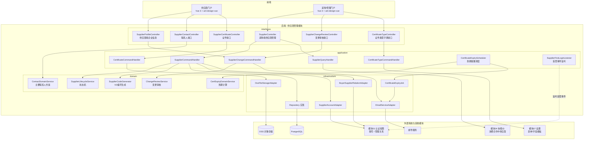
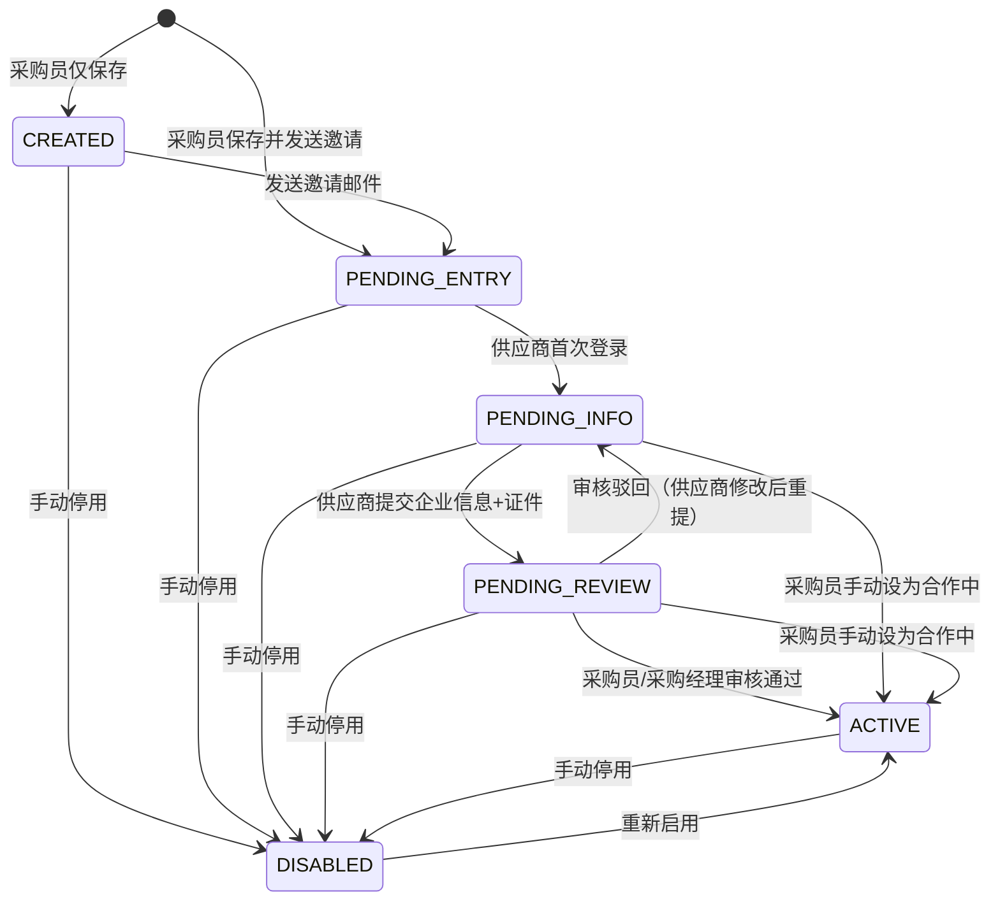
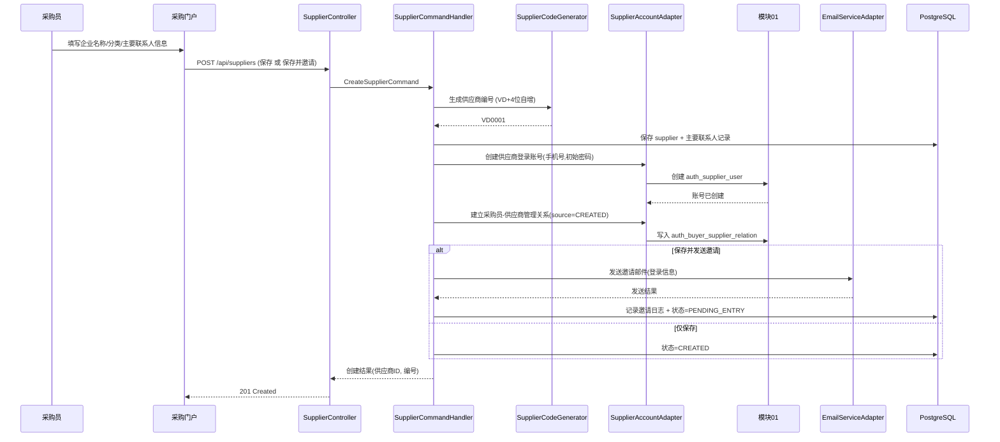
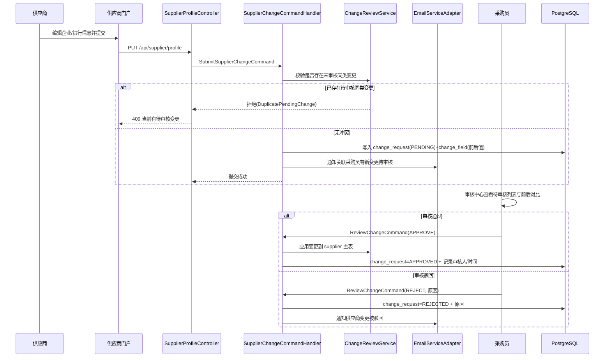
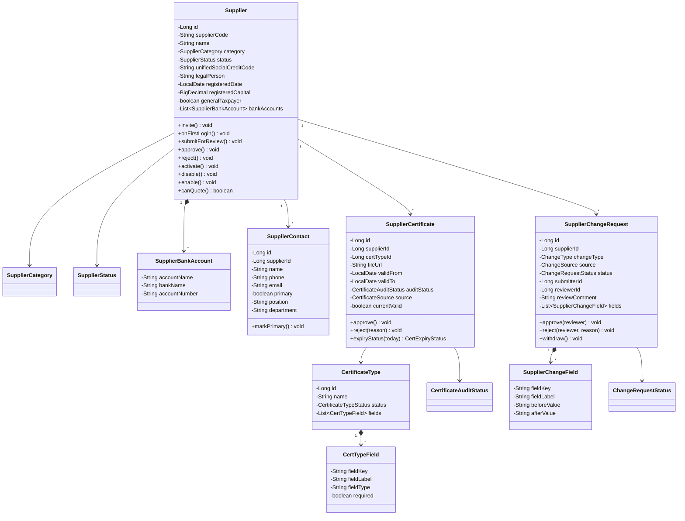

# 设计文档：供应商管理模块

## Overview

概述

本模块负责供应商全生命周期管理，是采购平台的核心业务模块之一。覆盖供应商创建与邀请入驻、企业基本信息维护与审核、银行信息维护、联系人管理、证件上传与审核、证件类型字典管理、供应商状态流转和证件到期提醒。

本模块依赖模块 01（用户认证与权限）提供的账号体系、登录入口和采购员-供应商管理关系；并被模块 04（询报价管理）依赖以获取"合作中"状态的供应商列表。

核心设计决策：

- **企业实体与登录账号分离**：供应商企业信息（本模块 `supplier` 聚合根）与供应商登录账号（模块 01 `auth_supplier_user`）是两张独立的表，通过 `auth_supplier_user.supplier_id` 关联。本模块负责企业信息，账号的创建/停用通过端口回调模块 01。
- **状态机驱动生命周期**：供应商有 6 个状态（创建成功、待进入、待完善信息、待审核信息、合作中、已停用），状态流转由领域服务集中控制，非法流转抛出领域异常。
- **变更审核机制（差异快照）**：供应商在「合作中」后编辑基本/银行信息时，变更不直接覆盖当前生效信息，而是落入 `supplier_change_request` + `supplier_change_field`（待审核），审核通过后才应用；采购员直接编辑则即时生效并写入一条"已通过"的变更记录。两类操作统一进入变更历史。
- **入驻草稿 vs 变更审核**：首次入驻阶段（待完善信息）供应商的编辑直接写入 `supplier` 主表（草稿，尚未生效审核），提交后置为「待审核信息」；激活后（合作中）的编辑才走变更审核流程。以 `status` 区分两种模式。
- **证件独立审核 + OSS 存储**：证件文件存储至 OSS 对象存储，库内仅存文件元数据与访问标识；证件有独立的审核状态（待审核/已通过/驳回），与供应商整体准入状态解耦。
- **差异化证件字段**：不同证件类型可绑定差异化字段（`supplier_cert_type_field`），供应商上传时动态渲染表单，提交值以 JSONB 存于证件记录。
- **定时到期提醒**：每日定时任务扫描已通过且当前有效的证件，在到期前 30/15/7/3/0 天分别向供应商与关联采购员发送邮件，按提醒节点去重。
- **数据范围隔离**：采购员仅可见自己管理的供应商（依据模块 01 `auth_buyer_supplier_relation`），采购经理（Admin）可见全量；供应商仅可见本企业数据。

## Architecture

架构

### 系统架构图



### 供应商状态机



说明：
- 状态枚举值 `CREATED / PENDING_ENTRY / PENDING_INFO / PENDING_REVIEW / ACTIVE / DISABLED`，对应中文「创建成功/待进入/待完善信息/待审核信息/合作中/已停用」。
- 「待进入」表示已发送邀请但供应商尚未首次登录；首次登录由模块 01 供应商登录流程触发本模块状态流转（见跨模块集成）。
- 停用会同步停用模块 01 的 `auth_supplier_user`（供应商无法登录）；启用则反之。

### 供应商创建与邀请入驻流程



### 信息变更审核流程（合作中供应商）



### 跨模块集成

本模块通过领域端口（domain/port）与基础设施适配器（infrastructure/external）与其他模块和外部系统集成，保持领域层无框架/无跨模块直接依赖：

- **模块 01（认证权限）— 出站**：
  - `SupplierAccountPort`：创建供应商账号（创建供应商时，以主要联系人手机号 + 初始密码调用模块 01）、停用/启用供应商账号（状态流转时同步）。
  - `BuyerSupplierRelationPort`：建立/查询采购员-供应商管理关系（用于数据范围隔离与变更通知收件人）。
- **模块 01（认证权限）— 入站**：供应商首次登录由模块 01 触发，本模块通过 `SupplierFirstLoginListener` 监听 Spring `ApplicationEvent`（或由模块 01 应用服务回调），将状态由「待进入/创建成功」流转为「待完善信息」（Req 7.3）。
- **模块 04（询报价）**：通过 `GET /api/internal/suppliers/active` 提供「合作中」供应商列表。
- **模块 07（设置）**：供应商企业信息表单、证件上传表单的字段定义/模板由模块 07 Req 13 维护；本模块的动态表单渲染与提交校验读取该模板。证件类型字典的差异化字段（Req 11.5）在 MVP 阶段由本模块 `supplier_cert_type_field` 承载，后续可对接模块 07 统一表单引擎。
- **OSS 对象存储**：`FileStoragePort`（`OssFileStorageAdapter`）负责证件文件上传/下载，库内仅存元数据。
- **邮件服务**：`EmailPort`（`EmailServiceAdapter`）负责邀请邮件、变更待审核/审核结果通知、证件到期提醒。

## Components and Interfaces

组件与接口

### 后端模块结构

```
src/main/java/com/cdp/ecosaas/procurement/supplier/
├── domain/
│   ├── model/
│   │   ├── Supplier.java                    # 供应商聚合根
│   │   ├── SupplierBankAccount.java         # 银行账号实体
│   │   ├── SupplierContact.java             # 联系人实体
│   │   ├── SupplierCertificate.java         # 证件实体
│   │   ├── CertificateType.java             # 证件类型
│   │   ├── CertTypeField.java               # 证件类型差异化字段
│   │   ├── SupplierChangeRequest.java       # 变更申请/记录聚合根
│   │   ├── SupplierChangeField.java         # 变更字段差异值对象
│   │   ├── SupplierStatus.java              # 供应商状态枚举
│   │   ├── SupplierCategory.java            # 分类枚举(DOMESTIC/OVERSEAS)
│   │   ├── ChangeType.java                  # 变更类型枚举(BASIC_INFO/BANK)
│   │   ├── ChangeSource.java                # 变更来源枚举(SUPPLIER/BUYER)
│   │   ├── ChangeRequestStatus.java         # 变更状态枚举
│   │   ├── CertificateAuditStatus.java      # 证件审核状态枚举
│   │   ├── CertificateSource.java           # 证件来源枚举
│   │   ├── CertExpiryStatus.java            # 证件到期状态(派生)
│   │   └── CertificateTypeStatus.java       # 证件类型状态枚举
│   ├── service/
│   │   ├── SupplierLifecycleService.java    # 状态机：合法流转校验与转换
│   │   ├── ChangeReviewService.java         # 变更审核：差异计算、应用、冲突校验
│   │   ├── ContactDomainService.java        # 主要联系人唯一性与删除约束
│   │   ├── CertExpiryDomainService.java     # 到期状态/剩余天数计算
│   │   └── SupplierCodeGenerator.java       # VD+4位编号生成
│   ├── repository/
│   │   ├── SupplierRepository.java
│   │   ├── SupplierContactRepository.java
│   │   ├── SupplierCertificateRepository.java
│   │   ├── CertificateTypeRepository.java
│   │   └── SupplierChangeRequestRepository.java
│   ├── port/
│   │   ├── SupplierAccountPort.java         # 调用模块01：账号创建/停用/启用
│   │   ├── BuyerSupplierRelationPort.java   # 模块01：管理关系建立/查询
│   │   ├── FileStoragePort.java             # OSS 上传/下载
│   │   └── EmailPort.java                   # 邀请/通知/提醒邮件
│   └── event/
│       ├── SupplierCreatedEvent.java
│       ├── SupplierInfoChangeSubmittedEvent.java
│       ├── SupplierActivatedEvent.java
│       └── SupplierDisabledEvent.java
│
├── application/
│   ├── command/
│   │   ├── CreateSupplierCommand.java
│   │   ├── InviteSupplierCommand.java
│   │   ├── UpdateSupplierInfoCommand.java       # 采购员直接编辑
│   │   ├── SubmitSupplierChangeCommand.java     # 供应商提交变更
│   │   ├── WithdrawChangeCommand.java
│   │   ├── ReviewChangeCommand.java             # 审核通过/驳回
│   │   ├── ChangeSupplierStatusCommand.java
│   │   ├── SubmitForReviewCommand.java          # 供应商提交准入审核
│   │   ├── SaveContactCommand.java
│   │   ├── DeleteContactCommand.java
│   │   ├── SetPrimaryContactCommand.java
│   │   ├── InviteContactCommand.java
│   │   ├── UploadCertificateCommand.java
│   │   ├── ReviewCertificateCommand.java
│   │   ├── BuyerAddCertificateCommand.java
│   │   ├── SaveCertTypeCommand.java
│   │   └── UpdateCertTypeFieldsCommand.java
│   ├── query/
│   │   ├── SupplierListQuery.java
│   │   ├── ChangeHistoryQuery.java
│   │   ├── PendingChangeQuery.java
│   │   └── CertificateListQuery.java
│   ├── handler/
│   │   ├── SupplierCommandHandler.java
│   │   ├── SupplierQueryHandler.java
│   │   ├── SupplierChangeCommandHandler.java
│   │   ├── SupplierChangeQueryHandler.java
│   │   ├── ContactCommandHandler.java
│   │   ├── CertificateCommandHandler.java
│   │   └── CertificateTypeCommandHandler.java
│   ├── service/
│   │   ├── SupplierAccessService.java       # 数据范围：按角色/管理关系过滤
│   │   └── CertificateExpiryScheduler.java  # @Scheduled 触发到期提醒
│   └── listener/
│       └── SupplierFirstLoginListener.java  # 监听模块01首登事件→PENDING_INFO
│
├── infrastructure/
│   ├── persistence/
│   │   ├── entity/
│   │   │   ├── SupplierEntity.java
│   │   │   ├── SupplierBankAccountEntity.java
│   │   │   ├── SupplierContactEntity.java
│   │   │   ├── SupplierCertificateEntity.java
│   │   │   ├── CertificateTypeEntity.java
│   │   │   ├── CertTypeFieldEntity.java
│   │   │   ├── SupplierChangeRequestEntity.java
│   │   │   ├── SupplierChangeFieldEntity.java
│   │   │   ├── SupplierInvitationLogEntity.java
│   │   │   └── CertReminderLogEntity.java
│   │   ├── repository/
│   │   │   ├── JpaSupplierRepository.java + SupplierJpaDao.java
│   │   │   ├── JpaSupplierContactRepository.java + ...
│   │   │   ├── JpaSupplierCertificateRepository.java + ...
│   │   │   ├── JpaCertificateTypeRepository.java + ...
│   │   │   └── JpaSupplierChangeRequestRepository.java + ...
│   │   └── mapper/
│   │       ├── SupplierMapper.java
│   │       ├── SupplierContactMapper.java
│   │       ├── SupplierCertificateMapper.java
│   │       └── CertificateTypeMapper.java
│   ├── external/
│   │   ├── EmailServiceAdapter.java
│   │   ├── OssFileStorageAdapter.java
│   │   ├── SupplierAccountAdapter.java       # 调用模块01应用服务
│   │   └── BuyerSupplierRelationAdapter.java
│   ├── scheduler/
│   │   └── CertificateExpiryJob.java
│   └── config/
│       ├── SupplierModuleConfig.java
│       └── OssProperties.java
│
├── interfaces/
│   ├── rest/
│   │   ├── SupplierProfileController.java    # 供应商端：企业信息
│   │   ├── SupplierContactController.java    # 联系人(双端)
│   │   ├── SupplierCertificateController.java# 证件(双端)
│   │   ├── SupplierController.java           # 采购端：供应商管理
│   │   ├── SupplierChangeReviewController.java # 变更审核
│   │   ├── CertificateTypeController.java    # 证件类型字典(管理端)
│   │   └── SupplierInternalController.java   # 内部集成(模块04)
│   └── dto/
│       ├── SupplierProfileRequest.java / Response.java
│       ├── CreateSupplierRequest.java / Response.java
│       ├── SupplierListResponse.java
│       ├── ContactRequest.java / Response.java
│       ├── CertificateUploadRequest.java / Response.java
│       ├── ChangeRequestResponse.java / ChangeDiffResponse.java
│       ├── ReviewRequest.java
│       ├── ChangeStatusRequest.java / DisableImpactResponse.java
│       └── CertTypeRequest.java / Response.java
│
└── shared/
    ├── constants/
    │   └── SupplierConstants.java            # 编号前缀、文件大小/格式白名单、提醒节点
    └── exception/
        ├── SupplierErrorCode.java
        ├── SupplierNotFoundException.java
        ├── InvalidSupplierStatusException.java
        ├── DuplicatePendingChangeException.java
        ├── PrimaryContactRequiredException.java
        └── InvalidCertificateFileException.java
```

复用模块根 `shared/` 跨模块代码：`shared/model/PageQuery`、`PageResult`（分页），`shared/util/SecurityUtils`（当前用户），`shared/exception/BusinessException`、`ResourceNotFoundException`、`ForbiddenException`、`GlobalExceptionHandler`。

### 前端模块结构

```
src/modules/supplier/
├── application/
│   ├── manage-supplier-info.usecase.ts      # 供应商端信息维护
│   ├── submit-info-change.usecase.ts        # 提交变更/撤回
│   ├── create-supplier.usecase.ts           # 采购端创建+邀请
│   ├── manage-suppliers.usecase.ts          # 列表/搜索/状态调整
│   ├── review-change.usecase.ts             # 变更审核
│   ├── manage-contacts.usecase.ts
│   ├── manage-certificates.usecase.ts       # 上传/审核
│   └── manage-cert-types.usecase.ts         # 证件类型字典
├── domain/
│   ├── entities/
│   │   ├── supplier.entity.ts
│   │   ├── contact.entity.ts
│   │   └── certificate.entity.ts
│   ├── value-objects/
│   │   ├── supplier-status.vo.ts
│   │   └── bank-account.vo.ts
│   └── rules/
│       ├── bank-account-validation.rule.ts  # 一旦填写则三项必填
│       └── contact-validation.rule.ts       # 主要联系人约束
├── infrastructure/
│   ├── services/
│   │   ├── supplier.service.ts
│   │   ├── supplier-change.service.ts
│   │   ├── contact.service.ts
│   │   ├── certificate.service.ts
│   │   └── cert-type.service.ts
│   └── adapters/
│       └── oss-upload.adapter.ts            # 证件文件上传
├── presentation/
│   ├── views/
│   │   ├── SupplierProfileView.vue          # 供应商端：企业信息(默认首页)
│   │   ├── SupplierListView.vue             # 采购端：供应商列表
│   │   ├── SupplierDetailView.vue           # 采购端：详情(信息/联系人/证件/变更记录Tab)
│   │   ├── SupplierCreateView.vue           # 采购端：创建供应商
│   │   ├── ChangeReviewView.vue             # 采购端：变更审核中心
│   │   └── CertTypeManagementView.vue       # 管理端：证件类型字典
│   ├── components/
│   │   ├── SupplierBasicInfoForm.vue
│   │   ├── BankAccountList.vue
│   │   ├── ContactList.vue / ContactFormDialog.vue
│   │   ├── CertificateUpload.vue / CertificateList.vue
│   │   ├── ChangeDiffView.vue               # 前后字段对比
│   │   ├── StatusChangeDialog.vue           # 含停用风险提示
│   │   ├── InviteDialog.vue
│   │   ├── SupplierStatusTag.vue
│   │   └── CertExpiryTag.vue
│   ├── composables/
│   │   ├── useSupplierForm.ts
│   │   ├── useBankAccountValidation.ts
│   │   ├── useCertificateUpload.ts
│   │   └── useSupplierStatus.ts
│   ├── stores/
│   │   └── supplier.store.ts
│   └── routes/
│       └── supplier.routes.ts
└── types/
    ├── dto/
    │   ├── supplier.dto.ts
    │   ├── contact.dto.ts
    │   ├── certificate.dto.ts
    │   └── change.dto.ts
    ├── vo/
    │   └── supplier-info.vo.ts
    └── command/
        ├── create-supplier.command.ts
        └── submit-change.command.ts
```

### REST API 设计

#### 供应商端接口（供应商门户，JWT + SUPPLIER，数据范围=本企业）

| 方法 | 路径 | 说明 | 需求 |
|------|------|------|------|
| GET | `/api/supplier/profile` | 查看本企业信息（含银行信息、待审核变更标记）| 3.1, 3.2, 4.1 |
| PUT | `/api/supplier/profile` | 编辑企业/银行信息（合作中→提交待审核；待完善信息→保存草稿）| 3.3, 3.9, 4.2, 49 |
| POST | `/api/supplier/profile/submit-review` | 提交准入审核（待完善信息→待审核信息）| 4.4 |
| GET | `/api/supplier/profile/pending-change` | 查询当前待审核变更 | 3.6 |
| POST | `/api/supplier/profile/pending-change/withdraw` | 撤回待审核变更 | 3.7 |
| GET | `/api/supplier/contacts` | 联系人列表 | 9.2 |
| POST | `/api/supplier/contacts` | 新增联系人 | 9.1, 9.2 |
| PUT | `/api/supplier/contacts/{id}` | 编辑联系人（直接生效+记录）| 9.9 |
| DELETE | `/api/supplier/contacts/{id}` | 删除联系人（不可删唯一主要联系人）| 9.5 |
| PATCH | `/api/supplier/contacts/{id}/primary` | 设为主要联系人（自动取消原主要）| 9.4 |
| GET | `/api/supplier/certificates` | 本企业证件列表 | 10.5 |
| POST | `/api/supplier/certificates` | 上传/更新证件（OSS）→待审核 | 10.1-10.4 |
| GET | `/api/supplier/cert-types` | 可选证件类型及其差异化字段 | 10.1, 11.6 |

#### 采购端接口（采购/管理门户，JWT + BUYER/ADMIN）

| 方法 | 路径 | 说明 | 需求 |
|------|------|------|------|
| GET | `/api/suppliers` | 供应商列表（分页 / 名称模糊 / 状态 / 证件到期状态筛选）| 8 |
| POST | `/api/suppliers` | 创建供应商（仅保存 / 保存并发送邀请）| 6.1-6.6 |
| GET | `/api/suppliers/{id}` | 供应商详情 | 8.6 |
| PUT | `/api/suppliers/{id}` | 直接编辑供应商信息（即时生效 + 记录变更）| 49 |
| POST | `/api/suppliers/{id}/invite` | 发送/重发邀请邮件 | 6.7, 6.8 |
| GET | `/api/suppliers/{id}/disable-impact` | 停用前受影响事项清单 | 7.12 |
| PATCH | `/api/suppliers/{id}/status` | 调整状态（合作中/已停用，含操作备注）| 7.7-7.11 |
| GET | `/api/suppliers/{id}/change-history` | 变更记录（时间倒序，按时间范围筛选）| 50 |
| GET | `/api/suppliers/{id}/contacts` | 联系人列表 | 9.6 |
| POST | `/api/suppliers/{id}/contacts` | 新增联系人 | 9.6 |
| PUT | `/api/suppliers/{id}/contacts/{cid}` | 编辑联系人（即时生效）| 9.6, 9.8 |
| DELETE | `/api/suppliers/{id}/contacts/{cid}` | 删除联系人 | 9.6 |
| POST | `/api/suppliers/{id}/contacts/{cid}/invite` | 向联系人发送门户邀请 | 9.7, 9.10 |
| GET | `/api/suppliers/{id}/certificates` | 证件列表 | 10 |
| POST | `/api/suppliers/{id}/certificates` | 采购员手动添加证件（直接已通过）| 10.9, 10.11 |

#### 审核接口（采购/管理门户，JWT + BUYER/ADMIN，按管理关系/全量）

| 方法 | 路径 | 说明 | 需求 |
|------|------|------|------|
| GET | `/api/supplier-changes` | 待审核变更列表 | 5.1 |
| GET | `/api/supplier-changes/{id}` | 变更详情（前后对比）| 5.2 |
| POST | `/api/supplier-changes/{id}/approve` | 审核通过（变更生效）| 5.3, 5.7 |
| POST | `/api/supplier-changes/{id}/reject` | 审核驳回（原因 + 通知供应商）| 5.4, 5.5, 5.7 |
| POST | `/api/supplier-certificates/{id}/approve` | 证件审核通过 | 10.7 |
| POST | `/api/supplier-certificates/{id}/reject` | 证件审核驳回（原因 + 通知）| 10.8 |

#### 证件类型字典接口（管理门户，JWT + ADMIN）

| 方法 | 路径 | 说明 | 需求 |
|------|------|------|------|
| GET | `/api/admin/cert-types` | 证件类型列表 | 11.1 |
| POST | `/api/admin/cert-types` | 新增证件类型（名称唯一）| 11.2, 11.3 |
| PUT | `/api/admin/cert-types/{id}` | 编辑证件类型 | 11.1 |
| PATCH | `/api/admin/cert-types/{id}/status` | 停用/启用证件类型 | 11.4 |
| PUT | `/api/admin/cert-types/{id}/fields` | 维护差异化字段 | 11.5 |

#### 内部集成接口（供其他模块）

| 方法 | 路径 | 说明 | 需求 |
|------|------|------|------|
| GET | `/api/internal/suppliers/active` | 查询「合作中」供应商列表（供模块04 RFQ 选择）| 依赖关系 |

## Data Models

数据模型

> 数据库为 PostgreSQL 16（schema `trial_procurement`），DDL 风格与模块 01 迁移脚本一致：`BIGSERIAL` 主键、`BOOLEAN`/`TIMESTAMP(3)`/`NUMERIC`/`JSONB` 类型、独立 `CREATE INDEX`、可空唯一列使用部分唯一索引、`COMMENT ON TABLE`。跨表引用仅用 `BIGINT` 列 + 索引，不声明外键约束（与模块 01 保持一致）。迁移脚本从 `V4` 起延续。

### 数据库表设计

#### 供应商企业表 `supplier`

```sql
CREATE TABLE supplier (
    id                          BIGSERIAL PRIMARY KEY,
    supplier_code               VARCHAR(16) NOT NULL,              -- 供应商ID号(VD+4位自增)
    name                        VARCHAR(128) NOT NULL,            -- 供应商名称
    category                    VARCHAR(16) NOT NULL,             -- 分类: DOMESTIC/OVERSEAS
    status                      VARCHAR(20) NOT NULL DEFAULT 'CREATED', -- 状态机
    unified_social_credit_code  VARCHAR(32),                      -- 统一社会信用代码
    legal_person                VARCHAR(64),                      -- 公司法人
    registered_date             DATE,                             -- 注册时间
    registered_capital          NUMERIC(18,2),                    -- 注册资金(正数)
    address                     VARCHAR(255),                     -- 公司地址
    general_taxpayer            BOOLEAN,                          -- 一般纳税人
    business_scope              TEXT,                             -- 经营范围(选填)
    enterprise_nature           VARCHAR(64),                      -- 企业性质(选填)
    sales_mode                  VARCHAR(64),                      -- 销售模式(选填)
    coverage_area               VARCHAR(255),                     -- 覆盖区域(选填)
    annual_revenue              NUMERIC(18,2),                    -- 本年度营业额(选填)
    employee_count              INT,                              -- 员工人数(选填)
    main_customers              VARCHAR(512),                     -- 主力客户(选填)
    created_at                  TIMESTAMP(3) NOT NULL,
    updated_at                  TIMESTAMP(3) NOT NULL,
    created_by                  VARCHAR(64),
    updated_by                  VARCHAR(64),
    version                     INT NOT NULL DEFAULT 0            -- 乐观锁
);

CREATE UNIQUE INDEX uk_supplier_code ON supplier (supplier_code);
CREATE INDEX idx_supplier_status ON supplier (status);
CREATE INDEX idx_supplier_name ON supplier (name);

COMMENT ON TABLE supplier IS '供应商企业表';
```

> 说明：`supplier_code`（供应商ID号，Req 3.1）系统生成，规则 `VD` + 4 位自增（Req 6.2）；`unified_social_credit_code`（统一社会信用代码）在列表展示（Req 8.1），作为企业基本信息字段维护。`registered_capital` 正数校验在应用/前端层（Req 3.8）。

#### 供应商银行账号表 `supplier_bank_account`

```sql
CREATE TABLE supplier_bank_account (
    id              BIGSERIAL PRIMARY KEY,
    supplier_id     BIGINT NOT NULL,                              -- 所属供应商
    account_name    VARCHAR(128) NOT NULL,                        -- 户名
    bank_name       VARCHAR(128) NOT NULL,                        -- 开户银行名称
    account_number  VARCHAR(64) NOT NULL,                         -- 银行账号
    sort_order      INT NOT NULL DEFAULT 0,
    created_at      TIMESTAMP(3) NOT NULL,
    updated_at      TIMESTAMP(3) NOT NULL
);

CREATE INDEX idx_bank_account_supplier ON supplier_bank_account (supplier_id);

COMMENT ON TABLE supplier_bank_account IS '供应商银行账号表';
```

> 说明：银行信息整体非必填；一旦填写一条记录，则户名/开户银行名称/银行账号三者必填（Req 3.9），由应用/前端层校验。

#### 供应商联系人表 `supplier_contact`

```sql
CREATE TABLE supplier_contact (
    id              BIGSERIAL PRIMARY KEY,
    supplier_id     BIGINT NOT NULL,                              -- 所属供应商
    name            VARCHAR(64) NOT NULL,                         -- 姓名(必填)
    phone           VARCHAR(20) NOT NULL,                         -- 手机号(必填)
    email           VARCHAR(128) NOT NULL,                        -- 邮箱(必填)
    is_primary      BOOLEAN NOT NULL DEFAULT FALSE,               -- 是否主要联系人
    position        VARCHAR(64),                                  -- 职务(选填)
    department      VARCHAR(64),                                  -- 部门(选填)
    created_at      TIMESTAMP(3) NOT NULL,
    updated_at      TIMESTAMP(3) NOT NULL,
    created_by      VARCHAR(64),
    updated_by      VARCHAR(64)
);

CREATE INDEX idx_contact_supplier ON supplier_contact (supplier_id);
CREATE UNIQUE INDEX uk_contact_primary ON supplier_contact (supplier_id) WHERE is_primary = TRUE;

COMMENT ON TABLE supplier_contact IS '供应商联系人表';
```

> 说明：部分唯一索引 `uk_contact_primary` 保证每个供应商至多一个主要联系人（配合应用层保证至少一个，Req 9.3-9.5）。联系人不区分销售/财务类型（Req 6.6, 9.1）。

#### 证件类型表 `supplier_certificate_type`

```sql
CREATE TABLE supplier_certificate_type (
    id              BIGSERIAL PRIMARY KEY,
    name            VARCHAR(64) NOT NULL,                         -- 证件类型名称
    status          VARCHAR(16) NOT NULL DEFAULT 'ACTIVE',        -- ACTIVE/DISABLED
    remark          VARCHAR(255),
    created_at      TIMESTAMP(3) NOT NULL,
    updated_at      TIMESTAMP(3) NOT NULL,
    created_by      VARCHAR(64),
    updated_by      VARCHAR(64)
);

CREATE UNIQUE INDEX uk_cert_type_name ON supplier_certificate_type (name);

COMMENT ON TABLE supplier_certificate_type IS '证件类型字典表';
```

> 说明：停用证件类型保留历史数据，仅新上传时不再展示（Req 11.4）；名称唯一（Req 11.3）。

#### 证件类型差异化字段表 `supplier_cert_type_field`

```sql
CREATE TABLE supplier_cert_type_field (
    id              BIGSERIAL PRIMARY KEY,
    cert_type_id    BIGINT NOT NULL,                              -- 所属证件类型
    field_key       VARCHAR(64) NOT NULL,                         -- 字段标识
    field_label     VARCHAR(64) NOT NULL,                         -- 字段显示名
    field_type      VARCHAR(32) NOT NULL,                         -- TEXT/NUMBER/DATE/SELECT...
    required        BOOLEAN NOT NULL DEFAULT FALSE,
    sort_order      INT NOT NULL DEFAULT 0,
    created_at      TIMESTAMP(3) NOT NULL
);

CREATE INDEX idx_cert_type_field_type ON supplier_cert_type_field (cert_type_id);

COMMENT ON TABLE supplier_cert_type_field IS '证件类型差异化字段表';
```

> 说明：供应商选择证件类型后据此动态渲染表单（Req 11.5, 11.6）。后续可由模块 07 统一表单引擎（Req 13）替代。

#### 供应商证件表 `supplier_certificate`

```sql
CREATE TABLE supplier_certificate (
    id              BIGSERIAL PRIMARY KEY,
    supplier_id     BIGINT NOT NULL,                              -- 所属供应商
    cert_type_id    BIGINT NOT NULL,                             -- 证件类型
    file_url        VARCHAR(512) NOT NULL,                        -- OSS 访问标识
    file_name       VARCHAR(255) NOT NULL,                        -- 原始文件名
    valid_from      DATE NOT NULL,                                -- 有效期起始
    valid_to        DATE NOT NULL,                                -- 有效期截止
    audit_status    VARCHAR(20) NOT NULL DEFAULT 'PENDING_REVIEW', -- 待审核/已通过/驳回
    reject_reason   VARCHAR(255),                                 -- 驳回原因(可选)
    source          VARCHAR(20) NOT NULL,                         -- SUPPLIER_UPLOAD/BUYER_MAINTAIN
    is_current_valid BOOLEAN NOT NULL DEFAULT TRUE,               -- 是否当前有效(否=历史版本)
    extra_fields    JSONB,                                        -- 差异化字段提交值
    maintained_by   VARCHAR(64),                                  -- 维护人
    created_at      TIMESTAMP(3) NOT NULL,
    updated_at      TIMESTAMP(3) NOT NULL
);

CREATE INDEX idx_certificate_supplier ON supplier_certificate (supplier_id);
CREATE INDEX idx_certificate_audit_status ON supplier_certificate (audit_status);
CREATE INDEX idx_certificate_valid_to ON supplier_certificate (valid_to);

COMMENT ON TABLE supplier_certificate IS '供应商证件表';
```

> 说明：`valid_to > valid_from` 校验在应用层（Req 10.2）；文件格式（PDF/JPG/PNG）与大小（≤100MB）白名单校验在应用层（Req 10.6）。采购员手动添加 `audit_status=APPROVED` 且不进审核中心（Req 10.9）。「更新当前有效证件 vs 新增历史证件」通过 `is_current_valid` 控制（Req 10.11）。

#### 供应商变更申请/记录表 `supplier_change_request`

```sql
CREATE TABLE supplier_change_request (
    id              BIGSERIAL PRIMARY KEY,
    supplier_id     BIGINT NOT NULL,                              -- 所属供应商
    change_type     VARCHAR(20) NOT NULL,                         -- BASIC_INFO/BANK
    source          VARCHAR(20) NOT NULL,                         -- SUPPLIER/BUYER
    status          VARCHAR(20) NOT NULL,                         -- 待审核/已通过/驳回/已撤回
    submitter_id    BIGINT NOT NULL,                              -- 提交人ID
    submitter_name  VARCHAR(64) NOT NULL,                         -- 提交人姓名
    submitted_at    TIMESTAMP(3) NOT NULL,                        -- 提交时间
    reviewer_id     BIGINT,                                       -- 审核人ID
    reviewer_name   VARCHAR(64),                                  -- 审核人姓名
    reviewed_at     TIMESTAMP(3),                                 -- 审核时间
    review_comment  VARCHAR(255),                                 -- 审核意见/驳回原因
    withdrawn_at    TIMESTAMP(3),                                 -- 撤回时间
    reminded_at     TIMESTAMP(3),                                 -- 24h 提醒时间
    created_at      TIMESTAMP(3) NOT NULL
);

CREATE INDEX idx_change_supplier ON supplier_change_request (supplier_id);
CREATE INDEX idx_change_status ON supplier_change_request (status);
CREATE UNIQUE INDEX uk_change_pending ON supplier_change_request (supplier_id, change_type)
    WHERE status = 'PENDING_REVIEW';

COMMENT ON TABLE supplier_change_request IS '供应商信息变更申请/记录表';
```

> 说明：统一承载三类操作——供应商提交的待审核变更（Req 3.3）、采购员直接编辑的即时生效记录（`source=BUYER, status=APPROVED`，Req 49.3）、变更历史（Req 50）。部分唯一索引 `uk_change_pending` 防止同一供应商同类变更存在多条待审核（Req 3.6）。`reminded_at` 支撑提交后 24h 未审核再提醒（Req 5.8）。

#### 供应商变更字段明细表 `supplier_change_field`

```sql
CREATE TABLE supplier_change_field (
    id                  BIGSERIAL PRIMARY KEY,
    change_request_id   BIGINT NOT NULL,                          -- 所属变更
    field_key           VARCHAR(64) NOT NULL,                     -- 字段标识
    field_label         VARCHAR(64) NOT NULL,                     -- 字段显示名
    before_value        TEXT,                                     -- 变更前值
    after_value         TEXT                                      -- 变更后值
);

CREATE INDEX idx_change_field_request ON supplier_change_field (change_request_id);

COMMENT ON TABLE supplier_change_field IS '供应商变更字段明细表';
```

> 说明：字段级前后值用于审核对比展示（Req 5.2）与变更记录展示（Req 50.2）。银行/多值字段以序列化文本承载。

#### 供应商邀请日志表 `supplier_invitation_log`

```sql
CREATE TABLE supplier_invitation_log (
    id              BIGSERIAL PRIMARY KEY,
    supplier_id     BIGINT NOT NULL,                              -- 所属供应商
    contact_id      BIGINT,                                       -- 收件联系人(可空)
    recipient_email VARCHAR(128) NOT NULL,                        -- 收件邮箱
    sent_by         VARCHAR(64),                                  -- 发送人
    sent_at         TIMESTAMP(3) NOT NULL,                        -- 发送时间
    result          VARCHAR(16) NOT NULL                          -- SUCCESS/FAILURE
);

CREATE INDEX idx_invitation_supplier ON supplier_invitation_log (supplier_id);

COMMENT ON TABLE supplier_invitation_log IS '供应商邀请邮件发送日志表';
```

> 说明：记录邀请邮件发送时间与状态（Req 6.8）及向联系人发送邀请的记录（Req 9.10）。

#### 证件到期提醒日志表 `supplier_cert_reminder_log`

```sql
CREATE TABLE supplier_cert_reminder_log (
    id              BIGSERIAL PRIMARY KEY,
    certificate_id  BIGINT NOT NULL,                              -- 证件ID
    remind_node     INT NOT NULL,                                 -- 提醒节点天数(30/15/7/3/0)
    sent_at         TIMESTAMP(3) NOT NULL
);

CREATE UNIQUE INDEX uk_cert_reminder_node ON supplier_cert_reminder_log (certificate_id, remind_node);

COMMENT ON TABLE supplier_cert_reminder_log IS '证件到期提醒去重日志表';
```

> 说明：唯一索引保证每个证件每个提醒节点仅发送一次（Req 12.3）。

### 领域模型



### 枚举定义

- `SupplierStatus`：`CREATED`(创建成功)、`PENDING_ENTRY`(待进入)、`PENDING_INFO`(待完善信息)、`PENDING_REVIEW`(待审核信息)、`ACTIVE`(合作中)、`DISABLED`(已停用)
- `SupplierCategory`：`DOMESTIC`(国内)、`OVERSEAS`(国外)
- `ChangeType`：`BASIC_INFO`(基本信息)、`BANK`(银行信息)
- `ChangeSource`：`SUPPLIER`(供应商提交)、`BUYER`(采购员直接编辑)
- `ChangeRequestStatus`：`PENDING_REVIEW`(待审核)、`APPROVED`(已通过)、`REJECTED`(驳回)、`WITHDRAWN`(已撤回)
- `CertificateAuditStatus`：`PENDING_REVIEW`(待审核)、`APPROVED`(已通过)、`REJECTED`(驳回)
- `CertificateSource`：`SUPPLIER_UPLOAD`(供应商上传)、`BUYER_MAINTAIN`(采购员维护)
- `CertificateTypeStatus`：`ACTIVE`(启用)、`DISABLED`(停用)
- `CertExpiryStatus`（派生，不落库）：`NORMAL`(正常)、`EXPIRING_SOON`(即将到期，截止日在未来30天内)、`EXPIRED`(已过期)

### 证件到期提醒机制

- `CertificateExpiryScheduler` 通过 Spring `@Scheduled`（每日固定时间，配置于 `application.yml`）触发 `CertificateExpiryJob`。
- 任务扫描 `audit_status='APPROVED' AND is_current_valid=TRUE` 的证件，按 `CertExpiryDomainService` 计算 `valid_to - today` 的剩余天数。
- 命中提醒节点 {30, 15, 7, 3, 0} 天时，向供应商主要联系人及关联采购员发送邮件（Req 12.2），邮件含企业名称、证件类型、截止日期、剩余天数（Req 12.4）。
- 发送前查 `supplier_cert_reminder_log`，已发送的 `(certificate_id, remind_node)` 跳过，发送成功后写入日志，保证每节点仅一次（Req 12.3）。
- 列表的证件到期状态（正常/即将到期/已过期）由 `CertExpiryStatus` 在查询时派生标注（Req 8.1, 8.4, 12.5, 12.6）。

### 文件存储（OSS）

- 证件文件经 `FileStoragePort` 上传至 OSS（Req 10.3）；库内 `file_url` 存对象标识，下载时由 `OssFileStorageAdapter` 生成临时访问地址。
- 上传校验：仅允许 PDF/JPG/PNG，单文件 ≤100MB；拒绝可执行/脚本/含宏等高风险格式（Req 10.6），在应用层基于内容类型与扩展名双重校验。

### 数据范围与权限

- `SupplierAccessService` 依据当前用户角色与模块 01 `auth_buyer_supplier_relation` 过滤数据：`ADMIN` 全量；`BUYER` 仅其管理关系内的供应商（Req 2.12, 50.5）；`SUPPLIER` 仅本企业（Req 3.10）。
- 供应商端不暴露变更记录入口与接口（Req 50.1, 50.4）；列表/详情接口在采购端按上述范围裁剪。
- 接口层权限沿用模块 01 的 Spring Security 配置：`/api/supplier/**` 限 SUPPLIER，`/api/admin/**` 限 ADMIN，`/api/suppliers/**` 与 `/api/supplier-changes/**` 限 BUYER/ADMIN。
