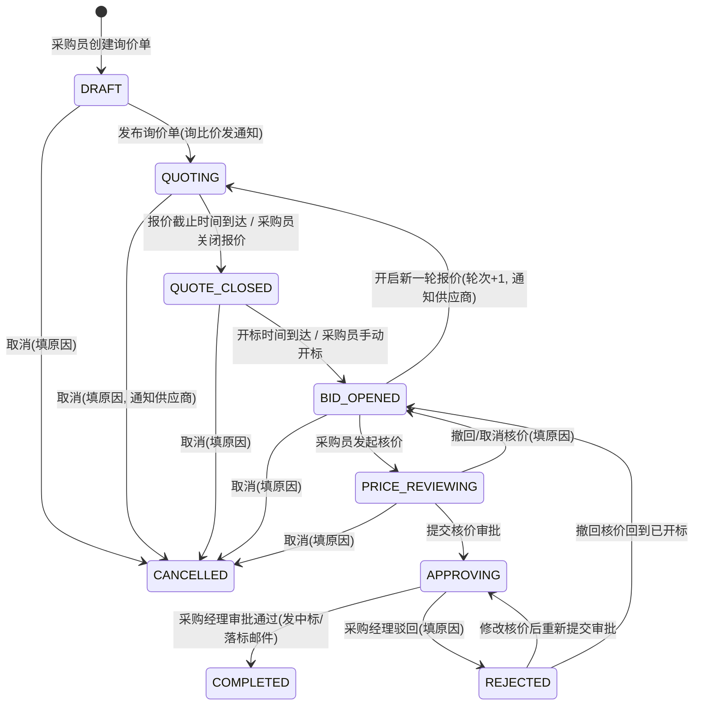
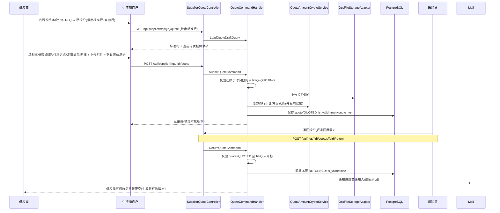
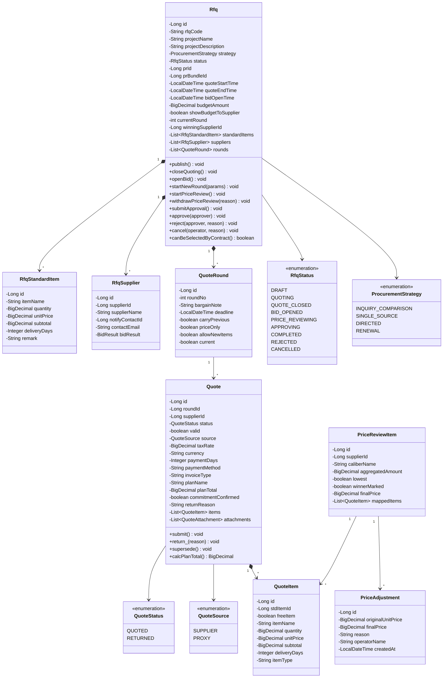

# 设计文档：询报价管理模块

## Overview

概述

本模块负责采购员基于 PR/PR 合集发起询报价、供应商在线报价、采购员代询价、报价退回、多轮报价、报价截止与开标、核价（报价归集 + 改价）、核价审批，以及询价单列表与管理的完整流程，是「PR → RFQ → 合同」链路的中枢环节。支持四种采购策略：询比价、单一来源、定向采购、续约。

本模块依赖模块 01（认证权限）的账号体系与数据范围、模块 02（供应商管理）的「合作中」供应商及其联系人、模块 03（采购申请单）的已审批 PR/PR 合集；被模块 05（合同管理）依赖（合同创建时选择已完成核价的 RFQ，并带出中标供应商、报价明细、核价结果）。

核心设计决策：

- **状态机驱动生命周期**：RFQ 有 9 个状态（草稿、报价中、报价截止、已开标、核价中、审批中、已完成、已驳回、已取消），状态流转由 `RfqLifecycleService` 集中校验，非法流转抛领域异常。截止/开标的时间触发由 `RfqTimerScheduler`（`@Scheduled`）驱动，关闭报价/手动开标由采购员动作驱动（Req 22）。
- **采购策略统一控制询价差异**：删除「RFQ 类型」字段与线下寻源独立入口，询比价 vs 单一来源/定向采购/续约的差异完全由 `ProcurementStrategy` 控制——询比价多供应商 + 发通知 + 供应商在线报价；其余三种单供应商 + 不发通知 + 采购员代录（Req 17.4-17.6、17.13、18.3）。
- **标准报价行 + 自由报价行**：采购员在 RFQ 上维护标准报价行（`rfq_standard_item`），供应商报价时默认带出这些标准行，同时允许新增自由报价行；核价阶段可将自由报价行映射回标准/统一口径进行比价（Req 17.8、17.16、19、24.2、24.3）。
- **三层报价数据分离**：供应商原始报价（`quote` + `quote_item`）、采购员核价归集（`price_review_item` + `quote_item_mapping`）、核价后最终成交价快照（`price_adjustment` / `price_review_item.final_price`）分开存储，改价不覆盖原始报价（Req 19.9、24.8、24.13）。
- **多轮报价以轮次隔离**：每轮一个 `quote_round`，每供应商每轮一条有效 `quote`；历史轮次报价锁定保留，默认以最新有效轮次作为核价轮次（Req 23.2、23.4、23.5、23.10）。同一供应商同轮被退回后重提交，旧版本保留为历史并标记失效，由 `quote.is_valid` 控制（Req 19.15、20.3）。
- **开标前报价保密**：开标前所有报价金额在应用层加密存储、API 不下发、前端对所有用户屏蔽；开标后仅向 RFQ 创建人（及有数据范围的采购经理/Admin）展示报价汇总对比（Req 22.5、22.6）。
- **报价归集与比价矩阵**：核价页提供报价归集，将供应商自由报价项映射到统一核价口径（支持 1→N、N→1），归集后生成比价矩阵（行=核价口径、列=供应商报价方案、单元格=归集金额/来源/附件状态/核价后价格/改价记录），并自动标记每个口径项的最低报价供应商（Req 24.2-24.5、24.14）。
- **当前版本简化口径**：采用整单中标供应商模式（不做分项中标 / 多供应商拆分）；核价页不展示「复核维度/结论/说明」矩阵；上述均作为后续备用能力保留扩展位（Req 24.11、24.12）。报价方案当前默认每供应商每轮一个主方案（Req 19.13）。
- **数据范围隔离**：普通采购员仅可见/操作本人创建的 RFQ 与所辖 PR，采购经理/Admin 全量；供应商仅可见发给本企业的 RFQ 及本企业报价，不得查看他人报价（Req 17.1、18.4、19.1、19.2、26.4）。
- **可扩展字段后端预留**：报价项类型、规格说明、单位 U.O.M.、是否替代项、对应采购需求项、项目预算展示开关等作为后端可扩展字段保存，当前页面不要求展示（Req 17.12、19.18）。

> 外部依赖说明：本阶段邮件服务、OSS 对象存储按领域端口 + 适配器边界设计，便于后续替换为真实对接：
> - `EmailServiceAdapter`（`NotificationPort`）：发布通知、退回通知、新一轮通知、审批待办、中标/落标结果邮件（Req 18.2、20.2、22.7、23.3、25.2）。沿用模块 02 的邮件适配器约定。
> - `OssFileStorageAdapter`（`FileStoragePort`）：报价附件 / 代询价证据附件 / 报价模板上传下载，库内仅存对象标识；上传按内容类型 + 扩展名双重白名单校验（Req 19.16、21.2）。当前空实现：上传返回占位对象标识，下载返回占位地址。

## Architecture

架构

### 系统架构图

```mermaid
graph TB
    subgraph 前端
        BP[采购/管理门户<br/>Vue 3 + ant-design-vue]
        SP[供应商门户<br/>Vue 3 + ant-design-vue]
    end

    subgraph 后端 - 询报价管理模块
        subgraph interfaces
            RC[RfqController<br/>采购端询价单管理]
            RPC[RfqPriceReviewController<br/>核价/归集/改价/审批]
            SQC[SupplierQuoteController<br/>供应商端报价]
            RIC[RfqInternalController<br/>内部集成(模块05)]
        end

        subgraph application
            RCH[RfqCommandHandler<br/>创建/编辑/发布/取消]
            RQH[RfqQueryHandler<br/>列表/详情/对比]
            QCH[QuoteCommandHandler<br/>报价/退回/代询价]
            ROH[RoundCommandHandler<br/>多轮报价]
            PRH[PriceReviewHandler<br/>核价/归集/改价]
            APH[ApprovalHandler<br/>核价审批]
        end

        subgraph domain
            RLS[RfqLifecycleService<br/>状态机]
            RCS[RfqCreationService<br/>带出/校验/编号]
            PAS[PriceAggregationService<br/>报价归集/比价矩阵]
            RAS[RfqAccessService<br/>数据范围]
            RCG[RfqCodeGenerator<br/>RFQ 编号生成]
        end

        subgraph infrastructure
            REPO[Repository 实现]
            MAIL[EmailServiceAdapter]
            OSS[OssFileStorageAdapter]
            CRYP[QuoteAmountCryptoService<br/>开标前金额加解密]
            SCH[RfqTimerScheduler<br/>截止/开标定时]
            SUP[ActiveSupplierAdapter]
            PR[PrSourceAdapter]
        end
    end

    subgraph 外部系统与其他模块
        M01[模块01 认证权限<br/>账号 / 数据范围]
        M02[模块02 供应商<br/>合作中供应商 / 联系人]
        M03[模块03 采购申请单<br/>已审批 PR / PR合集]
        M05[模块05 合同管理<br/>已核价 RFQ 结果]
        MS[邮件服务]
        OSSS[(OSS 对象存储)]
        DB[(PostgreSQL)]
    end

    BP --> RC
    BP --> RPC
    SP --> SQC
    M05 --> RIC

    RC --> RCH
    RC --> RQH
    RC --> ROH
    RPC --> PRH
    RPC --> APH
    SQC --> QCH
    SQC --> RQH

    RCH --> RCS
    RCH --> RLS
    RCH --> RCG
    QCH --> RLS
    QCH --> CRYP
    ROH --> RLS
    PRH --> PAS
    PRH --> RLS
    APH --> RLS

    RCH --> REPO
    RCS --> SUP
    RCS --> PR
    QCH --> OSS
    QCH --> MAIL
    APH --> MAIL
    SCH --> RLS

    SUP --> M02
    PR --> M03
    MAIL --> MS
    OSS --> OSSS
    RIC --> M05
    REPO --> DB
```

### RFQ 状态机



说明：

- 状态枚举值 `DRAFT / QUOTING / QUOTE_CLOSED / BID_OPENED / PRICE_REVIEWING / APPROVING / COMPLETED / REJECTED / CANCELLED`，对应中文「草稿/报价中/报价截止/已开标/核价中/审批中/已完成/已驳回/已取消」。
- **代询价（单一来源/定向采购/续约）路径**：发布后进入 `QUOTING`（不发通知、不创建供应商报价入口），采购员代录报价后点击统一「关闭报价」，系统在流水记录「报价截止」并立即流转 `QUOTING → QUOTE_CLOSED → BID_OPENED`（Req 21.5、21.8、22.4）。
- **多轮报价**：仅允许在 `BID_OPENED` 开启新一轮，轮次号自增、状态重置为 `QUOTING`；若已进入 `PRICE_REVIEWING` 必须先撤回/取消核价回到 `BID_OPENED` 再开启（Req 23.1、23.7）。
- **取消**：采购员可在 `DRAFT/QUOTING/QUOTE_CLOSED/BID_OPENED/PRICE_REVIEWING` 取消，须填原因；非草稿态取消邮件通知所有参与供应商（Req 26.5、26.6）。`COMPLETED` 不可取消。

### 询价单创建与发布流程

```mermaid
sequenceDiagram
    participant B as 采购员
    participant FE as 采购门户
    participant RC as RfqController
    participant H as RfqCommandHandler
    participant Create as RfqCreationService
    participant SUP as ActiveSupplierAdapter
    participant Code as RfqCodeGenerator
    participant Mail as EmailServiceAdapter
    participant DB as PostgreSQL

    B->>FE: 选择 PR/PR合集 → 填基本信息/标准报价行 → 选供应商+通知人
    FE->>RC: GET /api/rfqs/selectable-suppliers?status=ACTIVE
    RC->>H: SelectableSuppliersQuery
    H->>SUP: 查询「合作中」供应商(模块02)
    SUP-->>H: 供应商 + 联系人列表
    H-->>FE: 可选供应商
    FE->>RC: POST /api/rfqs (草稿)
    RC->>H: CreateRfqCommand
    H->>Create: 校验开标时间>报价结束时间; 策略-供应商数量约束
    Create->>Code: 生成编号(RFQ-YYYYMM-5位)
    Code-->>H: RFQ-202605-00001
    H->>DB: 保存 rfq(DRAFT)+标准行+参与供应商
    H-->>FE: 201 Created(草稿)
    B->>FE: 发布询价单
    FE->>RC: POST /api/rfqs/{id}/publish
    RC->>H: PublishRfqCommand
    H->>H: DRAFT → QUOTING; 创建第1轮 quote_round
    alt 询比价
        H->>Mail: 通知各供应商通知人(报价入口/截止/开标)
    else 单一来源/定向/续约
        H->>H: 不发通知, 不建报价入口(待代询价)
    end
    H-->>FE: 已发布
```

### 供应商报价与退回流程



### 核价、报价归集与审批流程

```mermaid
sequenceDiagram
    participant B as 采购员
    participant RPC as RfqPriceReviewController
    participant PRH as PriceReviewHandler
    participant Agg as PriceAggregationService
    participant APH as ApprovalHandler
    participant Mail as EmailServiceAdapter
    participant M as 采购经理
    participant DB as PostgreSQL

    B->>RPC: 发起核价 (BID_OPENED → PRICE_REVIEWING)
    RPC->>PRH: StartPriceReviewCommand
    PRH->>DB: RFQ=PRICE_REVIEWING, 取最新有效轮次报价
    B->>RPC: 报价归集(原始报价项 → 统一核价口径, 支持 1→N / N→1)
    RPC->>PRH: AggregateQuoteItemsCommand
    PRH->>Agg: 建/改 price_review_item + quote_item_mapping
    Agg->>Agg: 生成比价矩阵 + 自动标记每口径最低价供应商
    PRH->>DB: 保存归集结果
    B->>RPC: 确认中标供应商 + 新增改价(选明细, 填最终成交价+原因)
    RPC->>PRH: SaveBidResultCommand / AddPriceAdjustmentCommand
    PRH->>DB: 写 price_adjustment(不覆盖原始报价) + 中标标记
    B->>RPC: 提交采购经理审批(确认弹窗: 报价+最终成交价快照)
    RPC->>APH: SubmitApprovalCommand
    APH->>APH: 校验推荐方案已完成必要归集; RFQ=APPROVING
    APH->>Mail: 通知采购经理待审批
    M->>RPC: 审批通过 / 驳回(填原因)
    RPC->>APH: ApproveCommand / RejectCommand
    alt 通过
        APH->>DB: RFQ=COMPLETED + 记录审批
        APH->>Mail: 向所有参与供应商发中标/落标结果
    else 驳回
        APH->>DB: RFQ=REJECTED + 驳回原因
        APH->>Mail: 通知采购员
    end
```

### 跨模块集成

本模块通过领域端口（domain/port）与基础设施适配器（infrastructure/external）与其他模块和外部系统集成，保持领域层无框架/无跨模块直接依赖：

- **模块 01（认证权限）**：账号体系与数据范围由 `SecurityUtils` / Spring Security 提供；`RfqAccessService` 依据角色与创建人裁剪可见 RFQ（Req 17.1、26.4）。
- **模块 02（供应商）— 入站 `ActiveSupplierPort`**：查询「合作中」供应商及其联系人，供创建 RFQ 选择参与供应商与通知人，并带出供应商基础信息（名称/联系人/电话/邮箱）；已停用供应商不可加入新询价单（Req 17.5、17.7、17.14、17.15）。对接模块 02 暴露的 `/api/internal/suppliers/active`。
- **模块 03（采购申请单）— 入站 `PrSourcePort`**：查询当前用户可选的已审批 PR/PR 合集（普通采购员仅本人、采购经理全量），支持按 PR 号/需求内容/部门/PR 类型筛选；带出 PR 预算金额/币种（Req 17.1、17.2、17.12）。
- **模块 05（合同管理）— 出站集成**：通过 `RfqInternalController` 暴露「PR/PR 合集下已完成核价审批的 RFQ 结果」，含中标供应商、报价明细、核价后最终成交价快照，供合同创建带出（Req 依赖关系，对应模块 05 的 `RfqResultPort`）。
- **邮件服务 — `NotificationPort`**：发布/退回/新一轮/审批待办/中标落标邮件（Req 18.2、20.2、22.7、23.3、25.2）。
- **OSS 对象存储 — `FileStoragePort`**：报价附件、代询价证据附件、标准报价模板上传下载（Req 19.16、21.2、21.7）。**当前空实现：上传返回占位对象标识，下载返回占位地址。**

## Components and Interfaces

组件与接口

### 后端模块结构

```
src/main/java/com/cdp/ecosaas/procurement/rfq/
├── domain/
│   ├── model/
│   │   ├── Rfq.java                       # 询价单聚合根
│   │   ├── RfqStandardItem.java           # 标准报价行(采购员维护)
│   │   ├── RfqSupplier.java               # 参与供应商(含通知人/中标结果)
│   │   ├── QuoteRound.java                # 报价轮次
│   │   ├── Quote.java                     # 报价单(每供应商每轮一条有效)
│   │   ├── QuoteItem.java                 # 报价明细行(标准/自由)
│   │   ├── QuoteAttachment.java           # 报价附件(OSS)
│   │   ├── PriceReviewItem.java           # 统一核价口径项(归集+中标+最终价)
│   │   ├── QuoteItemMapping.java          # 报价归集映射(原始项↔核价口径)
│   │   ├── PriceAdjustment.java           # 改价记录(快照, 不覆盖原始)
│   │   ├── RfqStatus.java                 # RFQ 状态枚举
│   │   ├── ProcurementStrategy.java       # 采购策略枚举
│   │   ├── QuoteStatus.java               # 报价单状态枚举
│   │   ├── QuoteSource.java               # 报价来源枚举(供应商/代询价)
│   │   └── BidResult.java                 # 中标/落标枚举
│   ├── service/
│   │   ├── RfqLifecycleService.java       # 状态机：合法流转校验与转换
│   │   ├── RfqCreationService.java        # 带出/时间与策略校验/快照
│   │   ├── PriceAggregationService.java   # 报价归集/比价矩阵/最低价标记
│   │   └── RfqCodeGenerator.java          # RFQ-YYYYMM-5位编号生成
│   ├── repository/
│   │   ├── RfqRepository.java
│   │   └── QuoteRepository.java
│   ├── port/
│   │   ├── NotificationPort.java          # 邮件通知
│   │   ├── FileStoragePort.java           # OSS 附件
│   │   ├── ActiveSupplierPort.java        # 模块02：合作中供应商/联系人
│   │   ├── PrSourcePort.java              # 模块03：可选 PR/PR合集 + 预算带出
│   │   └── QuoteAmountCryptoPort.java     # 开标前金额加解密
│   └── event/
│       ├── RfqPublishedEvent.java
│       ├── QuoteSubmittedEvent.java
│       ├── BidOpenedEvent.java
│       └── RfqCompletedEvent.java
│
├── application/
│   ├── command/
│   │   ├── CreateRfqCommand.java
│   │   ├── UpdateRfqDraftCommand.java         # 草稿/报价中无报价时编辑
│   │   ├── PublishRfqCommand.java
│   │   ├── CancelRfqCommand.java
│   │   ├── CloseQuotingCommand.java           # 关闭报价
│   │   ├── OpenBidCommand.java                # 手动开标
│   │   ├── SubmitQuoteCommand.java            # 供应商报价
│   │   ├── ReturnQuoteCommand.java            # 退回报价
│   │   ├── ProxyQuoteCommand.java             # 代询价
│   │   ├── StartNewRoundCommand.java          # 开启新一轮
│   │   ├── StartPriceReviewCommand.java
│   │   ├── WithdrawPriceReviewCommand.java    # 撤回/取消核价
│   │   ├── AggregateQuoteItemsCommand.java    # 报价归集
│   │   ├── SaveBidResultCommand.java          # 确认中标 + 最终中标价
│   │   ├── AddPriceAdjustmentCommand.java     # 新增改价
│   │   ├── SubmitApprovalCommand.java
│   │   ├── ApproveCommand.java
│   │   └── RejectCommand.java
│   ├── query/
│   │   ├── RfqListQuery.java
│   │   ├── RfqDetailQuery.java
│   │   ├── SelectableSuppliersQuery.java
│   │   ├── SelectablePrQuery.java
│   │   ├── QuoteComparisonQuery.java          # 开标后报价对比
│   │   ├── PriceMatrixQuery.java              # 比价矩阵
│   │   ├── SupplierRfqListQuery.java
│   │   └── RfqResultQuery.java                # 供模块05带出
│   ├── handler/
│   │   ├── RfqCommandHandler.java             # 创建/编辑/发布/关闭/开标/取消
│   │   ├── RfqQueryHandler.java
│   │   ├── QuoteCommandHandler.java           # 报价/退回/代询价
│   │   ├── RoundCommandHandler.java           # 多轮报价
│   │   ├── PriceReviewHandler.java            # 核价/归集/改价
│   │   └── ApprovalHandler.java               # 核价审批
│   └── service/
│       └── RfqAccessService.java              # 数据范围：按角色/创建人过滤
│
├── infrastructure/
│   ├── persistence/
│   │   ├── entity/
│   │   │   ├── RfqEntity.java
│   │   │   ├── RfqStandardItemEntity.java
│   │   │   ├── RfqSupplierEntity.java
│   │   │   ├── QuoteRoundEntity.java
│   │   │   ├── QuoteEntity.java
│   │   │   ├── QuoteItemEntity.java
│   │   │   ├── QuoteAttachmentEntity.java
│   │   │   ├── PriceReviewItemEntity.java
│   │   │   ├── QuoteItemMappingEntity.java
│   │   │   ├── PriceAdjustmentEntity.java
│   │   │   ├── RfqApprovalLogEntity.java
│   │   │   ├── RfqOperationLogEntity.java
│   │   │   └── RfqNotificationLogEntity.java
│   │   ├── repository/
│   │   │   ├── JpaRfqRepository.java + RfqJpaDao.java
│   │   │   └── JpaQuoteRepository.java + QuoteJpaDao.java
│   │   └── mapper/
│   │       ├── RfqMapper.java
│   │       └── QuoteMapper.java
│   ├── external/
│   │   ├── EmailServiceAdapter.java       # NotificationPort
│   │   ├── OssFileStorageAdapter.java     # FileStoragePort 空实现(占位对象标识)
│   │   ├── ActiveSupplierAdapter.java     # 调模块02
│   │   └── PrSourceAdapter.java           # 调模块03
│   ├── crypto/
│   │   └── QuoteAmountCryptoService.java  # QuoteAmountCryptoPort：开标前 AES 加解密
│   ├── scheduler/
│   │   └── RfqTimerScheduler.java         # @Scheduled：报价截止/自动开标
│   └── config/
│       ├── RfqModuleConfig.java
│       └── RfqProperties.java             # 默认税率/币别、OSS 白名单、加密密钥来源
│
├── interfaces/
│   ├── rest/
│   │   ├── RfqController.java             # 采购端：创建/列表/详情/编辑/发布/关闭/开标/取消/新一轮
│   │   ├── RfqPriceReviewController.java  # 采购端：核价/归集/改价/审批
│   │   ├── SupplierQuoteController.java   # 供应商端：RFQ 列表/详情/报价
│   │   └── RfqInternalController.java     # 内部集成(模块05)
│   └── dto/
│       ├── CreateRfqRequest.java / Response.java
│       ├── RfqListResponse.java / RfqDetailResponse.java
│       ├── SelectableSupplierResponse.java / SelectablePrResponse.java
│       ├── SubmitQuoteRequest.java / QuoteResponse.java
│       ├── ReturnQuoteRequest.java / ProxyQuoteRequest.java
│       ├── StartNewRoundRequest.java
│       ├── AggregateRequest.java / PriceMatrixResponse.java
│       ├── BidResultRequest.java / PriceAdjustmentRequest.java
│       ├── SubmitApprovalRequest.java / ApprovalDecisionRequest.java
│       ├── QuoteComparisonResponse.java
│       └── RfqResultResponse.java         # 供模块05
│
└── shared/
    ├── constants/
    │   └── RfqConstants.java              # 编号前缀、默认税率(6%)/币别(CNY)、文件白名单、承诺文案
    └── exception/
        ├── RfqErrorCode.java
        ├── RfqNotFoundException.java
        ├── InvalidRfqStatusException.java
        ├── QuoteWindowClosedException.java       # 报价时间段外提交
        ├── StandardItemInUseException.java       # 标准行已被报价引用不可删
        ├── SupplierCountViolationException.java  # 策略-供应商数量约束
        └── AggregationIncompleteException.java   # 推荐方案未完成必要归集
```

复用模块根 `shared/` 跨模块代码：`shared/model/PageQuery`、`PageResult`（分页），`shared/util/SecurityUtils`（当前用户），`shared/exception/BusinessException`、`ResourceNotFoundException`、`ForbiddenException`、`GlobalExceptionHandler`。新增的 `messageCode`（如 `INVALID_RFQ_STATUS`、`QUOTE_WINDOW_CLOSED`、`STANDARD_ITEM_IN_USE`、`SUPPLIER_COUNT_VIOLATION`、`AGGREGATION_INCOMPLETE`）需在 `GlobalExceptionHandler.resolveHttpStatus` 的 `switch` 中登记对应 HTTP 状态（否则默认 400）。

### 前端模块结构

```
src/modules/rfq/
├── application/
│   ├── create-rfq.usecase.ts             # 选PR+基本信息+标准行+选供应商+发布
│   ├── manage-rfqs.usecase.ts            # 列表/搜索/取消
│   ├── close-and-open-bid.usecase.ts     # 关闭报价/手动开标
│   ├── return-quote.usecase.ts           # 退回报价
│   ├── proxy-quote.usecase.ts            # 代询价
│   ├── new-round.usecase.ts              # 开启新一轮
│   ├── price-review.usecase.ts           # 核价/归集/改价
│   ├── approval.usecase.ts               # 提交/审批
│   └── supplier-quote.usecase.ts         # 供应商端报价
├── domain/
│   ├── entities/
│   │   ├── rfq.entity.ts
│   │   └── quote.entity.ts
│   ├── value-objects/
│   │   ├── rfq-status.vo.ts
│   │   └── procurement-strategy.vo.ts
│   └── rules/
│       ├── quote-time-validation.rule.ts   # 开标>报价结束; 报价时间段内
│       └── quote-amount.rule.ts            # 小计/含税合计/折扣负数计算
├── infrastructure/
│   ├── services/
│   │   ├── rfq.service.ts
│   │   ├── quote.service.ts
│   │   ├── price-review.service.ts
│   │   └── supplier-quote.service.ts
│   └── adapters/
│       └── oss-upload.adapter.ts           # 报价/证据附件上传
├── presentation/
│   ├── views/
│   │   ├── RfqListView.vue                # 采购端：询价单列表
│   │   ├── RfqCreateView.vue              # 采购端：分步创建(PR→基本信息→标准行→供应商)
│   │   ├── RfqDetailView.vue              # 采购端：详情(信息/参与供应商/报价对比/操作记录Tab)
│   │   ├── PriceReviewView.vue            # 采购端：核价(归集+比价矩阵+改价+提交审批)
│   │   ├── SupplierRfqListView.vue        # 供应商端：询价单列表
│   │   └── SupplierQuoteView.vue          # 供应商端：报价填写
│   ├── components/
│   │   ├── PrSourceSelector.vue           # PR/PR合集选择(筛选)
│   │   ├── RfqBasicForm.vue               # 项目名称/概述/时间/策略/预算展示开关
│   │   ├── StandardItemTable.vue          # 标准报价行维护
│   │   ├── SupplierSelector.vue           # 选供应商+指定通知人(筛选)
│   │   ├── QuoteItemTable.vue             # 报价明细行(带出标准行+自由行)
│   │   ├── QuoteCommitmentDialog.vue      # 报价承诺确认
│   │   ├── QuoteComparisonTable.vue       # 开标后报价汇总对比
│   │   ├── PriceMatrix.vue                # 比价矩阵(归集金额/来源/附件/改价)
│   │   ├── AggregationDialog.vue          # 报价归集映射
│   │   ├── PriceAdjustmentDialog.vue      # 新增改价
│   │   ├── ProxyQuoteDialog.vue           # 代询价(证据附件必填)
│   │   ├── NewRoundDialog.vue             # 开启新一轮参数
│   │   ├── ReturnQuoteDialog.vue / CancelRfqDialog.vue
│   │   └── RfqStatusTag.vue
│   ├── composables/
│   │   ├── useRfqForm.ts
│   │   ├── useQuoteCalculation.ts
│   │   ├── usePriceMatrix.ts
│   │   └── useRfqStatus.ts
│   ├── stores/
│   │   └── rfq.store.ts
│   └── routes/
│       └── rfq.routes.ts
└── types/
    ├── dto/
    │   ├── rfq.dto.ts
    │   ├── quote.dto.ts
    │   └── price-review.dto.ts
    ├── vo/
    │   └── rfq-info.vo.ts
    └── command/
        ├── create-rfq.command.ts
        └── submit-quote.command.ts
```

### REST API 设计

#### 采购端 — 询价单管理（采购/管理门户，JWT + BUYER/ADMIN，按数据范围）

| 方法 | 路径 | 说明 | 需求 |
|------|------|------|------|
| GET | `/api/rfqs/selectable-prs` | 可选已审批 PR/PR合集（按 PR号/需求/部门/类型筛选）| 17.1, 17.2 |
| GET | `/api/rfqs/selectable-suppliers` | 可选「合作中」供应商及联系人（按名称/类型/证件到期筛选）| 17.5, 17.14, 17.19 |
| POST | `/api/rfqs` | 创建询价单（基本信息+标准报价行+参与供应商，DRAFT）| 17 |
| GET | `/api/rfqs` | 询价单列表（按项目名/PR号模糊，状态/策略筛选，分页）| 26.1-26.4 |
| GET | `/api/rfqs/{id}` | 询价单详情（信息/参与供应商/操作记录）| 26.1 |
| PUT | `/api/rfqs/{id}` | 编辑（草稿；报价中且无报价时可编辑，否则锁核心字段）| 18.5-18.8 |
| POST | `/api/rfqs/{id}/publish` | 发布询价单（DRAFT→QUOTING，询比价发通知）| 18.1-18.4 |
| POST | `/api/rfqs/{id}/close-quoting` | 关闭报价（QUOTING→QUOTE_CLOSED）| 22.4 |
| POST | `/api/rfqs/{id}/open-bid` | 手动开标（QUOTE_CLOSED→BID_OPENED）| 22.3 |
| GET | `/api/rfqs/{id}/comparison` | 开标后报价汇总对比（仅创建人/有权限者）| 22.5 |
| POST | `/api/rfqs/{id}/cancel` | 取消询价单（填原因，通知供应商）| 26.5, 26.6 |
| POST | `/api/rfqs/{id}/rounds` | 开启新一轮报价（议价说明/供应商/截止/带出/限制项）| 23 |

#### 采购端 — 报价处理与核价（采购/管理门户，JWT + BUYER/ADMIN）

| 方法 | 路径 | 说明 | 需求 |
|------|------|------|------|
| POST | `/api/rfqs/{id}/quotes/{qid}/return` | 退回供应商报价（填退回原因）| 20 |
| POST | `/api/rfqs/{id}/proxy-quote` | 代询价录入（字段同供应商 + 证据附件必填）| 21.1-21.4 |
| POST | `/api/rfqs/{id}/price-review` | 发起核价（BID_OPENED→PRICE_REVIEWING）| 24.1 |
| POST | `/api/rfqs/{id}/price-review/withdraw` | 撤回/取消核价（→BID_OPENED，填原因）| 23.7, 23.8, 23.11 |
| POST | `/api/rfqs/{id}/price-review/aggregate` | 报价归集（原始项→统一核价口径，1→N/N→1）| 24.2, 24.3 |
| GET | `/api/rfqs/{id}/price-review/matrix` | 比价矩阵（归集金额/来源/附件/核价后价/改价/最低价）| 24.4, 24.5, 24.14 |
| POST | `/api/rfqs/{id}/price-review/bid-result` | 确认整单中标供应商 + 中标标记 | 24.6, 24.12 |
| POST | `/api/rfqs/{id}/price-review/adjustments` | 新增改价（选明细，填最终成交价+原因）| 24.7-24.9, 24.13 |
| POST | `/api/rfqs/{id}/submit-approval` | 提交核价审批（确认弹窗快照，PRICE_REVIEWING→APPROVING）| 25.1, 25.7 |

#### 采购经理审批接口（采购/管理门户，JWT + ADMIN）

| 方法 | 路径 | 说明 | 需求 |
|------|------|------|------|
| POST | `/api/rfqs/{id}/approve` | 审批通过（APPROVING→COMPLETED，发中标/落标邮件）| 25.3, 22.7 |
| POST | `/api/rfqs/{id}/reject` | 审批驳回（填原因，APPROVING→REJECTED，通知采购员）| 25.4, 25.5 |

#### 供应商端接口（供应商门户，JWT + SUPPLIER，数据范围=本企业）

| 方法 | 路径 | 说明 | 需求 |
|------|------|------|------|
| GET | `/api/supplier/rfqs` | 发给本企业的询价单列表 | 19.1, 19.2 |
| GET | `/api/supplier/rfqs/{id}` | 询价单详情（项目/PR号/概述/时间/采购公司/本企业信息）| 19.3 |
| GET | `/api/supplier/rfqs/{id}/quote` | 当前轮次报价草稿（带出标准行 + 历史退回原因）| 19.4, 20.5 |
| POST | `/api/supplier/rfqs/{id}/quote` | 提交报价（税率/币别/账期/明细/附件 + 报价承诺确认）| 19.4-19.6, 19.16, 19.17 |
| GET | `/api/supplier/quote-template` | 下载标准供应商报价模板 | 19.10, 21.7 |

#### 内部集成接口（供其他模块）

| 方法 | 路径 | 说明 | 需求 |
|------|------|------|------|
| GET | `/api/internal/rfqs/completed?prId=&prBundleId=` | PR/PR合集下已完成核价审批的 RFQ 结果（中标供应商/明细/最终成交价快照）| 依赖关系（模块05）|

### 接口契约对齐说明

- 创建/编辑接口的供应商基础信息（名称/联系人/电话/邮箱）由 `ActiveSupplierPort` 后端带出，前端仅提交所选供应商 ID 与通知人联系人 ID（Req 17.15）。
- 开标前所有报价金额相关字段（行小计、方案总价、含税合计）一律不在任何采购端/供应商端响应中下发；`/api/rfqs/{id}/comparison` 与比价矩阵仅在 RFQ 进入 `BID_OPENED` 及之后对有数据范围的用户开放（Req 22.5、22.6）。
- 供模块 05 的内部接口返回核价后最终成交价快照，与本模块改价记录解耦：合同侧只读取快照，不感知改价过程（Req 24.8、对应模块05 快照隔离）。

## Data Models

数据模型

> 数据库为 PostgreSQL（schema `trial_procurement`，连接级 `currentSchema`），DDL 风格与模块 01/02 迁移脚本一致：`BIGSERIAL` 主键、`BOOLEAN`/`TIMESTAMP(3)`/`NUMERIC`/`JSONB` 类型、独立 `CREATE INDEX`、可空唯一列使用部分唯一索引、`COMMENT ON TABLE`。跨表引用仅用 `BIGINT` 列 + 索引，不声明外键约束。迁移脚本从下一可用编号延续（当前 V1–V4 已落库，本模块与模块 05 合同各取其后的下一可用脚本号，按模块落库先后分配，避免编号冲突）。

### 数据库表设计

#### 询价单表 `rfq`

```sql
CREATE TABLE rfq (
    id                      BIGSERIAL PRIMARY KEY,
    rfq_code                VARCHAR(20) NOT NULL,              -- 询价单编号(RFQ-YYYYMM-5位自增)
    project_name            VARCHAR(128) NOT NULL,            -- 项目名称
    project_description     TEXT NOT NULL,                     -- 项目需求概述
    procurement_strategy    VARCHAR(24) NOT NULL,             -- 采购策略枚举
    status                  VARCHAR(20) NOT NULL DEFAULT 'DRAFT', -- 状态机
    pr_id                   BIGINT,                            -- 关联 PR(与 pr_bundle_id 二选一)
    pr_bundle_id            BIGINT,                            -- 关联 PR 合集
    quote_start_time        TIMESTAMP(3) NOT NULL,             -- 可报价开始时间
    quote_end_time          TIMESTAMP(3) NOT NULL,             -- 可报价结束时间
    bid_open_time           TIMESTAMP(3) NOT NULL,             -- 开标时间(须晚于报价结束)
    budget_amount           NUMERIC(18,2),                     -- 项目预算金额(快照)
    budget_currency         VARCHAR(8),                        -- 预算币种
    show_budget_to_supplier BOOLEAN NOT NULL DEFAULT FALSE,    -- 是否向供应商展示预算(Req 17.12)
    current_round           INT NOT NULL DEFAULT 0,            -- 当前轮次号(发布后置1)
    review_round_id         BIGINT,                            -- 核价采用的轮次(默认最新有效)
    winning_supplier_id     BIGINT,                            -- 整单中标供应商(核价确认)
    actual_close_time       TIMESTAMP(3),                      -- 实际报价截止时间
    actual_open_time        TIMESTAMP(3),                      -- 实际开标时间
    cancel_reason           VARCHAR(512),                      -- 取消原因(Req 26.6)
    cancelled_by            VARCHAR(64),
    cancelled_at            TIMESTAMP(3),
    created_at              TIMESTAMP(3) NOT NULL,
    updated_at              TIMESTAMP(3) NOT NULL,
    created_by              VARCHAR(64),                       -- 创建采购员(数据范围)
    updated_by              VARCHAR(64),
    version                 INT NOT NULL DEFAULT 0             -- 乐观锁
);

CREATE UNIQUE INDEX uk_rfq_code ON rfq (rfq_code);
CREATE INDEX idx_rfq_pr ON rfq (pr_id);
CREATE INDEX idx_rfq_bundle ON rfq (pr_bundle_id);
CREATE INDEX idx_rfq_status ON rfq (status);
CREATE INDEX idx_rfq_strategy ON rfq (procurement_strategy);
CREATE INDEX idx_rfq_created_by ON rfq (created_by);

COMMENT ON TABLE rfq IS '询价单表';
```

> 说明：`bid_open_time > quote_end_time` 校验在应用层（Req 17.9）；编号 `RFQ-YYYYMM-5位`（Req 17.11）。已删除 RFQ 类型字段，询价差异由 `procurement_strategy` 控制（Req 17.13）。预算金额/币种为创建时从 PR 带出的快照。

#### 标准报价行表 `rfq_standard_item`

```sql
CREATE TABLE rfq_standard_item (
    id              BIGSERIAL PRIMARY KEY,
    rfq_id          BIGINT NOT NULL,                          -- 所属询价单
    item_name       VARCHAR(255) NOT NULL,                    -- 物料/服务名称(必填)
    quantity        NUMERIC(18,4) NOT NULL,                   -- 数量(必填)
    unit_price      NUMERIC(18,2),                            -- 单价(选填)
    subtotal        NUMERIC(18,2),                            -- 小计(系统计算)
    delivery_days   INT,                                      -- 服务/交货天数(选填)
    remark          VARCHAR(512),                             -- 备注(选填)
    sort_order      INT NOT NULL DEFAULT 0,
    created_at      TIMESTAMP(3) NOT NULL
);

CREATE INDEX idx_std_item_rfq ON rfq_standard_item (rfq_id);

COMMENT ON TABLE rfq_standard_item IS 'RFQ 标准报价行(采购员维护, 供应商报价默认带出)';
```

> 说明：至少保留 1 行（Req 17.8、17.18）；删除时若已被供应商报价行（`quote_item.std_item_id`）引用则阻止删除（Req 17.18），抛 `StandardItemInUseException`。

#### 参与供应商表 `rfq_supplier`

```sql
CREATE TABLE rfq_supplier (
    id                  BIGSERIAL PRIMARY KEY,
    rfq_id              BIGINT NOT NULL,                      -- 所属询价单
    supplier_id         BIGINT NOT NULL,                      -- 供应商企业ID
    supplier_name       VARCHAR(128) NOT NULL,               -- 供应商名称(带出快照)
    notify_contact_id   BIGINT,                              -- 通知人联系人ID(询比价必填)
    contact_name        VARCHAR(64),                          -- 联系人姓名(快照)
    contact_phone       VARCHAR(20),                          -- 联系人电话(快照)
    contact_email       VARCHAR(128),                         -- 联系人邮箱(快照)
    bid_result          VARCHAR(16),                          -- WIN/LOSE(核价完成后)
    created_at          TIMESTAMP(3) NOT NULL
);

CREATE INDEX idx_rfq_supplier_rfq ON rfq_supplier (rfq_id);
CREATE INDEX idx_rfq_supplier_supplier ON rfq_supplier (supplier_id);
CREATE UNIQUE INDEX uk_rfq_supplier ON rfq_supplier (rfq_id, supplier_id);

COMMENT ON TABLE rfq_supplier IS 'RFQ 参与供应商表(含通知人/中标结果)';
```

> 说明：单一来源/定向采购/续约仅 1 家、不指定通知人不发通知（Req 17.6）；询比价多家且每家须指定通知人（Req 17.7）。供应商基础信息为带出快照（Req 17.15）。

#### 报价轮次表 `quote_round`

```sql
CREATE TABLE quote_round (
    id                  BIGSERIAL PRIMARY KEY,
    rfq_id              BIGINT NOT NULL,                      -- 所属询价单
    round_no            INT NOT NULL,                         -- 轮次号(自增)
    bargain_note        VARCHAR(512),                         -- 议价说明(Req 23.6)
    deadline            TIMESTAMP(3),                         -- 本轮报价截止时间
    carry_previous      BOOLEAN NOT NULL DEFAULT FALSE,       -- 是否带出上一轮报价
    price_only          BOOLEAN NOT NULL DEFAULT FALSE,       -- 是否仅允许调整价格(Req 23.9)
    allow_new_items     BOOLEAN NOT NULL DEFAULT TRUE,        -- 是否允许新增报价项(Req 23.9)
    is_current          BOOLEAN NOT NULL DEFAULT TRUE,        -- 是否当前轮次
    created_at          TIMESTAMP(3) NOT NULL,
    created_by          VARCHAR(64)
);

CREATE INDEX idx_round_rfq ON quote_round (rfq_id);
CREATE UNIQUE INDEX uk_round_no ON quote_round (rfq_id, round_no);

COMMENT ON TABLE quote_round IS 'RFQ 报价轮次表(多轮报价)';
```

#### 报价单表 `quote`

```sql
CREATE TABLE quote (
    id                  BIGSERIAL PRIMARY KEY,
    rfq_id              BIGINT NOT NULL,                      -- 所属询价单
    round_id            BIGINT NOT NULL,                      -- 所属轮次
    supplier_id         BIGINT NOT NULL,                      -- 报价供应商
    status              VARCHAR(16) NOT NULL,                 -- QUOTED/RETURNED
    is_valid            BOOLEAN NOT NULL DEFAULT TRUE,        -- 是否当前有效版本(否=历史失效)
    source              VARCHAR(16) NOT NULL,                 -- SUPPLIER/PROXY(代询价)
    proxy_buyer_id      BIGINT,                               -- 代询价操作采购员(Req 21.4)
    proxy_buyer_name    VARCHAR(64),
    tax_rate            NUMERIC(6,4) NOT NULL DEFAULT 0.06,   -- 税率(默认6%)
    currency            VARCHAR(8) NOT NULL DEFAULT 'CNY',    -- 询价币别(默认CNY)
    payment_days        INT,                                  -- 账期(单位固化"天")
    payment_method      VARCHAR(64),                          -- 付款方式
    invoice_type        VARCHAR(64),                          -- 发票类型
    plan_name           VARCHAR(64) NOT NULL DEFAULT '标准方案', -- 报价方案名称(Req 19.13)
    plan_note           VARCHAR(512),                         -- 方案说明
    plan_total_enc      VARCHAR(512),                         -- 方案总价(开标前加密存储)
    total_with_tax_enc  VARCHAR(512),                         -- 含税合计(开标前加密存储)
    commitment_confirmed BOOLEAN NOT NULL DEFAULT FALSE,      -- 报价承诺确认(Req 19.8, 19.12)
    return_reason       VARCHAR(512),                         -- 退回原因(Req 20.1, 20.5)
    submitted_at        TIMESTAMP(3),                         -- 报价提交时间
    created_at          TIMESTAMP(3) NOT NULL,
    updated_at          TIMESTAMP(3) NOT NULL
);

CREATE INDEX idx_quote_rfq ON quote (rfq_id);
CREATE INDEX idx_quote_round ON quote (round_id);
CREATE INDEX idx_quote_supplier ON quote (supplier_id);
CREATE UNIQUE INDEX uk_quote_valid ON quote (round_id, supplier_id) WHERE is_valid = TRUE;

COMMENT ON TABLE quote IS '报价单表(每供应商每轮一条有效)';
```

> 说明：部分唯一索引 `uk_quote_valid` 保证每轮每供应商至多一条有效报价；退回/重提交时旧版本置 `is_valid=FALSE` 保留为历史（Req 19.15、20.3）。`plan_total_enc` / `total_with_tax_enc` 为开标前 AES 密文，开标后由应用层解密对采购端展示（Req 22.6）。明细行原始金额同样在 `quote_item` 加密列存储。代询价以 `source=PROXY` + `proxy_buyer_*` 标注（Req 21.4）。

#### 报价明细行表 `quote_item`

```sql
CREATE TABLE quote_item (
    id                  BIGSERIAL PRIMARY KEY,
    quote_id            BIGINT NOT NULL,                      -- 所属报价单
    std_item_id         BIGINT,                               -- 对应标准行(自由行为 NULL)
    is_free_item        BOOLEAN NOT NULL DEFAULT FALSE,       -- 是否自由报价行(Req 17.16)
    item_name           VARCHAR(255) NOT NULL,                -- 物料/服务名称(必填)
    quantity            NUMERIC(18,4) NOT NULL,               -- 数量(必填)
    unit_price_enc      VARCHAR(512) NOT NULL,                -- 单价(开标前加密)
    subtotal_enc        VARCHAR(512) NOT NULL,                -- 小计(开标前加密, 折扣类可为负 Req 19.14)
    delivery_days       INT,                                  -- 服务/交货天数
    item_type           VARCHAR(24),                          -- 报价项类型(NORMAL/DISCOUNT...扩展)
    specification       VARCHAR(255),                         -- 规格说明(扩展字段 Req 19.18)
    uom                 VARCHAR(32),                          -- 单位 U.O.M.(扩展字段)
    is_substitute       BOOLEAN NOT NULL DEFAULT FALSE,       -- 是否替代项(扩展字段)
    pr_item_ref         BIGINT,                               -- 对应采购需求项(扩展字段)
    sort_order          INT NOT NULL DEFAULT 0,
    created_at          TIMESTAMP(3) NOT NULL
);

CREATE INDEX idx_quote_item_quote ON quote_item (quote_id);
CREATE INDEX idx_quote_item_std ON quote_item (std_item_id);

COMMENT ON TABLE quote_item IS '报价明细行表(标准行带出/自由行)';
```

> 说明：折扣类报价项允许负数小计计入方案总价（Req 19.14）。`item_type/specification/uom/is_substitute/pr_item_ref` 为后端可扩展字段，当前报价页面不展示（Req 19.18）。

#### 报价附件表 `quote_attachment`

```sql
CREATE TABLE quote_attachment (
    id              BIGSERIAL PRIMARY KEY,
    quote_id        BIGINT NOT NULL,                          -- 所属报价单
    file_url        VARCHAR(512) NOT NULL,                    -- OSS 对象标识
    file_name       VARCHAR(255) NOT NULL,                    -- 原始文件名
    file_size       BIGINT,                                   -- 文件大小(字节)
    is_proxy_evidence BOOLEAN NOT NULL DEFAULT FALSE,         -- 是否代询价证据附件(Req 21.2)
    created_at      TIMESTAMP(3) NOT NULL
);

CREATE INDEX idx_quote_attachment_quote ON quote_attachment (quote_id);

COMMENT ON TABLE quote_attachment IS '报价附件表(OSS)';
```

> 说明：支持 PDF/Word/Excel/JPG/PNG/ZIP/RAR，单文件 ≤100MB，拒绝可执行/脚本/含宏等高风险格式，按内容类型 + 扩展名双重白名单在应用层校验（Req 19.16）。代询价证据附件必填（Req 21.2）。

#### 核价口径项表 `price_review_item`

```sql
CREATE TABLE price_review_item (
    id                  BIGSERIAL PRIMARY KEY,
    rfq_id              BIGINT NOT NULL,                      -- 所属询价单
    round_id            BIGINT NOT NULL,                      -- 核价轮次
    supplier_id         BIGINT NOT NULL,                      -- 该口径项归集到的供应商
    caliber_name        VARCHAR(255) NOT NULL,               -- 统一核价口径名称
    aggregated_amount   NUMERIC(18,2),                        -- 归集金额(原始报价项汇总)
    is_lowest           BOOLEAN NOT NULL DEFAULT FALSE,       -- 是否该口径最低报价(自动标记 Req 24.5)
    is_winner_marked    BOOLEAN NOT NULL DEFAULT FALSE,       -- 中标标记(Req 24.6)
    final_price         NUMERIC(18,2),                        -- 最终中标价快照(Req 24.6, 24.8)
    final_subtotal      NUMERIC(18,2),                        -- 最终小计快照
    sort_order          INT NOT NULL DEFAULT 0,
    created_at          TIMESTAMP(3) NOT NULL,
    updated_at          TIMESTAMP(3) NOT NULL
);

CREATE INDEX idx_review_item_rfq ON price_review_item (rfq_id);
CREATE INDEX idx_review_item_round ON price_review_item (round_id);
CREATE INDEX idx_review_item_supplier ON price_review_item (supplier_id);

COMMENT ON TABLE price_review_item IS '核价统一口径项(报价归集 + 中标 + 最终成交价快照)';
```

#### 报价归集映射表 `quote_item_mapping`

```sql
CREATE TABLE quote_item_mapping (
    id                  BIGSERIAL PRIMARY KEY,
    review_item_id      BIGINT NOT NULL,                      -- 核价口径项
    quote_item_id       BIGINT NOT NULL,                      -- 原始供应商报价项
    created_at          TIMESTAMP(3) NOT NULL
);

CREATE INDEX idx_mapping_review_item ON quote_item_mapping (review_item_id);
CREATE INDEX idx_mapping_quote_item ON quote_item_mapping (quote_item_id);

COMMENT ON TABLE quote_item_mapping IS '报价归集映射(原始报价项 ↔ 核价口径, 支持 1→N / N→1)';
```

> 说明：多对多映射，支持一条原始报价项映射到多个核价口径项、多条原始项合并映射到一个口径项（Req 24.3）。

#### 改价记录表 `price_adjustment`

```sql
CREATE TABLE price_adjustment (
    id                  BIGSERIAL PRIMARY KEY,
    rfq_id              BIGINT NOT NULL,                      -- 所属询价单
    review_item_id      BIGINT,                               -- 关联核价口径项
    quote_item_id       BIGINT,                               -- 关联原始报价明细
    original_unit_price NUMERIC(18,2),                        -- 原始报价单价(Req 24.13)
    original_subtotal   NUMERIC(18,2),                        -- 原始报价小计
    final_price         NUMERIC(18,2) NOT NULL,               -- 改价后最终成交价
    final_subtotal      NUMERIC(18,2),                        -- 最终小计
    reason              VARCHAR(512) NOT NULL,                -- 改价原因(Req 24.7)
    operator_id         BIGINT,                               -- 操作人
    operator_name       VARCHAR(64),
    created_at          TIMESTAMP(3) NOT NULL                 -- 改价时间
);

CREATE INDEX idx_adjustment_rfq ON price_adjustment (rfq_id);
CREATE INDEX idx_adjustment_review_item ON price_adjustment (review_item_id);

COMMENT ON TABLE price_adjustment IS '改价记录表(不覆盖原始报价, 完整快照 Req 24.9, 24.13)';
```

#### 核价审批日志表 `rfq_approval_log`

```sql
CREATE TABLE rfq_approval_log (
    id              BIGSERIAL PRIMARY KEY,
    rfq_id          BIGINT NOT NULL,                          -- 所属询价单
    action          VARCHAR(24) NOT NULL,                     -- SUBMIT/APPROVE/REJECT
    result          VARCHAR(16),                              -- APPROVED/REJECTED
    approver_id     BIGINT,                                   -- 审批人(采购经理)
    approver_name   VARCHAR(64),
    comment         VARCHAR(512),                             -- 审批意见/驳回原因(Req 25.4)
    created_at      TIMESTAMP(3) NOT NULL                     -- 审批时间(Req 25.6)
);

CREATE INDEX idx_approval_log_rfq ON rfq_approval_log (rfq_id);

COMMENT ON TABLE rfq_approval_log IS '核价审批日志表(Req 25.6)';
```

#### 操作流水表 `rfq_operation_log`

```sql
CREATE TABLE rfq_operation_log (
    id              BIGSERIAL PRIMARY KEY,
    rfq_id          BIGINT NOT NULL,                          -- 所属询价单
    operation       VARCHAR(48) NOT NULL,                     -- PUBLISH/CLOSE_QUOTING/OPEN_BID/PROXY_QUOTE/NEW_ROUND/WITHDRAW_REVIEW/CANCEL...
    from_status     VARCHAR(20),                              -- 流转前状态
    to_status       VARCHAR(20),                              -- 流转后状态
    operator_id     BIGINT,                                   -- 操作人(系统操作为 NULL)
    operator_name   VARCHAR(64),
    detail          VARCHAR(512),                             -- 操作详情/原因
    created_at      TIMESTAMP(3) NOT NULL
);

CREATE INDEX idx_operation_log_rfq ON rfq_operation_log (rfq_id);

COMMENT ON TABLE rfq_operation_log IS 'RFQ 操作与状态流水表(Req 21.8, 23.11)';
```

> 说明：代录报价场景记录状态流水「报价中 → 报价截止 → 已开标」（Req 21.8）；撤回/取消核价记录原因/操作人/时间（Req 23.11）。

#### 通知日志表 `rfq_notification_log`

```sql
CREATE TABLE rfq_notification_log (
    id              BIGSERIAL PRIMARY KEY,
    rfq_id          BIGINT NOT NULL,                          -- 所属询价单
    notify_type     VARCHAR(32) NOT NULL,                     -- PUBLISH/RETURN/NEW_ROUND/APPROVAL_TODO/BID_RESULT/CANCEL
    recipient_email VARCHAR(128) NOT NULL,                    -- 收件邮箱
    supplier_id     BIGINT,                                   -- 关联供应商(可空)
    result          VARCHAR(16) NOT NULL,                     -- SUCCESS/FAILURE
    sent_at         TIMESTAMP(3) NOT NULL
);

CREATE INDEX idx_notification_rfq ON rfq_notification_log (rfq_id);

COMMENT ON TABLE rfq_notification_log IS 'RFQ 邮件通知日志表';
```

### 领域模型



### 枚举定义

- `RfqStatus`：`DRAFT`(草稿)、`QUOTING`(报价中)、`QUOTE_CLOSED`(报价截止)、`BID_OPENED`(已开标)、`PRICE_REVIEWING`(核价中)、`APPROVING`(审批中)、`COMPLETED`(已完成)、`REJECTED`(已驳回)、`CANCELLED`(已取消)
- `ProcurementStrategy`：`INQUIRY_COMPARISON`(询比价)、`SINGLE_SOURCE`(单一来源)、`DIRECTED`(定向采购)、`RENEWAL`(续约)
- `QuoteStatus`：`QUOTED`(已报价)、`RETURNED`(已退回)
- `QuoteSource`：`SUPPLIER`(供应商自报)、`PROXY`(代询价)
- `BidResult`：`WIN`(中标)、`LOSE`(落标)

### 采购策略与供应商数量约束（Req 17.4-17.6）

`RfqCreationService` 按策略裁决参与供应商规则，违规抛 `SupplierCountViolationException`：

| 采购策略 | 供应商数量 | 通知人 | 发布通知 | 报价方式 |
|----------|-----------|--------|----------|----------|
| `INQUIRY_COMPARISON`(询比价) | 多家 | 每家必指定 | 邮件通知 | 供应商在线报价 |
| `SINGLE_SOURCE`(单一来源) | 仅 1 家 | 不指定 | 不通知 | 采购员代询价 |
| `DIRECTED`(定向采购) | 仅 1 家 | 不指定 | 不通知 | 采购员代询价 |
| `RENEWAL`(续约) | 仅 1 家 | 不指定 | 不通知 | 采购员代询价 |

### 编辑锁定规则（Req 18.5-18.8）

`RfqLifecycleService` 与 `RfqCommandHandler` 按状态与是否已有报价裁决可编辑范围：

- `DRAFT`：允许编辑所有内容（Req 18.5）。
- `QUOTING` 且无供应商提交报价：允许编辑询价内容（Req 18.6）。
- `QUOTING` 且已有供应商提交报价：锁定影响报价口径的核心字段（标准报价行、报价时间段、参与供应商、采购策略）；非核心说明字段（如项目需求概述）修改后自动重新通知所有参与供应商的通知人（Req 18.7、18.8）。如需改核心字段须开启新一轮或退回受影响报价后重提交。

### 报价归集与比价矩阵（Req 24.2-24.5、24.14）

`PriceAggregationService` 提供归集与比价矩阵生成：

- 采购员将供应商原始报价项（`quote_item`）映射到统一核价口径（`price_review_item`），映射关系存 `quote_item_mapping`，支持 1→N 与 N→1（Req 24.3）。
- 归集完成后生成比价矩阵：行 = 统一核价口径，列 = 供应商报价方案，单元格同时展示归集金额、原始报价项来源、附件状态、核价后价格与改价记录（Req 24.4、24.14）。
- 按统一口径自动标记每个口径项的最低报价供应商（`is_lowest`，Req 24.5）。
- 提交审批前校验推荐（中标）供应商方案已完成必要归集，未完成抛 `AggregationIncompleteException`（Req 24.10）。
- 当前版本采用整单中标供应商模式（`rfq.winning_supplier_id`）；分项中标 / 多供应商拆分合同 / 拆分 PO 作为后续能力，不纳入当前主流程（Req 24.12）。核价页不展示「复核维度/结论/说明」矩阵，作为后续备用能力（Req 24.11）。

### 报价截止与开标定时（Req 22）

- `RfqTimerScheduler`（`@Scheduled`）周期扫描：到达 `quote_end_time` 的 `QUOTING` RFQ → `QUOTE_CLOSED`（Req 22.1）；到达 `bid_open_time` 的 `QUOTE_CLOSED` RFQ → `BID_OPENED`（Req 22.2）。
- 采购员可在 `QUOTING` 关闭报价（`QUOTING → QUOTE_CLOSED`）、在 `QUOTE_CLOSED` 手动开标（`QUOTE_CLOSED → BID_OPENED`）（Req 22.3、22.4）。
- 代询价场景关闭报价时一次性流转 `QUOTING → QUOTE_CLOSED → BID_OPENED`，并在流水记录（Req 21.5、21.8）。

### 开标前报价保密（Req 22.6）

- 供应商报价提交时，`QuoteAmountCryptoService` 对行单价/小计、方案总价、含税合计加密后入库（`*_enc` 列）；开标前任何接口不下发金额，前端对所有用户屏蔽。
- RFQ 进入 `BID_OPENED` 后，仅对有数据范围的采购端用户解密展示报价汇总对比与比价矩阵（Req 22.5）。

### 数据范围与权限

- `RfqAccessService` 依据当前用户角色裁剪数据：`ADMIN`(采购经理) 全量可见、可发布/审批任意采购员的 RFQ；`BUYER`(普通采购员) 仅本人创建的 RFQ 与分配给本人的 PR；`SUPPLIER` 仅发给本企业的 RFQ 及本企业报价，不得查看他人报价（Req 17.1、18.4、19.1、19.2、26.4）。
- 接口层权限沿用模块 01 的 Spring Security 配置：`/api/supplier/**` 限 SUPPLIER，`/api/rfqs/**` 限 BUYER/ADMIN，其中审批接口（approve/reject）限 ADMIN，`/api/internal/**` 按内部调用约定放行（不走用户 JWT）。

### 文件存储（OSS）

- 报价附件、代询价证据附件、标准报价模板经 `FileStoragePort` 上传至 OSS，库内 `file_url` 存对象标识，下载时由 `OssFileStorageAdapter` 生成临时访问地址。
- 上传校验在应用层基于内容类型与扩展名双重校验，支持 PDF/Word/Excel/JPG/PNG/ZIP/RAR、单文件 ≤100MB，拒绝可执行/脚本/含宏等高风险格式（Req 19.16，复用模块 02 文件白名单约定）。
- 当前 `OssFileStorageAdapter` 为空实现：上传返回占位对象标识，下载返回占位地址。
