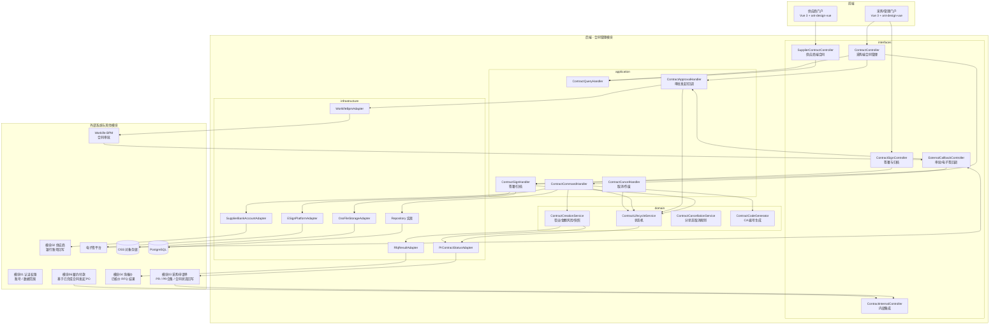
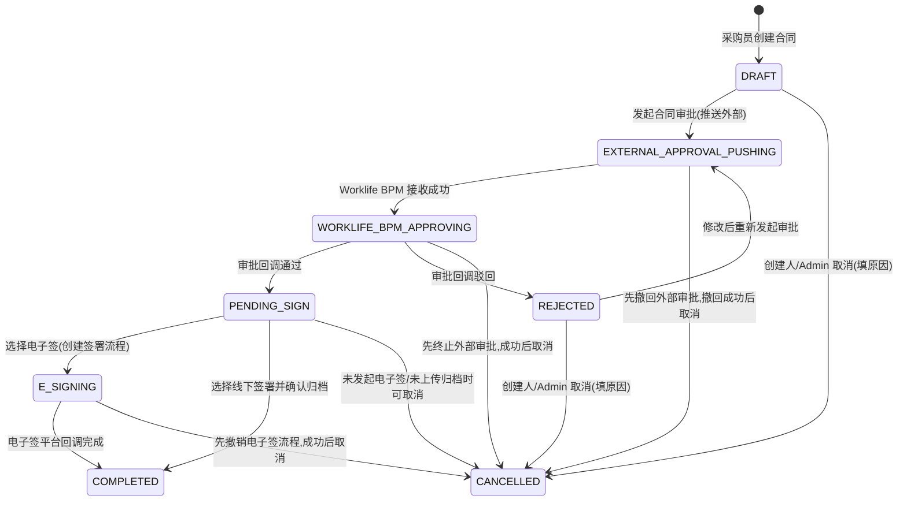
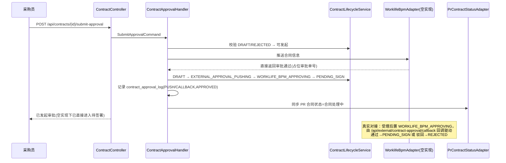
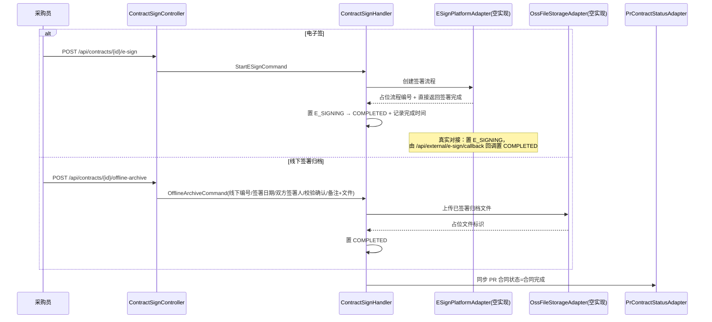
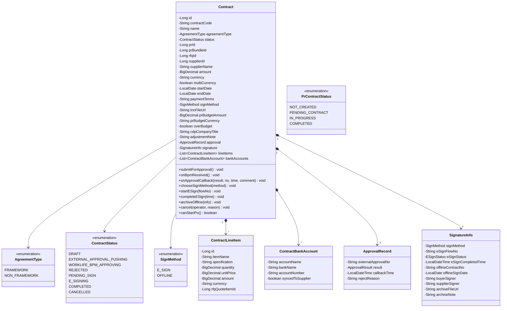

# 设计文档：合同管理模块

## Overview

概述

本模块负责采购合同的全生命周期管理，是「核价审批 → 合同 → PO/付款」链路的中枢。覆盖合同创建（基于 PR/PR 合集 + 已完成核价的 RFQ）、合同审批（对接 Worklife 系统 BPM 模块）、合同签署（电子签平台/线下归档）、合同列表与详情、供应商端合同查看、合同状态与 PR 的同步、以及合同取消与作废。支持框架合同（Framework）与非框架合同（Non-Framework）两种 Agreement Type。

本模块依赖模块 01（认证权限）的账号体系与数据范围、模块 03（采购申请单）的 PR/PR 合集、模块 04（询报价）已完成核价的 RFQ 结果；被模块 06（履约与付款）依赖（PO 基于已完成合同发起）。

核心设计决策：

- **状态机驱动生命周期**：合同有 8 个状态（合同草稿、外部审批推送中、Worklife BPM 审批中、审批驳回、待签署、电子签署中、合同完成、已取消），状态流转由 `ContractLifecycleService` 集中校验，非法流转抛出领域异常。
- **创建强约束「PR → RFQ → 合同」**：创建合同必须先选 PR/PR 合集，再选该 PR/PR 合集下已完成核价审批（或已完成代录报价归档）的 RFQ；不得跳过 RFQ 直接基于 PR 创建（Req 27.1、27.5）。供应商、报价明细、核价结果由所选 RFQ 自动带出（Req 27.2）。
- **快照隔离**：合同创建时保存 PR 预算金额/币种快照（Req 27.7）、中标明细快照（`contract_line_item`）、银行账号快照（`contract_bank_account`），用于金额风险提示与审计追溯，与上游单据后续变化解耦。
- **外部审批通过领域端口对接 + 当前空实现**：合同审批推送至 Worklife BPM（`ExternalApprovalPort`），保留回调入站接口与外部审批单号/回调时间/回调结果记录（Req 28.7）；当前 `WorklifeBpmAdapter` 为**空实现，推送后直接返回审批通过**，由发起审批同一请求内在进程内驱动状态走到「待签署」，不经真实人工审批与外部 HTTP 回调。撤回/终止审批也经同一端口（Req 47.2），空实现直接返回成功。
- **签署双通道**：审批通过后采购员二选一——电子签（`ESignPort` 创建签署流程，回调置「合同完成」）或线下归档（上传已签文件 + 手填线下信息，确认后置「合同完成」）。两通道的过程信息记录于合同（Req 29.6）。当前 `ESignPlatformAdapter` 为**空实现，创建签署流程后直接返回签署完成**。
- **PR 合同状态汇总**：合同状态变化通过 `PrContractStatusPort` 同步给模块 03，PR 合同状态字段（未创建/待建合同/合同处理中/合同完成）按汇总规则计算（Req 32.5），不写入 PR 主状态（遵循主文档「状态边界规则」）。
- **金额风险不阻断**：合同金额超 PR/PR 合集预算仅红色风险提醒不阻止提交（Req 27.6）；框架合同累计 PO 超框架金额仅在 PO 页提示不阻断（Req 27.9，由模块 06 落地）。
- **配置化必填/可编辑**：需求部门、采购合同号、开户行、账号、申请人、税率等字段的必填与可编辑规则配置化，默认「可带出则自动带出，未带出非必填且允许编辑」（Req 27.14）。
- **数据范围隔离**：合同创建人、采购经理/Admin、关联 PR 原始申请人、关联供应商各自按权限可见；普通采购员不得查看非本人负责且未授权的合同；供应商仅本企业合同（Req 30.4、31.3）。

> 外部依赖说明：本阶段 Worklife BPM、电子签平台、OSS 对象存储**全部采用空实现（stub）**——保留领域端口与适配器边界，便于后续替换为真实对接：
> - `WorklifeBpmAdapter`：推送审批后直接返回「审批通过」（BPM 直接审批通过），撤回/终止直接返回成功。
> - `ESignPlatformAdapter`：创建签署流程后直接返回「签署完成」，撤销直接返回成功。
> - `OssFileStorageAdapter`：上传返回占位对象标识，下载返回占位地址，不落真实对象存储。
>
> 因 BPM 直接审批通过、电子签直接完成，空实现下不会产生外部 HTTP 回调；适配器在进程内直接调用对应应用层处理（`ContractApprovalHandler` / `ContractSignHandler`）驱动状态流转。`/api/external/**` 回调接口仍按真实对接形态预留。

## Architecture

架构

### 系统架构图



### 合同状态机



说明：

- 状态枚举值 `DRAFT / EXTERNAL_APPROVAL_PUSHING / WORKLIFE_BPM_APPROVING / REJECTED / PENDING_SIGN / E_SIGNING / COMPLETED / CANCELLED`，对应中文「合同草稿/外部审批推送中/Worklife BPM 审批中/审批驳回/待签署/电子签署中/合同完成/已取消」。
- 需求 Req 32.3 提及的「Worklife BPM 审批通过」是回调通过的瞬时结果，本设计直接映射为 `PENDING_SIGN`，不单设持久状态；其在 PR 合同状态汇总中归入「合同处理中」。
- **当前空实现下 BPM 直接审批通过**：发起审批后状态在同一请求内连续经 `EXTERNAL_APPROVAL_PUSHING → WORKLIFE_BPM_APPROVING → PENDING_SIGN`，`REJECTED` 分支保留供真实对接使用，空实现不会触发；`E_SIGNING → COMPLETED` 同理由电子签空实现直接完成。
- `COMPLETED` 不允许直接取消，只能走线下作废/补充协议/冲销（Req 47.5），本系统不再提供取消入口。
- `CANCELLED` 后阻止基于该合同创建 PO（Req 47.7，由 `ContractInternalController` 对模块 06 暴露的校验保证）。

### 合同创建流程

```mermaid
sequenceDiagram
    participant B as 采购员
    participant FE as 采购门户
    participant CC as ContractController
    participant H as ContractCommandHandler
    participant Create as ContractCreationService
    participant RFQ as RfqResultAdapter
    participant Code as ContractCodeGenerator
    participant DB as PostgreSQL

    B->>FE: 选择 PR/PR合集 → 选择已核价 RFQ
    FE->>CC: GET /api/contracts/creatable-sources
    CC->>H: ListCreatableSourcesQuery
    H->>RFQ: 查询 PR 下已完成核价/已归档代录的 RFQ
    RFQ-->>H: 可选 RFQ 列表
    H-->>FE: 返回可选源
    B->>FE: 填写合同名称/类型/金额/币种/期限/付款条款/签署方式/TNC
    FE->>CC: POST /api/contracts
    CC->>H: CreateContractCommand
    H->>Create: 校验 RFQ 已核价 + 带出供应商/明细/核价结果
    Create->>RFQ: 拉取中标供应商与明细快照
    Create->>Create: 校验金额(超预算→风险标记; 与明细不一致→需调整说明)
    H->>Code: 生成合同编号(CA-YYYYMM-5位)
    Code-->>H: CA-202605-00001
    H->>DB: 保存 contract(DRAFT)+明细+银行快照+预算快照
    H-->>CC: 创建结果(合同ID, 编号)
    CC-->>FE: 201 Created
```

### 合同审批流程

> 当前 `WorklifeBpmAdapter` 为空实现：推送后直接返回审批通过，状态在同一请求内连续流转至「待签署」。下图括注为真实对接时的形态。



### 合同签署与归档流程

> 当前 `ESignPlatformAdapter` 为空实现：创建签署流程后直接返回签署完成；`OssFileStorageAdapter` 上传返回占位对象标识。



### 跨模块集成

本模块通过领域端口（domain/port）与基础设施适配器（infrastructure/external）与其他模块和外部系统集成，保持领域层无框架/无跨模块直接依赖：

- **模块 03（采购申请单）**：
  - 入站：创建合同时按 PR/PR 合集拉取预算金额/币种、业务成本类标识与 CDP 公司抬头（Req 27.7、27.15）。
  - 出站 `PrContractStatusPort`：合同状态变化时回写关联 PR 的合同状态，按汇总规则计算（Req 32）。
- **模块 04（询报价）— 入站 `RfqResultPort`**：查询 PR/PR 合集下已完成核价审批（或已完成代录报价归档）的 RFQ，并带出中标供应商、报价明细、核价结果（Req 27.1、27.2、27.5）。
- **模块 02（供应商）— 出站 `SupplierBankAccountPort`**：采购员在合同中手填新银行账号且选择同步时，校验重复后写回供应商银行账号列表（Req 27.10）。
- **模块 06（履约付款）— 出站集成**：通过 `ContractInternalController` 暴露「合同是否可发起 PO」校验（已完成且未取消），并提供已完成合同详情（Req 47.7、依赖关系）。
- **Worklife BPM（外部审批）— `ExternalApprovalPort`**：推送合同审批、撤回/终止审批；回调经 `ExternalCallbackController` 入站（Req 28、47.2）。**当前空实现：推送直接返回审批通过，撤回/终止直接返回成功。**
- **电子签平台 — `ESignPort`**：创建/撤销签署流程；签署完成回调入站（Req 29.3、29.4、47.4）。**当前空实现：创建直接返回签署完成，撤销直接返回成功。**
- **OSS 对象存储 — `FileStoragePort`**：TNC 附件、归档文件上传/下载，库内仅存对象标识（Req 27.3、29.5、29.7）。**当前空实现：上传返回占位对象标识，下载返回占位地址。**

## Components and Interfaces

组件与接口

### 后端模块结构

```
src/main/java/com/cdp/ecosaas/procurement/contract/
├── domain/
│   ├── model/
│   │   ├── Contract.java                    # 合同聚合根
│   │   ├── ContractLineItem.java            # 合同明细行(中标明细快照)
│   │   ├── ContractBankAccount.java         # 合同银行账号快照
│   │   ├── ApprovalRecord.java              # 外部审批记录值对象
│   │   ├── SignatureInfo.java               # 签署信息值对象(电子签/线下)
│   │   ├── ContractStatus.java              # 合同状态枚举
│   │   ├── AgreementType.java               # 框架/非框架枚举
│   │   ├── SignMethod.java                  # 电子签/线下枚举
│   │   ├── ApprovalResult.java              # 审批回调结果枚举
│   │   ├── ESignStatus.java                 # 电子签状态枚举
│   │   └── PrContractStatus.java            # PR 合同状态枚举(汇总用)
│   ├── service/
│   │   ├── ContractLifecycleService.java    # 状态机：合法流转校验与转换
│   │   ├── ContractCreationService.java     # 带出/金额风险/快照构建
│   │   ├── ContractCancellationService.java # 分状态取消规则(Req 47)
│   │   └── ContractCodeGenerator.java       # CA-YYYYMM-5位编号生成
│   ├── repository/
│   │   └── ContractRepository.java
│   ├── port/
│   │   ├── ExternalApprovalPort.java        # Worklife BPM：推送/撤回/终止
│   │   ├── ESignPort.java                   # 电子签：创建/撤销签署流程
│   │   ├── FileStoragePort.java             # OSS：TNC/归档文件上传下载
│   │   ├── RfqResultPort.java               # 模块04：已核价 RFQ 结果
│   │   ├── PrContractStatusPort.java        # 模块03：PR 合同状态回写
│   │   └── SupplierBankAccountPort.java     # 模块02：银行账号回写
│   └── event/
│       ├── ContractCreatedEvent.java
│       ├── ContractApprovalSubmittedEvent.java
│       ├── ContractCompletedEvent.java
│       └── ContractCancelledEvent.java
│
├── application/
│   ├── command/
│   │   ├── CreateContractCommand.java
│   │   ├── UpdateContractDraftCommand.java      # 草稿/驳回后修改
│   │   ├── SubmitApprovalCommand.java
│   │   ├── HandleApprovalCallbackCommand.java   # 外部审批回调
│   │   ├── ChooseSignMethodCommand.java
│   │   ├── StartESignCommand.java
│   │   ├── HandleESignCallbackCommand.java      # 电子签回调
│   │   ├── OfflineArchiveCommand.java
│   │   └── CancelContractCommand.java
│   ├── query/
│   │   ├── ContractListQuery.java
│   │   ├── ContractDetailQuery.java
│   │   ├── SupplierContractListQuery.java
│   │   ├── CreatableSourcesQuery.java           # 可选 PR/RFQ
│   │   └── PrContractStatusQuery.java           # 供模块03汇总查询
│   ├── handler/
│   │   ├── ContractCommandHandler.java          # 创建/编辑
│   │   ├── ContractQueryHandler.java
│   │   ├── ContractApprovalHandler.java         # 发起/回调
│   │   ├── ContractSignHandler.java             # 电子签/线下归档/回调
│   │   └── ContractCancelHandler.java
│   └── service/
│       └── ContractAccessService.java           # 数据范围：按角色/创建人/PR申请人/供应商过滤
│
├── infrastructure/
│   ├── persistence/
│   │   ├── entity/
│   │   │   ├── ContractEntity.java
│   │   │   ├── ContractLineItemEntity.java
│   │   │   ├── ContractBankAccountEntity.java
│   │   │   ├── ContractApprovalLogEntity.java
│   │   │   └── ContractOperationLogEntity.java
│   │   ├── repository/
│   │   │   └── JpaContractRepository.java + ContractJpaDao.java
│   │   └── mapper/
│   │       └── ContractMapper.java
│   ├── external/
│   │   ├── WorklifeBpmAdapter.java          # ExternalApprovalPort 空实现(直接审批通过)
│   │   ├── ESignPlatformAdapter.java        # ESignPort 空实现(直接签署完成)
│   │   ├── OssFileStorageAdapter.java       # FileStoragePort 空实现(占位对象标识)
│   │   ├── RfqResultAdapter.java            # 调模块04
│   │   ├── PrContractStatusAdapter.java     # 调模块03
│   │   └── SupplierBankAccountAdapter.java  # 调模块02
│   └── config/
│       ├── ContractModuleConfig.java
│       └── ExternalApprovalProperties.java  # BPM/电子签端点配置
│
├── interfaces/
│   ├── rest/
│   │   ├── ContractController.java          # 采购端：创建/列表/详情/编辑/发起审批/取消
│   │   ├── ContractSignController.java      # 采购端：选择签署方式/电子签/线下归档
│   │   ├── SupplierContractController.java  # 供应商端：合同列表/详情
│   │   ├── ExternalCallbackController.java  # 审批/电子签回调入站
│   │   └── ContractInternalController.java  # 内部集成(模块03/06)
│   └── dto/
│       ├── CreateContractRequest.java / Response.java
│       ├── ContractListResponse.java / ContractDetailResponse.java
│       ├── CreatableSourceResponse.java
│       ├── SubmitApprovalRequest.java
│       ├── ApprovalCallbackRequest.java
│       ├── SignMethodRequest.java / ESignResponse.java
│       ├── OfflineArchiveRequest.java
│       ├── CancelContractRequest.java
│       └── ESignCallbackRequest.java
│
└── shared/
    ├── constants/
    │   └── ContractConstants.java           # 编号前缀、文件白名单、状态提示文案
    └── exception/
        ├── ContractErrorCode.java
        ├── ContractNotFoundException.java
        ├── InvalidContractStatusException.java
        ├── RfqNotPriceReviewedException.java   # RFQ 未完成核价
        └── ContractCancellationNotAllowedException.java
```

复用模块根 `shared/` 跨模块代码：`shared/model/PageQuery`、`PageResult`（分页），`shared/util/SecurityUtils`（当前用户），`shared/exception/BusinessException`、`ResourceNotFoundException`、`ForbiddenException`、`GlobalExceptionHandler`。新增的 `messageCode`（如 `INVALID_CONTRACT_STATUS`、`RFQ_NOT_PRICE_REVIEWED`、`CONTRACT_CANCELLATION_NOT_ALLOWED`）需在 `GlobalExceptionHandler.resolveHttpStatus` 的 `switch` 中登记对应 HTTP 状态（否则默认 400）。

### 前端模块结构

```
src/modules/contract/
├── application/
│   ├── create-contract.usecase.ts          # 选源+带出+创建
│   ├── manage-contracts.usecase.ts         # 列表/搜索/详情
│   ├── submit-approval.usecase.ts          # 发起审批/驳回后修改重提
│   ├── sign-contract.usecase.ts            # 选择签署方式/电子签/线下归档
│   ├── cancel-contract.usecase.ts
│   └── supplier-contracts.usecase.ts       # 供应商端列表/详情
├── domain/
│   ├── entities/
│   │   └── contract.entity.ts
│   ├── value-objects/
│   │   └── contract-status.vo.ts
│   └── rules/
│       └── amount-risk.rule.ts             # 超预算/与明细不一致校验
├── infrastructure/
│   ├── services/
│   │   ├── contract.service.ts
│   │   └── supplier-contract.service.ts
│   └── adapters/
│       └── oss-upload.adapter.ts           # TNC/归档文件上传
├── presentation/
│   ├── views/
│   │   ├── ContractListView.vue            # 采购端：合同列表
│   │   ├── ContractCreateView.vue          # 采购端：创建合同(选源→带出→填写)
│   │   ├── ContractDetailView.vue          # 采购端：详情(信息/外部流程/明细/操作记录Tab)
│   │   ├── SupplierContractListView.vue    # 供应商端：合同列表
│   │   └── SupplierContractDetailView.vue  # 供应商端：合同详情
│   ├── components/
│   │   ├── ContractSourceSelector.vue      # PR/PR合集 + RFQ 选择
│   │   ├── ContractBasicForm.vue
│   │   ├── ContractLineItemTable.vue
│   │   ├── BankAccountSnapshotForm.vue     # 含「同步到供应商」选项
│   │   ├── SignMethodDialog.vue            # 电子签/线下归档
│   │   ├── OfflineArchiveDialog.vue
│   │   ├── CancelContractDialog.vue
│   │   ├── ContractStatusTag.vue           # 含状态「?」悬停提示
│   │   └── AmountRiskAlert.vue             # 超预算红色提醒
│   ├── composables/
│   │   ├── useContractForm.ts
│   │   ├── useContractStatus.ts
│   │   └── useAmountRisk.ts
│   ├── stores/
│   │   └── contract.store.ts
│   └── routes/
│       └── contract.routes.ts
└── types/
    ├── dto/
    │   ├── contract.dto.ts
    │   └── sign.dto.ts
    ├── vo/
    │   └── contract-info.vo.ts
    └── command/
        ├── create-contract.command.ts
        └── sign-contract.command.ts
```

### REST API 设计

#### 采购端接口（采购/管理门户，JWT + BUYER/ADMIN，按数据范围）

| 方法 | 路径 | 说明 | 需求 |
|------|------|------|------|
| GET | `/api/contracts/creatable-sources` | 可选 PR/PR合集及其下已完成核价的 RFQ | 27.1, 27.5 |
| POST | `/api/contracts` | 创建合同（带出供应商/明细/核价，生成编号，DRAFT）| 27 |
| GET | `/api/contracts` | 合同列表（按编号/PR号/RFQ号/供应商/状态筛选）| 30.1, 30.2 |
| GET | `/api/contracts/{id}` | 合同详情（基本信息/外部流程状态/明细/操作记录）| 30.3, 30.7 |
| PUT | `/api/contracts/{id}` | 编辑草稿 / 驳回后修改 | 28.6 |
| POST | `/api/contracts/{id}/submit-approval` | 发起合同审批（推送 Worklife BPM）| 28.1-28.3 |
| POST | `/api/contracts/{id}/cancel` | 取消合同（按状态规则，填原因）| 47 |
| GET | `/api/contracts/{id}/archive-file` | 查看/下载归档文件 | 29.7 |

#### 签署接口（采购/管理门户，JWT + BUYER/ADMIN）

| 方法 | 路径 | 说明 | 需求 |
|------|------|------|------|
| POST | `/api/contracts/{id}/sign-method` | 选择签署方式（电子签/线下）| 29.2 |
| POST | `/api/contracts/{id}/e-sign` | 发起电子签（创建签署流程→E_SIGNING）| 29.3 |
| POST | `/api/contracts/{id}/offline-archive` | 线下归档（上传已签文件+线下信息→COMPLETED）| 29.5, 29.6 |

#### 供应商端接口（供应商门户，JWT + SUPPLIER，数据范围=本企业）

| 方法 | 路径 | 说明 | 需求 |
|------|------|------|------|
| GET | `/api/supplier/contracts` | 本企业合同列表（区分待签署/签署中/已签署/完成）| 31.1, 31.2, 31.3 |
| GET | `/api/supplier/contracts/{id}` | 合同详情（电子签入口/链接状态、线下归档结果与可下载文件）| 31.4, 31.5 |

#### 外部回调接口（外部系统入站，签名校验，无 JWT）

| 方法 | 路径 | 说明 | 需求 |
|------|------|------|------|
| POST | `/api/external/contract-approval/callback` | Worklife BPM 审批回调（通过/驳回，单号/时间/意见）| 28.5, 28.6, 28.7 |
| POST | `/api/external/e-sign/callback` | 电子签平台签署完成回调 | 29.4 |

#### 内部集成接口（供其他模块）

| 方法 | 路径 | 说明 | 需求 |
|------|------|------|------|
| GET | `/api/internal/contracts/pr-status?prIds=` | 按 PR 返回汇总合同状态（供模块03 PR 列表展示）| 32 |
| GET | `/api/internal/contracts/{id}/po-eligibility` | 合同是否可发起 PO（已完成且未取消）| 47.7 |

### 接口契约对齐说明

- 创建合同接口入参不接受前端直传供应商/明细/核价金额，统一由 `ContractCreationService` 依据所选 RFQ 后端带出，前端仅提交合同名称、Agreement Type、金额、币种、起止日期、付款条款、签署方式、TNC、（手填）银行账号与同步选项、调整说明等可填字段（Req 27.2、27.3）。
- 列表/详情响应中的 PR 合同状态由内部集成实时汇总，不在合同表内冗余存储 PR 主状态（遵循「状态边界规则」）。

## Data Models

数据模型

### 数据库表设计（PostgreSQL 16）

#### 合同表 `contract`

```sql
CREATE TABLE contract (
    id                      BIGSERIAL PRIMARY KEY,
    contract_code           VARCHAR(20) NOT NULL,              -- 合同申请编号(CA-YYYYMM-5位自增)
    name                    VARCHAR(128) NOT NULL,             -- 合同名称
    agreement_type          VARCHAR(20) NOT NULL,             -- FRAMEWORK/NON_FRAMEWORK
    status                  VARCHAR(32) NOT NULL DEFAULT 'DRAFT', -- 状态机
    pr_id                   BIGINT,                            -- 关联 PR(与 pr_bundle_id 二选一)
    pr_bundle_id            BIGINT,                            -- 关联 PR 合集
    rfq_id                  BIGINT NOT NULL,                   -- 关联已核价 RFQ
    supplier_id             BIGINT NOT NULL,                   -- 中标供应商(带出)
    supplier_name           VARCHAR(128) NOT NULL,             -- 供应商名称(快照)
    amount                  NUMERIC(18,2) NOT NULL,            -- 合同金额
    currency                VARCHAR(8) NOT NULL,               -- 合同主币种
    multi_currency          BOOLEAN NOT NULL DEFAULT FALSE,    -- 是否单合同多币种(强提示)
    start_date              DATE,                              -- 合同开始日期
    end_date                DATE,                              -- 合同结束日期
    payment_terms           VARCHAR(512),                      -- 付款条款
    sign_method             VARCHAR(16),                       -- E_SIGN/OFFLINE(选择后写入)
    tnc_file_url            VARCHAR(512),                      -- TNC 附件对象标识
    pr_budget_amount        NUMERIC(18,2),                     -- PR 预算金额快照(Req 27.7)
    pr_budget_currency      VARCHAR(8),                        -- PR 预算币种快照
    over_budget             BOOLEAN NOT NULL DEFAULT FALSE,    -- 金额超预算风险标记(Req 27.6)
    cdp_company_title       VARCHAR(128),                      -- 业务成本类带出的 CDP 公司抬头(Req 27.15)
    adjustment_note         VARCHAR(512),                      -- 金额与中标明细不一致说明(Req 27.11)
    -- 外部审批当前态缓存
    external_approval_no    VARCHAR(64),                       -- 外部审批单号
    approval_callback_time  TIMESTAMP(3),                      -- 回调时间
    approval_result         VARCHAR(16),                       -- APPROVED/REJECTED
    reject_reason           VARCHAR(512),                      -- 驳回原因
    -- 签署当前态缓存
    e_sign_flow_no          VARCHAR(64),                       -- 电子签流程编号
    e_sign_status           VARCHAR(32),                       -- 电子签状态
    e_sign_completed_time   TIMESTAMP(3),                      -- 电子签完成时间
    offline_contract_no     VARCHAR(64),                       -- 线下合同编号
    offline_sign_date       DATE,                              -- 线下签署完成日期
    buyer_signer            VARCHAR(64),                       -- 采购方签署人
    supplier_signer         VARCHAR(64),                       -- 供应商签署人
    archive_file_url        VARCHAR(512),                      -- 归档文件对象标识
    archive_note            VARCHAR(512),                      -- 归档备注
    -- 取消
    cancel_reason           VARCHAR(512),                      -- 取消原因(Req 47)
    cancelled_by            VARCHAR(64),
    cancelled_at            TIMESTAMP(3),
    created_at              TIMESTAMP(3) NOT NULL,
    updated_at              TIMESTAMP(3) NOT NULL,
    created_by              VARCHAR(64),                       -- 合同创建人(数据范围)
    updated_by              VARCHAR(64),
    version                 INT NOT NULL DEFAULT 0             -- 乐观锁
);

CREATE UNIQUE INDEX uk_contract_code ON contract (contract_code);
CREATE INDEX idx_contract_pr ON contract (pr_id);
CREATE INDEX idx_contract_bundle ON contract (pr_bundle_id);
CREATE INDEX idx_contract_rfq ON contract (rfq_id);
CREATE INDEX idx_contract_supplier ON contract (supplier_id);
CREATE INDEX idx_contract_status ON contract (status);

COMMENT ON TABLE contract IS '采购合同表';
```

#### 合同明细行表 `contract_line_item`

```sql
CREATE TABLE contract_line_item (
    id                  BIGSERIAL PRIMARY KEY,
    contract_id         BIGINT NOT NULL,                       -- 所属合同
    item_name           VARCHAR(255) NOT NULL,                 -- 项目/物料名称
    specification       VARCHAR(255),                          -- 规格
    quantity            NUMERIC(18,4),                         -- 数量
    unit_price          NUMERIC(18,2),                         -- 单价(核价结果)
    amount              NUMERIC(18,2),                         -- 行金额
    currency            VARCHAR(8) NOT NULL,                   -- 行项目币种(Req 27.12)
    rfq_quote_item_id   BIGINT,                                -- 来源 RFQ 中标明细ID(快照溯源)
    created_at          TIMESTAMP(3) NOT NULL
);

CREATE INDEX idx_line_item_contract ON contract_line_item (contract_id);

COMMENT ON TABLE contract_line_item IS '合同明细行(中标明细快照)';
```

#### 合同银行账号快照表 `contract_bank_account`

```sql
CREATE TABLE contract_bank_account (
    id                  BIGSERIAL PRIMARY KEY,
    contract_id         BIGINT NOT NULL,                       -- 所属合同
    account_name        VARCHAR(128) NOT NULL,                 -- 户名
    bank_name           VARCHAR(128) NOT NULL,                 -- 开户银行名称
    account_number      VARCHAR(64) NOT NULL,                  -- 银行账号
    synced_to_supplier  BOOLEAN NOT NULL DEFAULT FALSE,        -- 是否回写供应商银行列表(Req 27.10)
    created_at          TIMESTAMP(3) NOT NULL
);

CREATE INDEX idx_contract_bank_contract ON contract_bank_account (contract_id);

COMMENT ON TABLE contract_bank_account IS '合同银行账号快照表';
```

#### 合同审批日志表 `contract_approval_log`

```sql
CREATE TABLE contract_approval_log (
    id                  BIGSERIAL PRIMARY KEY,
    contract_id         BIGINT NOT NULL,                       -- 所属合同
    external_approval_no VARCHAR(64),                          -- 外部审批单号
    event_type          VARCHAR(32) NOT NULL,                  -- PUSH/BPM_RECEIVED/CALLBACK
    result              VARCHAR(16),                           -- APPROVED/REJECTED(回调时)
    comment             VARCHAR(512),                          -- 审批意见/驳回原因
    occurred_at         TIMESTAMP(3) NOT NULL,                 -- 事件发生时间
    created_at          TIMESTAMP(3) NOT NULL
);

CREATE INDEX idx_approval_log_contract ON contract_approval_log (contract_id);

COMMENT ON TABLE contract_approval_log IS '合同外部审批日志表(Req 28.7)';
```

#### 合同操作记录表 `contract_operation_log`

```sql
CREATE TABLE contract_operation_log (
    id              BIGSERIAL PRIMARY KEY,
    contract_id     BIGINT NOT NULL,                           -- 所属合同
    operation       VARCHAR(48) NOT NULL,                      -- CREATE/SUBMIT_APPROVAL/CHOOSE_SIGN/E_SIGN/OFFLINE_ARCHIVE/CANCEL...
    operator_id     BIGINT,                                    -- 操作人(系统操作为 NULL)
    operator_name   VARCHAR(64),
    detail          VARCHAR(512),                              -- 操作详情
    created_at      TIMESTAMP(3) NOT NULL
);

CREATE INDEX idx_operation_log_contract ON contract_operation_log (contract_id);

COMMENT ON TABLE contract_operation_log IS '合同操作记录表(Req 30.3)';
```

### 领域模型



### 枚举定义

- `ContractStatus`：`DRAFT`(合同草稿)、`EXTERNAL_APPROVAL_PUSHING`(外部审批推送中)、`WORKLIFE_BPM_APPROVING`(Worklife BPM 审批中)、`REJECTED`(审批驳回)、`PENDING_SIGN`(待签署)、`E_SIGNING`(电子签署中)、`COMPLETED`(合同完成)、`CANCELLED`(已取消)
- `AgreementType`：`FRAMEWORK`(框架合同)、`NON_FRAMEWORK`(非框架合同)
- `SignMethod`：`E_SIGN`(电子签)、`OFFLINE`(线下签署归档)
- `ApprovalResult`：`APPROVED`(通过)、`REJECTED`(驳回)
- `ESignStatus`：`CREATED`(已创建)、`SIGNING`(签署中)、`COMPLETED`(已完成)、`CANCELLED`(已撤销)
- `PrContractStatus`（汇总派生，回写模块03，不在本模块落库）：`NOT_CREATED`(未创建)、`PENDING_CONTRACT`(待建合同)、`IN_PROGRESS`(合同处理中)、`COMPLETED`(合同完成)

### PR 合同状态汇总规则（Req 32）

`PrContractStatusPort` 在合同状态变化时回写关联 PR 的合同状态，由 `ContractQueryHandler` 按以下规则计算（Req 32.5）：

- RFQ 核价审批通过但尚未创建合同 → `PENDING_CONTRACT`(待建合同)（Req 32.2）。
- 合同处于 `DRAFT / EXTERNAL_APPROVAL_PUSHING / WORKLIFE_BPM_APPROVING / PENDING_SIGN / E_SIGNING` 任一 → `IN_PROGRESS`(合同处理中)（Req 32.3）。
- 一个 PR 关联多个合同时：存在任一未完成（非 `COMPLETED` 且非 `CANCELLED`）的有效合同 → `IN_PROGRESS`；全部有效合同 `COMPLETED` → `COMPLETED`（Req 32.4、32.5）。
- `CANCELLED` 合同不参与汇总；PR 主状态仍由模块 03 按所有有效 RFQ/合同完成条件独立计算，本字段不写入 PR 主状态。
- 合同管理列表不展示「待建合同」虚拟记录，待建合同仅作为 PR/RFQ 的状态提示（Req 30.5）。

### 合同取消与作废规则（Req 47）

`ContractCancellationService` 按当前状态裁决是否可取消及前置动作，违规抛 `ContractCancellationNotAllowedException`：

| 当前状态 | 可取消方 | 前置动作 | 取消后 |
|----------|----------|----------|--------|
| `DRAFT` / `REJECTED` | 创建人 / 采购经理(Admin) | 填取消原因 | `CANCELLED`（Req 47.1） |
| `EXTERNAL_APPROVAL_PUSHING` | — | 必须先撤回外部审批 | 撤回成功后 `CANCELLED`（Req 47.2） |
| `WORKLIFE_BPM_APPROVING` | — | 必须先终止外部审批 | 终止成功后 `CANCELLED`（Req 47.2） |
| `PENDING_SIGN` | 创建人 / 采购经理(Admin) | 仅当未发起电子签且未上传线下归档 | `CANCELLED`（Req 47.3） |
| `E_SIGNING` | — | 必须先调电子签平台撤销流程 | 撤销成功后 `CANCELLED`（Req 47.4） |
| `COMPLETED` | 不允许 | 走线下作废/补充协议/冲销 | —（Req 47.5） |

- PR 取消/关闭联动合同时，仅将符合可取消条件的合同置 `CANCELLED`；存在不可取消合同时在确认弹窗提示原因并阻止 PR 直接取消（Req 47.6），由模块 03 调用 `/api/internal/contracts/po-eligibility` 同类内部校验判断。
- `CANCELLED` 合同阻止基于其创建 PO（Req 47.7）。

### 文件存储（OSS）

- TNC 附件（Req 27.3、27.13）、线下归档文件（Req 29.5、29.7）经 `FileStoragePort` 上传至 OSS，库内 `tnc_file_url` / `archive_file_url` 存对象标识，下载时由 `OssFileStorageAdapter` 生成临时访问地址。
- 上传校验在应用层基于内容类型与扩展名双重校验，仅允许 PDF/常见文档与图片格式，拒绝可执行/脚本/含宏等高风险格式（复用模块 02 文件白名单约定）。

### 数据范围与权限

- `ContractAccessService` 依据当前用户角色裁剪数据：`ADMIN`(采购经理) 全量；`BUYER` 仅本人创建或被授权的合同（`created_by` + 关联 PR 负责采购员）；`BUSINESS_USER` 仅作为关联 PR 原始申请人时可见；`SUPPLIER` 仅 `supplier_id` = 本企业的合同（Req 30.4、31.3）。
- 接口层权限沿用模块 01 的 Spring Security 配置：`/api/supplier/**` 限 SUPPLIER，`/api/contracts/**` 与 `/api/contracts/{id}/...` 限 BUYER/ADMIN，`/api/external/**` 与 `/api/internal/**` 按外部签名校验或内部调用约定放行（不走用户 JWT）。
- 合同详情页在当前状态后提供「?」辅助提示，悬停展示外部审批/电子签/线下签署状态含义，不用大块规则说明占页（Req 30.6）。
