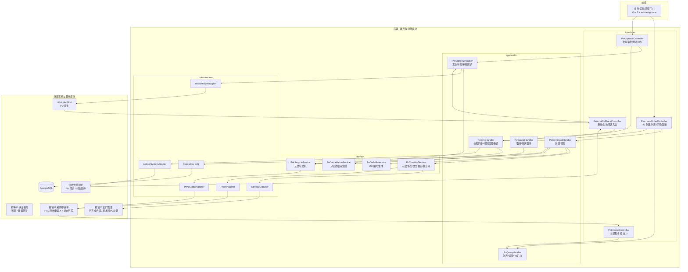
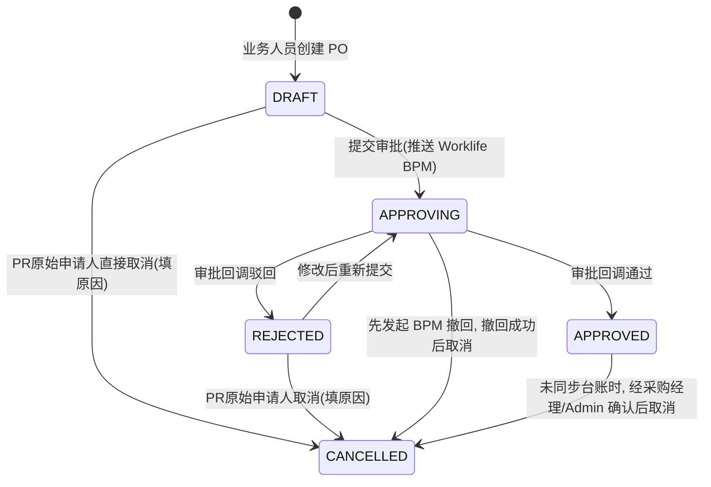
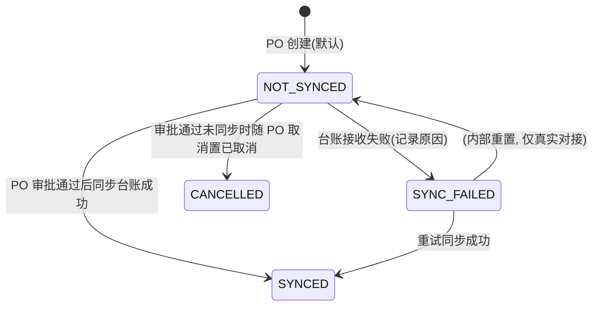
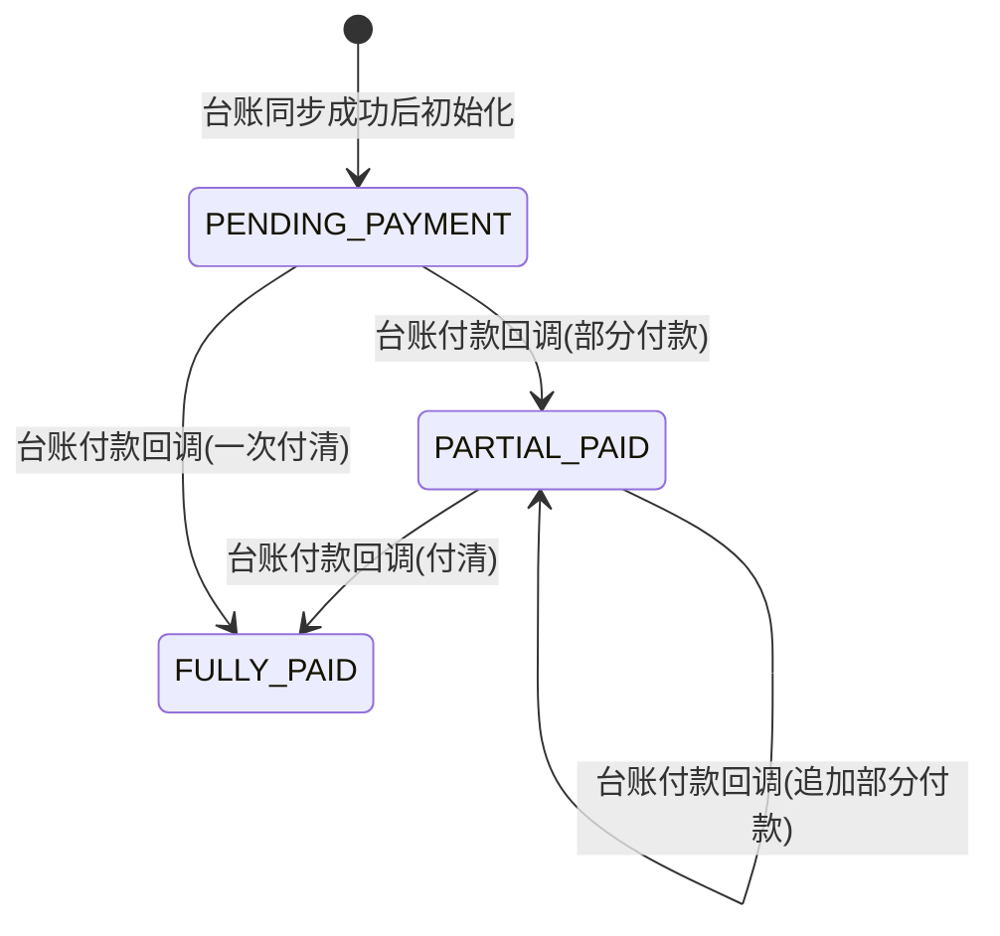
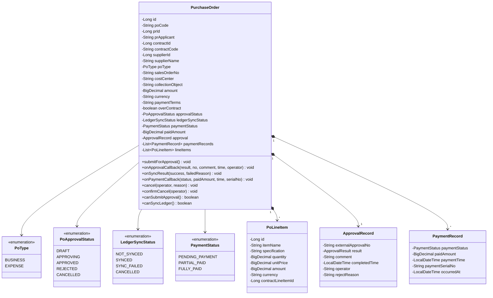

# 设计文档：履约与付款模块

## Overview

概述

本模块负责采购订单（PO）的全生命周期管理，是「合同完成 → PO → 台账同步 → 付款回传」链路的末端中枢。覆盖业务人员基于已完成合同发起 PO、PO 审批（对接 Worklife 系统 BPM 模块）、PO 同步至台账管理系统、付款结果回传、PO 列表与详情追踪、以及按状态的 PO 取消/撤回。支持一份合同/PR 拆分多个 PO，区分费用类 PO（关联成本中心）和业务类 PO（关联销售订单）。

本模块依赖模块 01（认证权限）的账号体系与数据范围、模块 03（采购申请单）的 PR/PR 原始申请人、模块 05（合同管理）已完成（COMPLETED 且未取消）的合同；是采购全链路的终点，不被其他业务模块依赖。

核心设计决策：

- **三类状态完全独立**：PO 审批状态（PO草稿/审批中/审批驳回/审批通过/已取消）、台账同步状态（未同步/已同步/同步失败/已取消）、付款状态（待付款/部分付款/已付款）三套状态各自独立存储、独立流转、独立展示，**不得混用**（Req 33.10、35.3）。由 `PoLifecycleService` 集中校验三套状态的合法流转。
- **创建强约束「合同完成 + PR 原始申请人」**：仅当关联合同状态为 COMPLETED（未取消）时，且仅该 PR 的原始申请人，可基于该合同发起 PO；其他业务人员不可发起（Req 33.1）。合同可发起性经模块 05 内部接口 `/api/internal/contracts/{id}/po-eligibility` 校验。
- **带出 + 拆分**：创建 PO 自动带入 PR 信息、合同信息、中标供应商、最终中标价与付款条款（Req 33.2）；一份 PR/合同可拆分多个 PO，每个 PO 维护拆分金额与归集对象（Req 33.3）。
- **快照隔离**：PO 创建时保存 PR 申请人、合同编号、供应商、成本中心/销售订单、中标明细快照（`po_line_item`），用于审批、台账同步与审计追溯，与上游单据后续变化解耦（Req 33.11）。
- **审批统一推送 BPM，风险由 BPM 裁决**：所有 PO 统一推送 Worklife BPM 审批（Req 52.1）；PO 内容在合同约定范围内为低风险（BPM 快速/自动审批），超合同范围为高风险（BPM 高风险规则）。采购系统不自行决定审批强度，仅在**提交前提示超合同风险**（`over_contract` 标记）并接收审批结果（Req 52.2、52.3）。
- **台账系统为付款唯一可信来源**：PO 审批通过后才同步台账（审批中/驳回/撤回不得同步，Req 52.4、35.5）；台账接收成功 → 台账同步状态=已同步、付款状态=待付款；台账付款节点变化经回调回传，更新付款状态/已付款金额/付款时间/付款流水号，台账回传是付款状态与金额的**唯一可信来源**（Req 34.6）。
- **付款状态回写 PR**：付款状态、PO 审批/同步状态经 `PrPoStatusPort` 回写模块 03，供 PR 列表与 PR 详情「PO与付款」Tab 汇总展示（Req 33.10、34.7、35.4）。
- **分状态取消**：按 PO 审批状态与台账同步/付款状态裁决取消规则——草稿直接取消、驳回取消或重提、审批中走 BPM 撤回、审批通过未同步需采购经理/Admin 确认、已同步只能台账作废/冲销、已付款不可取消（Req 48）。由 `PoCancellationService` 集中裁决。
- **数据范围隔离**：PO 创建业务人员（PR 原始申请人）、负责采购员、采购经理/Admin 各自按权限可见；普通业务人员仅本人发起的 PO，采购经理/Admin 全量（Req 35）。

> 外部依赖说明：本阶段 Worklife BPM、台账管理系统**全部采用空实现（stub）**——保留领域端口与适配器边界，便于后续替换为真实对接：
> - `WorklifeBpmAdapter`（`ExternalApprovalPort`）：推送 PO 审批后直接返回「审批通过」（占位审批单号），撤回直接返回成功。
> - `LedgerSystemAdapter`（`LedgerSyncPort`）：PO 审批通过后调用同步直接返回「接收成功」，台账同步状态置「已同步」、付款状态置「待付款」；**付款回传不自动推进**——付款状态停留在「待付款」，`/api/external/ledger/payment/callback` 回调接口按真实对接形态预留，待真实台账接入后由其回调驱动付款状态推进。
>
> 因 BPM 直接审批通过、台账同步直接成功，空实现下不会产生外部 HTTP 回调；适配器在进程内直接调用对应应用层处理（`PoApprovalHandler` / `PoSyncHandler`）驱动状态流转。`/api/external/**` 回调接口仍按真实对接形态预留（含签名校验）。
>
> 跨模块依赖：模块 03（PR）、模块 05（合同）尚未实现，其适配器（`PrInfoAdapter`、`PrPoStatusAdapter`、`ContractAdapter`）本阶段先以桩/占位实现，待对应模块就绪后联调。

## Architecture

架构

### 系统架构图



### PO 审批状态机（独立流转）



说明：

- PO 审批状态枚举 `DRAFT / APPROVING / APPROVED / REJECTED / CANCELLED`，对应中文「PO草稿/审批中/审批通过/审批驳回/已取消」。
- **当前空实现下 BPM 直接审批通过**：提交审批后状态在同一请求内 `DRAFT → APPROVING → APPROVED`，并触发台账同步；`REJECTED` 分支保留供真实对接使用，空实现不会触发。
- `APPROVED` 取消仅在**尚未同步台账**时允许（台账同步状态=NOT_SYNCED），需采购经理/Admin 确认，确认后同时将台账同步状态置 `CANCELLED`（Req 48.4）。空实现下审批通过即同步成功，故该分支真实对接时才会出现。
- `APPROVED` 且已同步台账后不允许在采购系统取消，只能走台账作废/冲销（Req 48.5）；已付款后不允许取消（Req 48.6）。

### 台账同步状态机（独立流转）



说明：台账同步状态枚举 `NOT_SYNCED / SYNCED / SYNC_FAILED / CANCELLED`，对应中文「未同步/已同步/同步失败/已取消」。仅 PO 审批通过后才允许由 `NOT_SYNCED` 进入同步（Req 35.5、52.4）；同步成功后付款状态初始化为 `PENDING_PAYMENT`（Req 34.3）。**空实现下同步直接成功**，`SYNC_FAILED` 与重试分支保留供真实对接，并由 `POST /api/purchase-orders/{id}/retry-sync` 触发重试（Req 34.4）。

### 付款状态机（独立流转）



说明：付款状态枚举 `PENDING_PAYMENT / PARTIAL_PAID / FULLY_PAID`，对应中文「待付款/部分付款/已付款」。付款状态、已付款金额、付款时间、付款流水号**仅由台账系统回调回传更新**，采购系统不主动修改（Req 34.5、34.6）。**空实现下付款回传不自动推进**——付款状态停留在 `PENDING_PAYMENT`，待真实台账接入后由 `/api/external/ledger/payment/callback` 回调驱动。

### PO 创建流程

```mermaid
sequenceDiagram
    participant U as 业务人员(PR原始申请人)
    participant FE as 业务门户
    participant PC as PurchaseOrderController
    participant H as PoCommandHandler
    participant Create as PoCreationService
    participant CON as ContractAdapter(模块05)
    participant Code as PoCodeGenerator
    participant DB as PostgreSQL

    U->>FE: 选择已完成合同(本人为PR原始申请人)
    FE->>PC: GET /api/purchase-orders/creatable-contracts
    PC->>H: ListCreatableContractsQuery
    H->>CON: 查询本人 PR 下已完成且可发起 PO 的合同
    CON-->>H: 可选合同列表
    H-->>FE: 返回可选合同
    U->>FE: 填写 PO 类型/拆分金额/归集对象/(销售订单或成本中心)
    FE->>PC: POST /api/purchase-orders
    PC->>H: CreatePoCommand
    H->>Create: 校验合同可发起PO + 校验类型必填(业务类→销售订单, 费用类→成本中心)
    Create->>CON: 拉取合同/供应商/中标价/付款条款/明细快照
    Create->>Create: 校验拆分金额; 计算是否超合同范围(over_contract)
    H->>Code: 生成 PO 编号(PO-YYYYMM-5位)
    Code-->>H: PO-202605-00001
    H->>DB: 保存 po(DRAFT, NOT_SYNCED)+明细快照
    H-->>PC: 创建结果(PO ID, 编号)
    PC-->>FE: 201 Created
```

### PO 审批与台账同步流程

> 当前 `WorklifeBpmAdapter`、`LedgerSystemAdapter` 均为空实现：推送审批后直接返回通过，审批通过后调用同步直接返回成功，状态在同一请求内连续流转。下图括注为真实对接时的形态。

```mermaid
sequenceDiagram
    participant U as 业务人员
    participant PAC as PoApprovalController
    participant AH as PoApprovalHandler
    participant SH as PoSyncHandler
    participant Life as PoLifecycleService
    participant BPM as WorklifeBpmAdapter(空实现)
    participant LED as LedgerSystemAdapter(空实现)
    participant PRS as PrPoStatusAdapter

    U->>PAC: POST /api/purchase-orders/{id}/submit-approval
    PAC->>AH: SubmitApprovalCommand
    AH->>Life: 校验 DRAFT/REJECTED → 可发起; 超合同则前端已提示风险
    AH->>BPM: 推送 PO 审批信息
    BPM-->>AH: 直接返回审批通过(占位审批单号)
    AH->>Life: 审批状态 DRAFT → APPROVING → APPROVED
    AH->>AH: 记录 po_approval_log(PUSH/CALLBACK, APPROVED, 单号/意见/完成时间/操作人)
    AH->>SH: 触发台账同步(审批通过)
    SH->>LED: 同步 PO(编号/PR/合同/供应商/金额/币种/付款条款/类型/成本中心或销售订单/明细)
    LED-->>SH: 直接返回接收成功
    SH->>Life: 台账同步状态 NOT_SYNCED → SYNCED; 付款状态 → PENDING_PAYMENT
    SH->>SH: 记录 po_ledger_sync_log(SYNC_PUSH/SYNC_RESULT, SUCCESS)
    SH->>PRS: 回写 PR 的 PO审批/同步/付款状态
    PAC-->>U: 已发起审批(空实现下已直通审批通过并已同步待付款)
    Note over BPM,LED: 真实对接：BPM 受理后置 APPROVING,<br/>由 /api/external/po-approval/callback 回调置 APPROVED/REJECTED;<br/>审批通过后同步台账, 接收失败置 SYNC_FAILED 并支持重试
```

### 付款回传流程（真实对接形态，空实现不触发）

```mermaid
sequenceDiagram
    participant LEDGER as 台账管理系统
    participant ECC as ExternalCallbackController
    participant SH as PoSyncHandler
    participant Life as PoLifecycleService
    participant PRS as PrPoStatusAdapter

    LEDGER->>ECC: POST /api/external/ledger/payment/callback(付款节点变化)
    ECC->>SH: HandlePaymentCallbackCommand(付款状态/已付款金额/付款时间/流水号)
    SH->>Life: 更新付款状态(PENDING→PARTIAL→FULLY)
    SH->>SH: 记录 po_payment_record; 更新 paid_amount/payment_time/serial_no
    SH->>PRS: 回写 PR 付款状态与金额
    ECC-->>LEDGER: 200 OK
    Note over SH: 台账回传为付款状态与金额唯一可信来源(Req 34.6)
```

### 跨模块集成

本模块通过领域端口（domain/port）与基础设施适配器（infrastructure/external）与其他模块和外部系统集成，保持领域层无框架/无跨模块直接依赖：

- **模块 05（合同管理）— 入站 `ContractPort`**：查询本人 PR 下已完成（COMPLETED 且未取消）可发起 PO 的合同（调用模块 05 `/api/internal/contracts/{id}/po-eligibility`），并带出合同信息、中标供应商、最终中标价、付款条款、中标明细（Req 33.1、33.2）。**模块 05 未实现，本阶段桩/占位。**
- **模块 03（采购申请单）**：
  - 入站 `PrInfoPort`：按合同关联 PR 拉取 PR 信息与 PR 原始申请人（用于发起权限校验，Req 33.1），并支持销售订单/成本中心归集对象的业务上下文。
  - 出站 `PrPoStatusPort`：PO 审批状态、台账同步状态、付款状态变化时回写关联 PR，供 PR 列表与 PR 详情「PO与付款」Tab 汇总展示（Req 33.10、34.7、35.4）。
  - **模块 03 未实现，本阶段桩/占位。**
- **Worklife BPM（外部审批）— `ExternalApprovalPort`**：推送 PO 审批、撤回审批；回调经 `ExternalCallbackController` 入站（Req 33.6、33.9、48.3）。**当前空实现：推送直接返回审批通过，撤回直接返回成功。**
- **台账管理系统 — `LedgerSyncPort`**：PO 审批通过后同步 PO 信息；付款结果经回调入站（Req 34）。**当前空实现：同步直接返回接收成功（已同步/待付款）；付款回传不自动推进，回调接口按真实形态预留。**

## Components and Interfaces

组件与接口

### 后端模块结构

```
src/main/java/com/cdp/ecosaas/procurement/order/
├── domain/
│   ├── model/
│   │   ├── PurchaseOrder.java                # PO 聚合根
│   │   ├── PoLineItem.java                   # PO 明细行(中标明细快照)
│   │   ├── ApprovalRecord.java              # 审批记录值对象
│   │   ├── PaymentRecord.java               # 付款回传记录值对象
│   │   ├── PoApprovalStatus.java            # PO 审批状态枚举
│   │   ├── LedgerSyncStatus.java            # 台账同步状态枚举
│   │   ├── PaymentStatus.java               # 付款状态枚举
│   │   ├── PoType.java                      # 业务类/费用类枚举
│   │   └── ApprovalResult.java              # 审批回调结果枚举
│   ├── service/
│   │   ├── PoLifecycleService.java          # 三套状态机：合法流转校验与转换
│   │   ├── PoCreationService.java           # 带出/拆分/类型校验/超合同判定
│   │   ├── PoCancellationService.java       # 分状态取消规则(Req 48)
│   │   └── PoCodeGenerator.java             # PO-YYYYMM-5位编号生成
│   ├── repository/
│   │   └── PurchaseOrderRepository.java
│   ├── port/
│   │   ├── ExternalApprovalPort.java        # Worklife BPM：推送/撤回审批
│   │   ├── LedgerSyncPort.java              # 台账：同步 PO
│   │   ├── ContractPort.java                # 模块05：可发起PO校验/合同带出
│   │   ├── PrInfoPort.java                  # 模块03：PR 信息/原始申请人
│   │   └── PrPoStatusPort.java              # 模块03：PO/付款状态回写
│   └── event/
│       ├── PoCreatedEvent.java
│       ├── PoApprovedEvent.java
│       ├── PoSyncedEvent.java
│       ├── PoPaidEvent.java
│       └── PoCancelledEvent.java
│
├── application/
│   ├── command/
│   │   ├── CreatePoCommand.java
│   │   ├── UpdatePoDraftCommand.java            # 草稿/驳回后修改
│   │   ├── SubmitApprovalCommand.java
│   │   ├── HandleApprovalCallbackCommand.java   # 外部审批回调
│   │   ├── HandlePaymentCallbackCommand.java    # 台账付款回调
│   │   ├── RetrySyncCommand.java
│   │   ├── CancelPoCommand.java                 # 草稿/驳回/审批中(撤回)取消
│   │   └── ConfirmCancelPoCommand.java          # 审批通过未同步, 经理确认取消(Req 48.4)
│   ├── query/
│   │   ├── PoListQuery.java
│   │   ├── PoDetailQuery.java
│   │   ├── CreatableContractsQuery.java         # 可发起 PO 的合同
│   │   └── PrPoSummaryQuery.java                # 供模块03 PR汇总
│   ├── handler/
│   │   ├── PoCommandHandler.java                # 创建/编辑
│   │   ├── PoQueryHandler.java
│   │   ├── PoApprovalHandler.java               # 发起/回调
│   │   ├── PoSyncHandler.java                   # 台账同步/付款回调/重试
│   │   └── PoCancelHandler.java
│   └── service/
│       └── PoAccessService.java                 # 数据范围：按角色/创建人过滤
│
├── infrastructure/
│   ├── persistence/
│   │   ├── entity/
│   │   │   ├── PurchaseOrderEntity.java
│   │   │   ├── PoLineItemEntity.java
│   │   │   ├── PoApprovalLogEntity.java
│   │   │   ├── PoLedgerSyncLogEntity.java
│   │   │   ├── PoPaymentRecordEntity.java
│   │   │   └── PoOperationLogEntity.java
│   │   ├── repository/
│   │   │   └── JpaPurchaseOrderRepository.java + PurchaseOrderJpaDao.java
│   │   └── mapper/
│   │       └── PurchaseOrderMapper.java
│   ├── external/
│   │   ├── WorklifeBpmAdapter.java          # ExternalApprovalPort 空实现(直接审批通过)
│   │   ├── LedgerSystemAdapter.java         # LedgerSyncPort 空实现(同步直接成功)
│   │   ├── ContractAdapter.java             # 调模块05(桩)
│   │   ├── PrInfoAdapter.java               # 调模块03(桩)
│   │   └── PrPoStatusAdapter.java           # 调模块03(桩)
│   └── config/
│       ├── OrderModuleConfig.java
│       └── ExternalIntegrationProperties.java  # BPM/台账端点占位配置
│
├── interfaces/
│   ├── rest/
│   │   ├── PurchaseOrderController.java     # 创建/列表/详情/编辑/取消/确认取消
│   │   ├── PoApprovalController.java        # 发起审批/重试同步
│   │   ├── ExternalCallbackController.java  # 审批/付款回调入站
│   │   └── PoInternalController.java        # 内部集成(模块03)
│   └── dto/
│       ├── CreatePoRequest.java / Response.java
│       ├── PoListResponse.java / PoDetailResponse.java
│       ├── CreatableContractResponse.java
│       ├── SubmitApprovalRequest.java
│       ├── ApprovalCallbackRequest.java
│       ├── PaymentCallbackRequest.java
│       ├── CancelPoRequest.java
│       └── PrPoSummaryResponse.java
│
└── shared/
    ├── constants/
    │   └── OrderConstants.java              # 编号前缀 PO、状态提示文案
    └── exception/
        ├── OrderErrorCode.java
        ├── PurchaseOrderNotFoundException.java
        ├── InvalidPoStatusException.java
        ├── ContractNotPoEligibleException.java     # 合同未完成/已取消, 不可发起PO
        ├── PoTypeRequirementException.java          # 业务类缺销售订单/费用类缺成本中心
        └── PoCancellationNotAllowedException.java
```

复用模块根 `shared/` 跨模块代码：`shared/model/PageQuery`、`PageResult`（分页），`shared/util/SecurityUtils`（当前用户），`shared/exception/BusinessException`、`ResourceNotFoundException`、`ForbiddenException`、`GlobalExceptionHandler`。新增的 `messageCode`（如 `INVALID_PO_STATUS`、`CONTRACT_NOT_PO_ELIGIBLE`、`PO_TYPE_REQUIREMENT`、`PO_CANCELLATION_NOT_ALLOWED`）需在 `GlobalExceptionHandler.resolveHttpStatus` 的 `switch` 中登记对应 HTTP 状态（否则默认 400）。

### 前端模块结构

```
src/modules/order/
├── application/
│   ├── create-po.usecase.ts                 # 选合同+带出+拆分+创建
│   ├── manage-pos.usecase.ts                # 列表/搜索/详情
│   ├── submit-po-approval.usecase.ts        # 发起审批/超合同风险提示/驳回后重提
│   ├── cancel-po.usecase.ts                 # 按状态取消/确认取消/重试同步
│   └── pr-po-summary.usecase.ts             # PR详情「PO与付款」Tab 汇总
├── domain/
│   ├── entities/
│   │   └── purchase-order.entity.ts
│   ├── value-objects/
│   │   └── po-status.vo.ts                   # 三类状态枚举 + 中文标签/颜色
│   └── rules/
│       └── over-contract.rule.ts            # 超合同范围风险判定(前端预提示)
├── infrastructure/
│   └── services/
│       └── purchase-order.service.ts
├── presentation/
│   ├── views/
│   │   ├── PoListView.vue                    # PO 列表
│   │   ├── PoCreateView.vue                  # 创建 PO(选合同→带出→拆分→填写)
│   │   └── PoDetailView.vue                  # PO 详情(基本/审批/台账同步/付款记录/明细Tab)
│   ├── components/
│   │   ├── CreatableContractSelector.vue     # 可发起 PO 的合同选择
│   │   ├── PoBasicForm.vue                    # 类型/拆分金额/归集对象/销售订单或成本中心
│   │   ├── PoLineItemTable.vue
│   │   ├── PoStatusTags.vue                   # 三类状态独立标签展示
│   │   ├── OverContractAlert.vue             # 超合同范围红色风险提示
│   │   ├── PaymentRecordTable.vue            # 付款回传记录
│   │   ├── CancelPoDialog.vue
│   │   └── PrPoSummaryPanel.vue              # 供模块03 PR详情「PO与付款」Tab 复用
│   ├── composables/
│   │   ├── usePoForm.ts
│   │   └── usePoStatus.ts
│   ├── stores/
│   │   └── order.store.ts
│   └── routes/
│       └── order.routes.ts
└── types/
    ├── dto/
    │   └── purchase-order.dto.ts
    ├── vo/
    │   └── po-info.vo.ts
    └── command/
        └── create-po.command.ts
```

### REST API 设计

#### 业务/采购端接口（业务/采购/管理门户，JWT + BUSINESS_USER/BUYER/ADMIN，按数据范围）

| 方法 | 路径 | 说明 | 需求 |
|------|------|------|------|
| GET | `/api/purchase-orders/creatable-contracts` | 本人 PR 下已完成可发起 PO 的合同（带出供应商/中标价/付款条款）| 33.1, 33.2 |
| POST | `/api/purchase-orders` | 创建 PO（带出+拆分+类型校验，DRAFT/NOT_SYNCED）| 33.2-33.5, 33.11 |
| GET | `/api/purchase-orders` | PO 列表（按 PO编号/PR/合同/供应商/三类状态筛选）| 35.1 |
| GET | `/api/purchase-orders/{id}` | PO 详情（基本/审批/台账同步/付款记录/明细/成本中心或销售订单）| 35.2, 35.6, 35.7 |
| PUT | `/api/purchase-orders/{id}` | 编辑草稿 / 驳回后修改 | 33.8 |
| POST | `/api/purchase-orders/{id}/submit-approval` | 发起 PO 审批（推送 BPM，超合同前端已提示）| 33.6, 52.1-52.3 |
| POST | `/api/purchase-orders/{id}/retry-sync` | 重试台账同步（SYNC_FAILED 时）| 34.4 |
| POST | `/api/purchase-orders/{id}/cancel` | 取消 PO（草稿直接取消 / 驳回取消 / 审批中先 BPM 撤回，填原因）| 48.1-48.3 |
| POST | `/api/purchase-orders/{id}/confirm-cancel` | 采购经理/Admin 确认取消（审批通过未同步）| 48.4 |

#### 外部回调接口（外部系统入站，签名校验，无 JWT）

| 方法 | 路径 | 说明 | 需求 |
|------|------|------|------|
| POST | `/api/external/po-approval/callback` | Worklife BPM 审批回调（通过/驳回，单号/意见/完成时间/操作人）| 33.9 |
| POST | `/api/external/ledger/payment/callback` | 台账付款结果回传（付款状态/已付款金额/付款时间/流水号）| 34.5, 34.6 |

#### 内部集成接口（供其他模块）

| 方法 | 路径 | 说明 | 需求 |
|------|------|------|------|
| GET | `/api/internal/purchase-orders/pr-summary?prIds=` | 按 PR 汇总 PO 的审批/同步/付款状态与已付款金额（供模块03 PR列表与「PO与付款」Tab）| 34.7, 35.4 |

### 接口契约对齐说明

- 创建 PO 接口入参不接受前端直传供应商/中标价/明细，统一由 `PoCreationService` 依据所选合同后端带出；前端仅提交 PO 类型、拆分金额、归集对象、（业务类）销售订单或（费用类）成本中心（Req 33.2-33.5）。
- 列表/详情响应中三类状态（PO审批/台账同步/付款）独立字段返回，前端独立标签展示，不合并为单一状态（Req 33.10、35.3）。
- PO 详情响应**不包含**「系统同步模块」说明与「PO 状态流程」说明字段（Req 35.6）；关联 PR 号以可点击链接形式返回，前端跳转 PR 详情（Req 35.7）。
- 付款状态与已付款金额仅来自台账回调写入，创建/编辑/审批接口均不接受前端传入付款字段（Req 34.6）。

## Data Models

数据模型

### 数据库表设计（PostgreSQL 16）

#### 采购订单表 `purchase_order`

```sql
CREATE TABLE purchase_order (
    id                      BIGSERIAL PRIMARY KEY,
    po_code                 VARCHAR(20) NOT NULL,              -- PO 编号(PO-YYYYMM-5位自增)
    pr_id                   BIGINT NOT NULL,                   -- 关联 PR
    pr_applicant            VARCHAR(64),                       -- PR 原始申请人快照(发起权限, Req 33.1/33.11)
    contract_id             BIGINT NOT NULL,                   -- 关联合同(已完成)
    contract_code           VARCHAR(20),                       -- 合同编号快照
    supplier_id             BIGINT NOT NULL,                   -- 中标供应商(带出)
    supplier_name           VARCHAR(128) NOT NULL,             -- 供应商名称快照
    po_type                 VARCHAR(16) NOT NULL,              -- BUSINESS/EXPENSE
    sales_order_no          VARCHAR(64),                       -- 业务类关联销售订单(Req 33.4)
    cost_center             VARCHAR(64),                       -- 费用类关联成本中心(Req 33.5)
    collection_object       VARCHAR(128),                      -- 归集对象(Req 33.3)
    amount                  NUMERIC(18,2) NOT NULL,            -- PO 金额(拆分金额)
    currency                VARCHAR(8) NOT NULL,               -- 币种
    payment_terms           VARCHAR(512),                      -- 付款条款(带出)
    over_contract           BOOLEAN NOT NULL DEFAULT FALSE,    -- 超合同范围风险标记(Req 52.3)
    -- 三类独立状态
    approval_status         VARCHAR(16) NOT NULL DEFAULT 'DRAFT',       -- DRAFT/APPROVING/APPROVED/REJECTED/CANCELLED
    ledger_sync_status      VARCHAR(16) NOT NULL DEFAULT 'NOT_SYNCED',  -- NOT_SYNCED/SYNCED/SYNC_FAILED/CANCELLED
    payment_status          VARCHAR(16),                       -- PENDING_PAYMENT/PARTIAL_PAID/FULLY_PAID(同步后初始化)
    paid_amount             NUMERIC(18,2) NOT NULL DEFAULT 0,  -- 已付款金额(台账回传, Req 34.5)
    last_payment_time       TIMESTAMP(3),                      -- 最近付款时间(台账回传)
    last_payment_serial_no  VARCHAR(64),                       -- 最近付款流水号(台账回传)
    -- 审批当前态缓存(Req 33.9)
    external_approval_no    VARCHAR(64),                       -- BPM 审批单号
    approval_result         VARCHAR(16),                       -- APPROVED/REJECTED
    approval_comment        VARCHAR(512),                      -- 审批意见
    approval_completed_time TIMESTAMP(3),                      -- 审批完成时间
    approval_operator       VARCHAR(64),                       -- 审批操作人
    reject_reason           VARCHAR(512),                      -- 驳回原因(Req 33.8)
    -- 台账同步当前态缓存
    sync_failed_reason      VARCHAR(512),                      -- 同步失败原因(Req 34.4)
    last_synced_time        TIMESTAMP(3),                      -- 最近同步成功时间
    -- 取消(Req 48)
    cancel_reason           VARCHAR(512),
    cancelled_by            VARCHAR(64),
    cancelled_at            TIMESTAMP(3),
    created_at              TIMESTAMP(3) NOT NULL,
    updated_at              TIMESTAMP(3) NOT NULL,
    created_by              VARCHAR(64),                       -- PO 创建业务人员(数据范围)
    updated_by              VARCHAR(64),
    version                 INT NOT NULL DEFAULT 0             -- 乐观锁
);

CREATE UNIQUE INDEX uk_po_code ON purchase_order (po_code);
CREATE INDEX idx_po_pr ON purchase_order (pr_id);
CREATE INDEX idx_po_contract ON purchase_order (contract_id);
CREATE INDEX idx_po_supplier ON purchase_order (supplier_id);
CREATE INDEX idx_po_approval_status ON purchase_order (approval_status);
CREATE INDEX idx_po_ledger_sync_status ON purchase_order (ledger_sync_status);
CREATE INDEX idx_po_payment_status ON purchase_order (payment_status);

COMMENT ON TABLE purchase_order IS '采购订单表';
```

#### PO 明细行表 `po_line_item`

```sql
CREATE TABLE po_line_item (
    id                      BIGSERIAL PRIMARY KEY,
    po_id                   BIGINT NOT NULL,                   -- 所属 PO
    item_name               VARCHAR(255) NOT NULL,             -- 项目/物料名称
    specification           VARCHAR(255),                      -- 规格
    quantity                NUMERIC(18,4),                     -- 数量
    unit_price              NUMERIC(18,2),                     -- 单价(最终中标价)
    amount                  NUMERIC(18,2),                     -- 行金额
    currency                VARCHAR(8) NOT NULL,               -- 行项目币种
    contract_line_item_id   BIGINT,                            -- 来源合同明细ID(快照溯源)
    created_at              TIMESTAMP(3) NOT NULL
);

CREATE INDEX idx_po_line_item_po ON po_line_item (po_id);

COMMENT ON TABLE po_line_item IS 'PO 明细行(中标明细快照)';
```

#### PO 审批日志表 `po_approval_log`

```sql
CREATE TABLE po_approval_log (
    id                      BIGSERIAL PRIMARY KEY,
    po_id                   BIGINT NOT NULL,                   -- 所属 PO
    external_approval_no    VARCHAR(64),                       -- BPM 审批单号
    event_type              VARCHAR(32) NOT NULL,              -- PUSH/WITHDRAW/CALLBACK
    result                  VARCHAR(16),                       -- APPROVED/REJECTED(回调时)
    comment                 VARCHAR(512),                      -- 审批意见/驳回原因
    operator                VARCHAR(64),                       -- 审批操作人(回调带回)
    occurred_at             TIMESTAMP(3) NOT NULL,             -- 事件发生时间
    created_at              TIMESTAMP(3) NOT NULL
);

CREATE INDEX idx_po_approval_log_po ON po_approval_log (po_id);

COMMENT ON TABLE po_approval_log IS 'PO 外部审批日志表(Req 33.9)';
```

#### PO 台账同步日志表 `po_ledger_sync_log`

```sql
CREATE TABLE po_ledger_sync_log (
    id              BIGSERIAL PRIMARY KEY,
    po_id           BIGINT NOT NULL,                           -- 所属 PO
    event_type      VARCHAR(32) NOT NULL,                      -- SYNC_PUSH/SYNC_RESULT/RETRY
    result          VARCHAR(16),                               -- SUCCESS/FAILED
    failed_reason   VARCHAR(512),                              -- 失败原因(Req 34.4)
    occurred_at     TIMESTAMP(3) NOT NULL,                     -- 事件发生时间
    created_at      TIMESTAMP(3) NOT NULL
);

CREATE INDEX idx_po_sync_log_po ON po_ledger_sync_log (po_id);

COMMENT ON TABLE po_ledger_sync_log IS 'PO 台账同步日志表(Req 34)';
```

#### PO 付款回传记录表 `po_payment_record`

```sql
CREATE TABLE po_payment_record (
    id                  BIGSERIAL PRIMARY KEY,
    po_id               BIGINT NOT NULL,                       -- 所属 PO
    payment_status      VARCHAR(16) NOT NULL,                  -- 回传付款状态
    paid_amount         NUMERIC(18,2),                         -- 本次回传累计已付款金额
    payment_time        TIMESTAMP(3),                          -- 付款时间
    payment_serial_no   VARCHAR(64),                           -- 付款流水号
    occurred_at         TIMESTAMP(3) NOT NULL,                 -- 台账回传时间
    created_at          TIMESTAMP(3) NOT NULL
);

CREATE INDEX idx_po_payment_record_po ON po_payment_record (po_id);

COMMENT ON TABLE po_payment_record IS 'PO 付款回传记录表(台账回传, Req 34.5/34.6)';
```

#### PO 操作记录表 `po_operation_log`

```sql
CREATE TABLE po_operation_log (
    id              BIGSERIAL PRIMARY KEY,
    po_id           BIGINT NOT NULL,                           -- 所属 PO
    operation       VARCHAR(48) NOT NULL,                      -- CREATE/SUBMIT_APPROVAL/RETRY_SYNC/CANCEL/CONFIRM_CANCEL...
    operator_id     BIGINT,                                    -- 操作人(系统操作为 NULL)
    operator_name   VARCHAR(64),
    detail          VARCHAR(512),                              -- 操作详情
    created_at      TIMESTAMP(3) NOT NULL
);

CREATE INDEX idx_po_operation_log_po ON po_operation_log (po_id);

COMMENT ON TABLE po_operation_log IS 'PO 操作记录表(Req 35.2)';
```

### 领域模型



### 枚举定义

- `PoApprovalStatus`：`DRAFT`(PO草稿)、`APPROVING`(审批中)、`APPROVED`(审批通过)、`REJECTED`(审批驳回)、`CANCELLED`(已取消)
- `LedgerSyncStatus`：`NOT_SYNCED`(未同步)、`SYNCED`(已同步)、`SYNC_FAILED`(同步失败)、`CANCELLED`(已取消)
- `PaymentStatus`：`PENDING_PAYMENT`(待付款)、`PARTIAL_PAID`(部分付款)、`FULLY_PAID`(已付款)
- `PoType`：`BUSINESS`(业务类，关联销售订单)、`EXPENSE`(费用类，关联成本中心)
- `ApprovalResult`：`APPROVED`(通过)、`REJECTED`(驳回)

### PO 类型与归集对象规则（Req 33.3-33.5）

`PoCreationService` 创建时按 PO 类型校验归集对象必填，违规抛 `PoTypeRequirementException`：

| PO 类型 | 必填归集对象 | 说明 |
|---------|--------------|------|
| `BUSINESS`(业务类) | 销售订单（`sales_order_no`） | 必须关联销售订单（Req 33.4） |
| `EXPENSE`(费用类) | 成本中心（`cost_center`） | 必须关联成本中心（Req 33.5） |

- 一份 PR/合同可创建多个 PO，各 PO 独立维护 `amount`（拆分金额）与 `collection_object`（归集对象，Req 33.3）。
- 拆分金额合计是否超合同金额由 `over_contract` 标记体现（超合同范围风险提示，不阻断；框架合同累计 PO 超框架金额仅提示，Req 52.3 与模块05 Req 27.9）。

### PO 取消与撤回规则（Req 48）

`PoCancellationService` 按 PO 审批状态与台账同步/付款状态裁决是否可取消及前置动作，违规抛 `PoCancellationNotAllowedException`：

| 审批状态 | 台账/付款前置 | 可取消方 | 前置动作 | 取消后 |
|----------|---------------|----------|----------|--------|
| `DRAFT` | — | PR 原始申请人 | 填取消原因 | 审批状态 `CANCELLED`（Req 48.1） |
| `REJECTED` | — | PR 原始申请人 | 填原因，或改后重提 | `CANCELLED`（Req 48.2） |
| `APPROVING` | — | — | 必须先发起 Worklife BPM 撤回 | 撤回成功后审批状态 `CANCELLED`（Req 48.3） |
| `APPROVED` | 台账=NOT_SYNCED | PR 原始申请人申请 + 采购经理/Admin 确认 | `confirm-cancel` | 审批状态与台账同步状态均 `CANCELLED`（Req 48.4） |
| `APPROVED` | 台账=SYNCED | 不允许 | 走台账作废/冲销 | —（Req 48.5） |
| `APPROVED` | 付款已部分/全部 | 不允许 | 走财务冲销 | —（Req 48.6） |

- PO 取消结果（审批/同步状态置已取消）经 `PrPoStatusPort` 回写 PR，同步展示在 PR 详情「PO与付款」Tab 与 PR 列表相关状态字段（Req 48.7）。
- 空实现下审批通过即同步成功（台账=SYNCED），故 Req 48.4「审批通过未同步」取消分支在真实对接（同步异步/可能失败）时才会出现；空实现下审批通过的 PO 取消按 Req 48.5 走台账作废，不在采购系统直接取消。

### PR 维度 PO 付款汇总（Req 34.7、35.4）

`PoQueryHandler` 提供 `/api/internal/purchase-orders/pr-summary`，按 PR 聚合其下所有 PO 的：

- PO 列表（PO编号、合同、供应商、金额、币种、三类状态、已付款金额）；
- PR 维度付款汇总：合计 PO 金额、合计已付款金额、整体付款进度（全部 PENDING→待付款、部分 PAID→部分付款、全部 FULLY_PAID→已付款）。

供模块 03 PR 列表展示付款状态字段（Req 34.7）与 PR 详情「PO与付款」Tab 汇总展示多个 PO（Req 35.4）。本模块不写入 PR 主状态，仅回写 PO/付款相关状态字段（遵循主文档「状态边界规则」）。

### 数据范围与权限

- `PoAccessService` 依据当前用户角色裁剪数据：`ADMIN`(采购经理) 全量；`BUYER`(采购员) 其负责 PR/合同关联的 PO；`BUSINESS_USER`(业务人员) 仅本人发起（`created_by`）或本人为 PR 原始申请人的 PO。
- 发起 PO 权限：仅关联 PR 的原始申请人可基于该合同创建/提交 PO（`pr_applicant` 校验，Req 33.1）；其他业务人员不可发起。
- 接口层权限沿用模块 01 的 Spring Security 配置：`/api/purchase-orders/**` 限 BUSINESS_USER/BUYER/ADMIN（按数据范围）；`/api/external/**` 与 `/api/internal/**` 按外部签名校验或内部调用约定放行（不走用户 JWT）。
- PO 详情页**不展示**「系统同步模块」说明卡与「PO 状态流程」说明卡（Req 35.6）；三类状态独立标签展示（Req 35.3）；关联 PR 号为可点击链接跳转 PR 详情（Req 35.7）。
