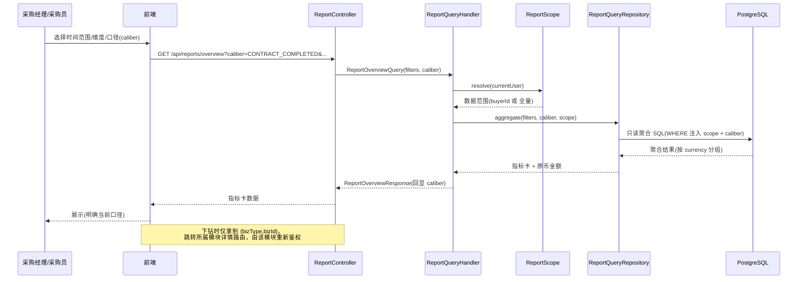
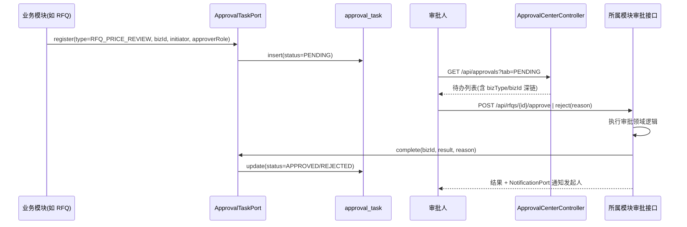
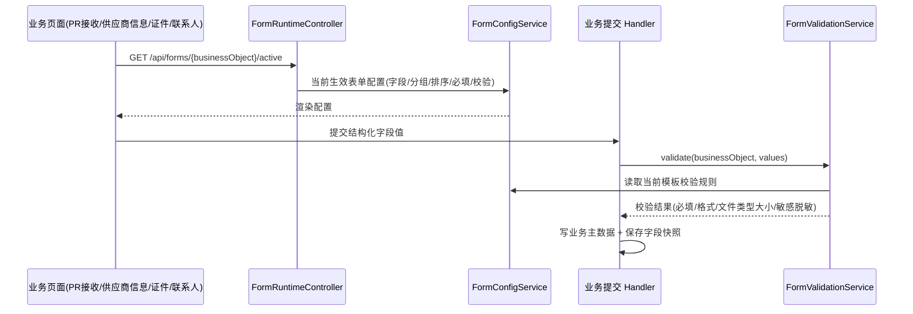
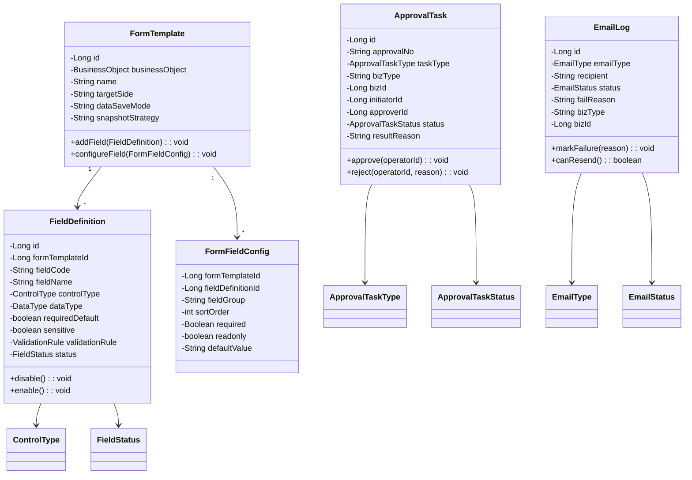

# 设计文档：报表 / 工作台 / 数据设置模块

## Overview

概述

本模块是采购平台的「辅助与横切」模块，覆盖三类能力：

1. **数据视图（只读聚合）**：报表管理（采购金额/效率/风险分析）、采购员工作台、采购经理工作台、业务人员首页、审批中心。这些功能本身不产生业务主数据，而是对模块 02–06 已有数据做聚合、汇总与下钻。
2. **基础配置（设置）**：数据设置菜单聚合「采购员账号」「字段设置」「表单设置」；其中字段/表单设置是一套动态表单引擎，被 PR 接收、供应商信息、证件上传、联系人等业务页面调用以完成动态渲染与校验。
3. **横切关注点（cross-cutting）**：统一编号规则、邮件通知机制与邮件日志，被所有业务模块调用。

落地到后端两个已存在的包骨架 + 共享层：

- `procurement/report`：报表、三类工作台/首页、审批中心、邮件日志/邮件通知。
- `procurement/setting`：数据设置菜单结构、动态表单引擎（字段设置 + 表单设置）。
- `procurement/shared`：统一编号生成器（`SequenceNumberGenerator`）作为全局编号的唯一后端实现。

> 本设计文档对应 spec 的单个模块（07），但实现横跨 `report` 与 `setting` 两个后端包；前端对应新增 `report` 与 `setting` 两个模块目录。下文「后端模块结构」分包给出。

### 核心设计决策

- **报表/工作台是只读聚合层，不持有业务主数据**：报表与工作台通过专用只读聚合查询（原生 SQL / 投影）直接读取模块 02–06 的既有表，不复制一份业务数据，也不绕道调用各业务模块的 CommandHandler。聚合查询集中在 `report/infrastructure/persistence/ReportQueryRepository`，避免 N 次跨模块 RPC 与 N+1（Req 43.1、43.3）。
- **下钻不绕过原业务权限**：指标卡/图表/风险项下钻时，后端只返回业务单据的类型与 ID，前端跳转到「所属业务模块自己的详情路由」，由该模块的接口重新做权限与数据范围校验。报表层不提供「越权直读业务详情」的旁路（Req 36.8、38.4）。
- **数据范围在聚合查询层强制注入**：普通采购员仅可见本人相关数据，采购经理/Admin 全量；业务人员首页仅限本人 PR/合同/PO。数据范围条件由 `ReportScope`（从 `SecurityUtils.getCurrentUserId()/getCurrentUserRole()` 推导）注入每条聚合 SQL 的 WHERE 子句，而非在内存中过滤（Req 36.1、38.3、58.4、58.5、44.5）。
- **采购金额口径显式化**：所有金额聚合必须带 `caliber` 参数（`CONTRACT_COMPLETED` 合同完成金额 / `PO_GENERATED` PO 已生成金额），返回体回显当前口径，前端页面明确展示，禁止默认混用（Req 36.9）。
- **多币种按原币分别展示**：金额聚合默认按 `currency` 分组返回原币金额；折算金额为可选能力，若返回必须附带 `rateSource` 与 `convertedAt`。当前版本不内置汇率源，折算能力预留扩展位（Req 36.10）。
- **审批中心是统一收件箱（aggregation inbox），不重复实现审批动作**：各业务模块在「需要审批」时通过 `ApprovalTaskPort` 向中央 `approval_task` 注册表写入一条待办，并在审批完成时回写状态；审批中心按 `需要我审批 / 我发起的 / 审批完成` 三个 Tab 聚合展示。真正的「审批通过/驳回」动作仍由所属业务模块的既有接口执行（如 RFQ 核价审批沿用 `POST /api/rfqs/{id}/approve`），审批中心负责路由与深链，不复制业务逻辑（Req 39）。
- **动态表单引擎「保存即生效」**：字段定义、表单模板、表单字段配置保存后立即作为当前配置生效，无草稿/发布状态（Req 13.5、13.8、40.5）。业务表单提交时记录字段快照，隔离后续配置变更对历史记录的影响（Req 13.7）。
- **字段编码在「表单字段库」内唯一**：每个表单模板拥有独立字段库，字段编码仅在所属库内唯一（`uk_field_template_code`），不同表单可重名（Req 13.2、13.3）。
- **编号规则集中在 shared**：`SequenceNumberGenerator` 基于 `number_sequence` 表（前缀 + 周期 + 自增值，行级锁保证并发唯一）生成所有单据编号；各业务模块既有的 `*CodeGenerator`（如 `RfqCodeGenerator`、`ContractCodeGenerator`）统一委托到该实现，避免多套自增逻辑导致编号冲突（Req 42.1、42.2、42.3）。
- **邮件为端口 + 适配器 + 集中日志**：`NotificationPort` 为所有模块的统一发信入口；每次发信落 `email_log`（类型/收件人/时间/状态/失败原因/关联单据），失败可手动重发（Req 41.4、41.5、53）。按既定约定，真实 SMTP 投递暂为占位实现（发信记录状态写入日志，不实际外发），便于后续替换为真实邮件服务。

> 外部依赖说明（沿用模块 02/04 约定）：
> - `NotificationPort` / `EmailServiceAdapter`：统一发信入口 + 邮件日志；当前为占位实现（不实际投递，仅记录日志与状态）。
> - 报表折算汇率源、定时聚合缓存等为预留扩展位，当前版本不接入。

## Architecture

架构

### 系统架构图

```mermaid
graph TB
    subgraph 前端
        MP[采购/管理门户<br/>Vue 3 + ant-design-vue]
        BUP[业务人员门户]
        SUP[供应商门户]
    end

    subgraph 后端 - report 包
        subgraph report-interfaces
            RC[ReportController<br/>报表接口]
            WC[WorkbenchController<br/>工作台/首页接口]
            APC[ApprovalCenterController<br/>审批中心接口]
            ELC[EmailLogController<br/>邮件日志接口]
        end
        subgraph report-application
            RQH[ReportQueryHandler]
            WQH[WorkbenchQueryHandler]
            AQH[ApprovalQueryHandler]
            ELH[EmailLogHandler]
        end
        subgraph report-domain
            RSCOPE[ReportScope<br/>数据范围]
            CAL[AmountCaliber<br/>金额口径]
            ATPORT[ApprovalTaskPort]
            NPORT[NotificationPort]
        end
        subgraph report-infra
            RQR[ReportQueryRepository<br/>只读聚合 SQL]
            ATR[ApprovalTaskRepository]
            ELR[EmailLogRepository]
            ESA[EmailServiceAdapter<br/>占位]
        end
    end

    subgraph 后端 - setting 包
        subgraph setting-interfaces
            FFC[FieldSettingController]
            FMC[FormSettingController]
            FRC[FormRuntimeController<br/>动态渲染配置]
        end
        FSVC[FormConfigService / FormValidationService]
        FREPO[FormTemplate/FieldDefinition/FormFieldConfig Repository]
    end

    subgraph 后端 - shared
        SNG[SequenceNumberGenerator]
    end

    subgraph 业务模块 02-06
        BM[(supplier/pr/rfq/contract/order/payment 表)]
    end

    MP --> RC & WC & APC & ELC & FFC & FMC
    BUP --> WC
    SUP --> ELC
    RC --> RQH --> RQR --> BM
    WC --> WQH --> RQR
    APC --> AQH --> ATR
    ELC --> ELH --> ELR
    FFC & FMC & FRC --> FSVC --> FREPO
    业务模块 02-06 -. ApprovalTaskPort .-> ATR
    业务模块 02-06 -. NotificationPort .-> ESA --> ELR
    业务模块 02-06 -. FormConfigQueryPort .-> FSVC
    业务模块 02-06 -. NumberPort .-> SNG
```

### 报表查询流程（含数据范围与口径）



### 审批中心聚合流程



### 动态表单渲染流程



## Components and Interfaces

组件与接口

### 后端模块结构 — `report` 包

```
src/main/java/com/cdp/ecosaas/procurement/report/
├── domain/
│   ├── model/
│   │   ├── AmountCaliber.java           # 金额口径枚举: CONTRACT_COMPLETED/PO_GENERATED
│   │   ├── ReportDimension.java         # 统计维度枚举: DEPT/COST_CENTER/SUPPLIER/CATEGORY/CURRENCY/BUYER
│   │   ├── RiskType.java                # 风险类型枚举
│   │   ├── ReportScope.java             # 数据范围值对象(全量 / 限定 buyerId / 限定本人)
│   │   ├── MetricCard.java              # 指标卡值对象
│   │   ├── ApprovalTask.java            # 审批待办(中央注册)聚合
│   │   ├── ApprovalTaskType.java        # 审批类型枚举
│   │   ├── ApprovalTaskStatus.java      # PENDING/APPROVED/REJECTED/CANCELLED
│   │   ├── EmailLog.java                # 邮件日志聚合
│   │   ├── EmailType.java               # 邮件类型枚举
│   │   └── EmailStatus.java             # SUCCESS/FAILURE
│   ├── service/
│   │   └── ReportScopeResolver.java     # 由当前用户解析数据范围
│   ├── repository/
│   │   ├── ApprovalTaskRepository.java
│   │   └── EmailLogRepository.java
│   └── port/
│       ├── ApprovalTaskPort.java        # 供业务模块注册/完成审批待办
│       ├── NotificationPort.java        # 统一发信入口
│       └── ReportDataQueryPort.java     # 只读聚合查询端口
│
├── application/
│   ├── query/
│   │   ├── ReportOverviewQuery.java     # 指标卡
│   │   ├── AmountStatQuery.java         # 多维金额统计(含 caliber)
│   │   ├── EfficiencyStatQuery.java     # 周期统计
│   │   ├── SupplierRankingQuery.java
│   │   ├── RiskListQuery.java
│   │   ├── FunnelQuery.java
│   │   ├── BuyerStatQuery.java
│   │   ├── ChartQuery.java              # 图表数据
│   │   ├── WorkbenchQuery.java          # 工作台/首页(按角色)
│   │   ├── ApprovalListQuery.java       # tab + type + 分页
│   │   └── EmailLogQuery.java
│   ├── command/
│   │   └── ResendEmailCommand.java
│   ├── handler/
│   │   ├── ReportQueryHandler.java
│   │   ├── WorkbenchQueryHandler.java
│   │   ├── ApprovalQueryHandler.java
│   │   └── EmailLogHandler.java
│   └── service/
│       └── EmailNotificationService.java # 实现 NotificationPort：发信 + 落日志 + 重发
│
├── infrastructure/
│   ├── persistence/
│   │   ├── entity/
│   │   │   ├── ApprovalTaskEntity.java
│   │   │   └── EmailLogEntity.java
│   │   ├── repository/
│   │   │   ├── JpaApprovalTaskRepository.java
│   │   │   ├── JpaEmailLogRepository.java
│   │   │   └── ReportQueryRepository.java   # 只读聚合(原生 SQL/投影)，实现 ReportDataQueryPort
│   │   └── mapper/
│   │       ├── ApprovalTaskMapper.java
│   │       └── EmailLogMapper.java
│   ├── external/
│   │   └── EmailServiceAdapter.java         # 占位实现(不实际投递)
│   └── config/
│       └── ReportModuleConfig.java
│
├── interfaces/
│   ├── rest/
│   │   ├── ReportController.java
│   │   ├── WorkbenchController.java
│   │   ├── ApprovalCenterController.java
│   │   └── EmailLogController.java
│   └── dto/
│       ├── ReportOverviewResponse.java
│       ├── AmountStatResponse.java
│       ├── EfficiencyStatResponse.java
│       ├── SupplierRankingResponse.java
│       ├── RiskItemResponse.java
│       ├── FunnelResponse.java
│       ├── BuyerStatResponse.java
│       ├── ChartResponse.java
│       ├── WorkbenchResponse.java          # buyer/manager/business 三态
│       ├── ApprovalTaskResponse.java
│       └── EmailLogResponse.java
│
└── shared/
    ├── constants/
    │   └── ReportConstants.java
    └── enums/                              # (复用 domain 枚举)
```

### 后端模块结构 — `setting` 包（动态表单引擎）

```
src/main/java/com/cdp/ecosaas/procurement/setting/
├── domain/
│   ├── model/
│   │   ├── FormTemplate.java            # 表单模板聚合根(业务对象/使用端/数据保存方式/快照策略)
│   │   ├── BusinessObject.java          # 业务对象枚举: PR_INTAKE/SUPPLIER_INFO/SUPPLIER_CREATE/CERTIFICATE/CONTACT
│   │   ├── FieldDefinition.java         # 字段定义(所属模板=字段库, 编码, 名称, 控件, 数据类型, 必填, 校验, 选项来源, 敏感, 说明, 状态)
│   │   ├── ControlType.java             # 控件类型枚举
│   │   ├── DataType.java                # 数据类型枚举
│   │   ├── FieldStatus.java             # ACTIVE/DISABLED
│   │   ├── FormFieldConfig.java         # 表单内字段配置(分组/排序/必填/只读/默认值/显示条件/校验覆盖)
│   │   └── ValidationRule.java          # 校验规则值对象
│   ├── service/
│   │   ├── FieldCodeUniquenessService.java  # 库内编码唯一校验
│   │   └── FormValidationService.java       # 按模板校验提交字段值
│   ├── repository/
│   │   ├── FormTemplateRepository.java
│   │   ├── FieldDefinitionRepository.java
│   │   └── FormFieldConfigRepository.java
│   └── port/
│       └── FormConfigQueryPort.java     # 供业务模块读取当前生效表单配置
│
├── application/
│   ├── command/
│   │   ├── CreateFieldCommand.java
│   │   ├── UpdateFieldCommand.java
│   │   ├── ToggleFieldStatusCommand.java
│   │   ├── CreateFormTemplateCommand.java
│   │   └── ConfigureFormFieldsCommand.java
│   ├── query/
│   │   ├── FieldLibraryListQuery.java
│   │   ├── FieldLibraryDetailQuery.java
│   │   ├── FieldDetailQuery.java
│   │   ├── FormListQuery.java
│   │   ├── FormDetailQuery.java
│   │   └── FormPreviewQuery.java
│   ├── handler/
│   │   ├── FieldSettingCommandHandler.java
│   │   ├── FieldSettingQueryHandler.java
│   │   ├── FormSettingCommandHandler.java
│   │   └── FormSettingQueryHandler.java
│   └── service/
│       └── FormConfigService.java       # 实现 FormConfigQueryPort
│
├── infrastructure/
│   ├── persistence/
│   │   ├── entity/
│   │   │   ├── FormTemplateEntity.java
│   │   │   ├── FieldDefinitionEntity.java
│   │   │   ├── FormFieldConfigEntity.java
│   │   │   └── FormSubmissionSnapshotEntity.java
│   │   ├── repository/
│   │   │   ├── JpaFormTemplateRepository.java
│   │   │   ├── JpaFieldDefinitionRepository.java
│   │   │   ├── JpaFormFieldConfigRepository.java
│   │   │   └── JpaFormSubmissionSnapshotRepository.java
│   │   └── mapper/
│   │       ├── FormTemplateMapper.java
│   │       ├── FieldDefinitionMapper.java
│   │       └── FormFieldConfigMapper.java
│   └── config/
│       └── SettingModuleConfig.java
│
├── interfaces/
│   ├── rest/
│   │   ├── FieldSettingController.java
│   │   ├── FormSettingController.java
│   │   └── FormRuntimeController.java    # 业务页面拉取当前生效配置
│   └── dto/
│       ├── FieldLibraryResponse.java
│       ├── FieldDefinitionRequest.java
│       ├── FieldDefinitionResponse.java
│       ├── FormTemplateRequest.java
│       ├── FormTemplateResponse.java
│       ├── FormFieldConfigRequest.java
│       ├── FormPreviewResponse.java
│       └── ActiveFormConfigResponse.java
│
└── shared/
    └── constants/
        └── SettingConstants.java
```

### 后端 — `shared` 统一编号

```
src/main/java/com/cdp/ecosaas/procurement/shared/
├── numbering/
│   ├── SequenceNumberGenerator.java     # 基于 number_sequence 表的并发安全编号生成
│   ├── NumberPrefix.java                # 前缀枚举: VD/PR/RFQ/QT/PO/CA/AP/CE/CO
│   └── NumberPort.java                  # 业务模块调用入口
```

> 既有 `RfqCodeGenerator`、`ContractCodeGenerator` 等模块内生成器统一改为委托 `SequenceNumberGenerator`，保证「全局唯一」（Req 42.2）。委托改造列在任务清单的集成阶段，并明确标注「触碰既有模块」。

### 前端模块结构

```
frontend/src/modules/report/
├── application/ { load-report.usecase.ts, load-workbench.usecase.ts, handle-approval.usecase.ts }
├── infrastructure/services/ { report.service.ts, workbench.service.ts, approval.service.ts, email-log.service.ts }
├── presentation/
│   ├── views/
│   │   ├── ReportDashboardView.vue       # 报表管理(指标卡+图表+漏斗+风险)
│   │   ├── BuyerWorkbenchView.vue        # 采购员工作台
│   │   ├── ManagerWorkbenchView.vue      # 采购经理工作台(报表视角)
│   │   ├── BusinessHomeView.vue          # 业务人员首页(我的采购申请)
│   │   ├── ApprovalCenterView.vue        # 审批中心(三 Tab)
│   │   └── EmailLogView.vue              # 邮件日志(采购员/供应商)
│   ├── components/ { MetricCard.vue, ReportFilterBar.vue, ProcurementFunnel.vue, RiskList.vue, ChartPanel.vue, ApprovalTabs.vue, EmailLogTable.vue }
│   ├── composables/ { useReportFilter.ts, useDrilldown.ts }
│   └── routes/report.routes.ts
└── types/ { report.dto.ts, workbench.dto.ts, approval.dto.ts, email-log.dto.ts }

frontend/src/modules/setting/
├── application/ { manage-fields.usecase.ts, manage-forms.usecase.ts }
├── infrastructure/services/ { field-setting.service.ts, form-setting.service.ts, form-runtime.service.ts }
├── presentation/
│   ├── views/
│   │   ├── DataSettingLayout.vue         # 数据设置一级菜单容器
│   │   ├── FieldLibraryListView.vue      # 字段设置主页(仅字段库列表)
│   │   ├── FieldLibraryDetailView.vue
│   │   ├── FieldEditView.vue             # 创建/编辑字段
│   │   ├── FormListView.vue              # 表单设置主页(仅表单列表)
│   │   ├── FormDetailView.vue
│   │   ├── FormFieldConfigView.vue       # 配置表单字段
│   │   └── FormPreviewView.vue
│   ├── components/ { DynamicFormRenderer.vue, FieldConfigRow.vue, FieldDefinitionForm.vue }
│   └── routes/setting.routes.ts
└── types/ { field.dto.ts, form.dto.ts }
```

> `DynamicFormRenderer.vue` 为可复用组件，被 PR 接收、供应商信息、证件上传、联系人等业务页面引用，依据 `GET /api/forms/{businessObject}/active` 返回配置渲染并执行客户端校验。

### REST API 设计

#### 报表（采购经理/Admin，数据范围全量；采购员限本人）

| 方法 | 路径 | 说明 | 需求 |
|------|------|------|------|
| GET | `/api/reports/overview` | 核心指标卡（带 `caliber` + 通用筛选） | 36.3, 36.9 |
| GET | `/api/reports/amount` | 多维采购金额统计（`dimension`=DEPT/COST_CENTER/SUPPLIER/CATEGORY/CURRENCY/BUYER，按原币分组） | 36.4, 36.10 |
| GET | `/api/reports/efficiency` | 各阶段周期统计 | 36.5 |
| GET | `/api/reports/supplier-ranking` | 供应商采购金额排行 / 报价参与 / 中标次数 / 中标率 | 36.6 |
| GET | `/api/reports/risks` | 异常风险清单（筛选 `riskType`/`ownerId`/`status`/时间） | 36.7, 36.13 |
| GET | `/api/reports/funnel` | 流程漏斗（PR→RFQ→核价→合同→PO→付款各阶段数量） | 36.11 |
| GET | `/api/reports/buyer-stats` | 按采购员统计进行中单据/平均核价周期/合同完成周期/异常数 | 36.12 |
| GET | `/api/reports/charts` | 图表数据（`metric`=SPEND_TREND/DEPT_RANK/SUPPLIER_RANK/RFQ_STATUS/CONTRACT_STATUS/PO_PAYMENT_STATUS） | 36.14 |

> 所有报表接口支持通用筛选 query：`startDate,endDate,deptId,buyerId,supplierId,category,currency,caliber`。下钻不另设接口：响应中的明细项携带 `{bizType, bizId}`，前端跳转所属模块详情路由。

#### 工作台 / 首页

| 方法 | 路径 | 说明 | 需求 |
|------|------|------|------|
| GET | `/api/workbench/buyer` | 采购员工作台（合作中供应商数、进行中统计、快捷操作；不含「待建合同」「草稿」「已完成」） | 37 |
| GET | `/api/workbench/manager` | 采购经理工作台（报表视角金额/进行中/效率/风险；不含审批列表） | 38.1, 38.2, 38.3 |
| GET | `/api/workbench/business` | 业务人员首页（本人 PR 分布、审批中 PR、可建 PO 合同、PO 审批与付款进度） | 58 |

#### 审批中心（采购员/采购经理）

| 方法 | 路径 | 说明 | 需求 |
|------|------|------|------|
| GET | `/api/approvals` | 审批待办列表（`tab`=PENDING/INITIATED/COMPLETED，默认 PENDING；`type` 过滤；分页） | 39.1, 39.2, 39.6 |
| GET | `/api/approvals/{id}` | 待办详情（含 `bizType/bizId` 深链 + 类型元数据） | 39.3, 39.4 |

> 审批「通过/驳回」动作不在本接口实现，由所属模块既有接口执行（如 RFQ：`POST /api/rfqs/{id}/approve` / `/reject`）。驳回需填原因并通知发起人（Req 39.5）由所属模块经 `NotificationPort` 完成；完成后业务模块回写 `approval_task` 状态。

#### 邮件日志（采购员端 / 供应商端）

| 方法 | 路径 | 说明 | 需求 |
|------|------|------|------|
| GET | `/api/email-logs` | 邮件日志列表（按当前用户范围；筛选 `emailType`/`status`/时间） | 53.1, 53.2, 53.3, 53.4 |
| POST | `/api/email-logs/{id}/resend` | 失败邮件手动重发 | 41.5, 53.5 |

#### 字段设置（Admin）

| 方法 | 路径 | 说明 | 需求 |
|------|------|------|------|
| GET | `/api/admin/form-fields/libraries` | 表单字段库列表（仅列表，无明细/统计） | 13.11, 13.12, 40.3 |
| GET | `/api/admin/form-fields/libraries/{templateId}` | 字段库详情（字段清单 + 证件类型绑定 + 使用关系） | 13.11, 13.14 |
| POST | `/api/admin/form-fields` | 创建字段（先选所属字段库，库内编码唯一） | 13.1, 13.2, 13.13 |
| GET | `/api/admin/form-fields/{id}` | 字段详情（含使用位置/证件绑定/历史变更影响） | 13.14 |
| PUT | `/api/admin/form-fields/{id}` | 编辑字段 | 13.1, 13.14 |
| PATCH | `/api/admin/form-fields/{id}/status` | 启用/停用字段 | 13.1 |

#### 表单设置（Admin）

| 方法 | 路径 | 说明 | 需求 |
|------|------|------|------|
| GET | `/api/admin/forms` | 表单列表（仅列表） | 13.15, 13.16, 40.4 |
| POST | `/api/admin/forms` | 创建表单（选业务对象/使用端/数据保存方式/快照策略，生成独立字段库） | 13.3, 13.18 |
| GET | `/api/admin/forms/{id}` | 表单详情（后台配置数据，不含说明卡） | 13.15, 13.17 |
| PUT | `/api/admin/forms/{id}/fields` | 配置表单字段（增/编/启停 + 分组/排序/必填/只读/默认值/显示条件/校验覆盖/移除） | 13.4, 13.19 |
| GET | `/api/admin/forms/{id}/preview` | 表单预览（按当前配置模拟渲染与校验） | 13.20 |

#### 表单运行时（业务模块/动态渲染）

| 方法 | 路径 | 说明 | 需求 |
|------|------|------|------|
| GET | `/api/forms/{businessObject}/active` | 获取当前生效表单配置（渲染 + 客户端校验依据） | 13.6, 13.10, 13.21 |

> 服务端权威校验由 `FormValidationService`（内部端口 `FormConfigQueryPort`）在各业务模块的提交 Handler 中调用，不单独暴露 REST（Req 13.9、13.10）。

> 编号生成（Req 42）为单据创建时自动调用 `SequenceNumberGenerator`，不提供人工编辑接口，无独立 REST。

## Data Models

数据模型

> 数据库为 PostgreSQL 16，DDL 风格与既有迁移（V1–V4）一致：`BIGSERIAL` 主键、`BOOLEAN`/`TIMESTAMP(3)`/`NUMERIC`/`JSONB`/`TEXT` 类型、`@Table(name=...)` 不带 schema（schema `caigou7` 为连接级）、独立 `CREATE INDEX`、可空唯一列用部分唯一索引、跨表引用仅用 `BIGINT` 列 + 索引不声明外键。本模块迁移脚本取 V4 之后下一可用编号。
>
> 报表与工作台为只读聚合，**不新建业务表**；仅以下 7 张表为本模块新建。

#### 统一编号序列表 `number_sequence`

```sql
CREATE TABLE number_sequence (
    id              BIGSERIAL PRIMARY KEY,
    prefix          VARCHAR(8) NOT NULL,        -- VD/PR/RFQ/QT/PO/CA/AP/CE/CO
    period          VARCHAR(6) NOT NULL DEFAULT '', -- YYYYMM；VD 等无周期前缀用空串
    current_value   BIGINT NOT NULL DEFAULT 0,  -- 当前自增值
    updated_at      TIMESTAMP(3) NOT NULL,
    version         INT NOT NULL DEFAULT 0
);
CREATE UNIQUE INDEX uk_seq_prefix_period ON number_sequence (prefix, period);
COMMENT ON TABLE number_sequence IS '统一编号自增序列';
```

> 取号在单条事务内对目标行加锁（`SELECT ... FOR UPDATE` 或乐观锁重试）后自增，保证全局唯一。VD 为 4 位无周期自增（`VD0001`），其余为 `PREFIX-YYYYMM-5位`，报价单号 `QT-YYYYMM-5位` 追加供应商后缀。

#### 邮件日志表 `email_log`

```sql
CREATE TABLE email_log (
    id              BIGSERIAL PRIMARY KEY,
    email_type      VARCHAR(48) NOT NULL,       -- RFQ_PUBLISHED/QUOTE_RETURNED/BID_RESULT/...
    recipient       VARCHAR(128) NOT NULL,      -- 收件邮箱
    recipient_name  VARCHAR(64),
    subject         VARCHAR(255) NOT NULL,
    body            TEXT,
    status          VARCHAR(16) NOT NULL,       -- SUCCESS/FAILURE
    fail_reason     VARCHAR(512),               -- 失败原因
    biz_type        VARCHAR(32),                -- 关联业务类型: RFQ/QUOTE/CONTRACT/PO/SUPPLIER/...
    biz_id          BIGINT,                     -- 关联业务单据 ID
    related_buyer_id    BIGINT,                 -- 关联采购员(采购员端可见范围)
    related_supplier_id BIGINT,                 -- 关联供应商(供应商端可见范围)
    sent_at         TIMESTAMP(3) NOT NULL,
    created_at      TIMESTAMP(3) NOT NULL
);
CREATE INDEX idx_email_status ON email_log (status);
CREATE INDEX idx_email_type ON email_log (email_type);
CREATE INDEX idx_email_buyer ON email_log (related_buyer_id);
CREATE INDEX idx_email_supplier ON email_log (related_supplier_id);
CREATE INDEX idx_email_sent_at ON email_log (sent_at);
COMMENT ON TABLE email_log IS '邮件发送日志';
```

#### 审批待办注册表 `approval_task`

```sql
CREATE TABLE approval_task (
    id              BIGSERIAL PRIMARY KEY,
    approval_no     VARCHAR(20) NOT NULL,       -- AP-YYYYMM-5位
    task_type       VARCHAR(40) NOT NULL,       -- RFQ_PRICE_REVIEW/CONTRACT_APPROVAL/PO_APPROVAL/SUPPLIER_INFO_REVIEW/CERTIFICATE_REVIEW/BUYER_ACCOUNT_CHANGE
    biz_type        VARCHAR(32) NOT NULL,       -- 所属业务类型(深链路由)
    biz_id          BIGINT NOT NULL,            -- 所属业务单据 ID
    title           VARCHAR(255) NOT NULL,
    initiator_id    BIGINT NOT NULL,            -- 发起人
    initiator_name  VARCHAR(64),
    approver_id     BIGINT,                     -- 指定审批人(可空，按角色路由)
    approver_role   VARCHAR(32),                -- 审批角色(如 ADMIN)
    status          VARCHAR(16) NOT NULL DEFAULT 'PENDING', -- PENDING/APPROVED/REJECTED/CANCELLED
    result_reason   VARCHAR(512),               -- 驳回原因/审批意见
    completed_by    BIGINT,
    completed_at    TIMESTAMP(3),
    created_at      TIMESTAMP(3) NOT NULL,
    updated_at      TIMESTAMP(3) NOT NULL,
    version         INT NOT NULL DEFAULT 0
);
CREATE UNIQUE INDEX uk_approval_no ON approval_task (approval_no);
CREATE UNIQUE INDEX uk_approval_biz ON approval_task (task_type, biz_id);
CREATE INDEX idx_approval_status ON approval_task (status);
CREATE INDEX idx_approval_approver ON approval_task (approver_id);
CREATE INDEX idx_approval_initiator ON approval_task (initiator_id);
COMMENT ON TABLE approval_task IS '审批中心统一待办注册表';
```

> `uk_approval_biz` 保证同一业务单据同类型不重复注册待办。「需要我审批」=`approver_id=当前用户` 或 `approver_role` 命中且 `status=PENDING`；「我发起的」=`initiator_id=当前用户`；「审批完成」=`status IN (APPROVED,REJECTED)` 且与当前用户相关。

#### 表单模板表 `form_template`

```sql
CREATE TABLE form_template (
    id                  BIGSERIAL PRIMARY KEY,
    business_object     VARCHAR(32) NOT NULL,   -- PR_INTAKE/SUPPLIER_INFO/SUPPLIER_CREATE/CERTIFICATE/CONTACT
    name                VARCHAR(128) NOT NULL,
    target_side         VARCHAR(16) NOT NULL,   -- 使用端: BUYER/SUPPLIER/BUSINESS
    data_save_mode      VARCHAR(24) NOT NULL,   -- 数据保存方式: STRUCTURED/...
    snapshot_strategy   VARCHAR(24) NOT NULL,   -- 历史快照策略: ON_SUBMIT/NONE
    updated_at          TIMESTAMP(3) NOT NULL,
    created_at          TIMESTAMP(3) NOT NULL,
    created_by          VARCHAR(64),
    updated_by          VARCHAR(64),
    version             INT NOT NULL DEFAULT 0
);
CREATE INDEX idx_form_business_object ON form_template (business_object);
COMMENT ON TABLE form_template IS '业务表单模板(每模板一套独立字段库)';
```

#### 字段定义表 `field_definition`（字段库 = 同一 form_template_id 下的字段集合）

```sql
CREATE TABLE field_definition (
    id                  BIGSERIAL PRIMARY KEY,
    form_template_id    BIGINT NOT NULL,        -- 所属表单字段库
    field_code          VARCHAR(64) NOT NULL,   -- 库内唯一
    field_name          VARCHAR(128) NOT NULL,
    control_type        VARCHAR(32) NOT NULL,   -- TEXT/NUMBER/DATE/SELECT/FILE/...
    data_type           VARCHAR(32) NOT NULL,   -- STRING/NUMBER/DATE/BOOLEAN/FILE
    required_default    BOOLEAN NOT NULL DEFAULT FALSE, -- 默认必填
    sensitive           BOOLEAN NOT NULL DEFAULT FALSE, -- 是否敏感(脱敏)
    validation_rule     JSONB,                  -- 校验规则
    option_source       JSONB,                  -- 选项来源(静态/字典/远程)
    description         VARCHAR(512),
    status              VARCHAR(16) NOT NULL DEFAULT 'ACTIVE', -- ACTIVE/DISABLED
    cert_type_binding   VARCHAR(64),            -- 证件类型字段绑定(证件库专用，可空)
    created_at          TIMESTAMP(3) NOT NULL,
    updated_at          TIMESTAMP(3) NOT NULL,
    version             INT NOT NULL DEFAULT 0
);
CREATE UNIQUE INDEX uk_field_template_code ON field_definition (form_template_id, field_code);
CREATE INDEX idx_field_template ON field_definition (form_template_id);
COMMENT ON TABLE field_definition IS '表单字段库字段定义';
```

#### 表单字段配置表 `form_field_config`（模板内字段的渲染/校验覆盖）

```sql
CREATE TABLE form_field_config (
    id                  BIGSERIAL PRIMARY KEY,
    form_template_id    BIGINT NOT NULL,
    field_definition_id BIGINT NOT NULL,
    field_group         VARCHAR(64),            -- 分组
    sort_order          INT NOT NULL DEFAULT 0, -- 排序
    required            BOOLEAN,                -- 必填覆盖(空=用字段默认)
    readonly            BOOLEAN NOT NULL DEFAULT FALSE,
    default_value       VARCHAR(512),
    visible_condition   JSONB,                  -- 显示条件
    validation_override JSONB,                  -- 校验覆盖
    created_at          TIMESTAMP(3) NOT NULL,
    updated_at          TIMESTAMP(3) NOT NULL,
    version             INT NOT NULL DEFAULT 0
);
CREATE UNIQUE INDEX uk_form_field ON form_field_config (form_template_id, field_definition_id);
CREATE INDEX idx_form_field_template ON form_field_config (form_template_id);
COMMENT ON TABLE form_field_config IS '表单模板内字段配置(分组/排序/必填/只读/默认/条件/校验覆盖)';
```

#### 表单提交快照表 `form_submission_snapshot`

```sql
CREATE TABLE form_submission_snapshot (
    id                  BIGSERIAL PRIMARY KEY,
    form_template_id    BIGINT NOT NULL,
    business_object     VARCHAR(32) NOT NULL,
    biz_id              BIGINT NOT NULL,        -- 关联业务单据 ID(如 PR/供应商/证件)
    field_snapshot      JSONB NOT NULL,         -- 提交时的字段定义+值快照
    submitted_at        TIMESTAMP(3) NOT NULL,
    submitted_by        VARCHAR(64),
    created_at          TIMESTAMP(3) NOT NULL
);
CREATE INDEX idx_snapshot_biz ON form_submission_snapshot (business_object, biz_id);
COMMENT ON TABLE form_submission_snapshot IS '表单提交字段快照(隔离配置变更对历史追溯影响)';
```

### 领域模型



### 枚举定义

- **AmountCaliber**：`CONTRACT_COMPLETED`（合同完成金额）、`PO_GENERATED`（PO 已生成金额）
- **ReportDimension**：`DEPT`、`COST_CENTER`、`SUPPLIER`、`CATEGORY`、`CURRENCY`、`BUYER`
- **RiskType**：`CONTRACT_OVER_PR`（合同金额超 PR）、`PO_SYNC_FAILED`、`PAYMENT_FAILED`、`CONTRACT_SIGN_OVERDUE`（合同待签超期）、`CERTIFICATE_EXPIRED`（供应商证件过期）
- **ApprovalTaskType**：`RFQ_PRICE_REVIEW`、`CONTRACT_APPROVAL`、`PO_APPROVAL`、`SUPPLIER_INFO_REVIEW`、`CERTIFICATE_REVIEW`、`BUYER_ACCOUNT_CHANGE`（Req 39.6）
- **ApprovalTaskStatus**：`PENDING`、`APPROVED`、`REJECTED`、`CANCELLED`
- **EmailType**：`RFQ_PUBLISHED`、`RFQ_CHANGED`、`QUOTE_RETURNED`、`BID_RESULT`、`FINAL_PRICE_CHANGED`、`QUOTE_DEADLINE_REMINDER`、`QUOTE_SUBMITTED`、`APPROVAL_REJECTED`、`APPROVAL_PENDING`（Req 41.1–41.3）
- **EmailStatus**：`SUCCESS`、`FAILURE`
- **BusinessObject**：`PR_INTAKE`、`SUPPLIER_INFO`、`SUPPLIER_CREATE`、`CERTIFICATE`、`CONTACT`（Req 13.5）
- **NumberPrefix**：`VD`、`PR`、`RFQ`、`QT`、`PO`、`CA`、`AP`、`CE`、`CO`（Req 42.1）

## 非功能性需求落地（Req 43–45）

- **性能（43）**：报表/工作台聚合查询走专用只读 SQL，关键过滤列（状态、时间、buyer_id、supplier_id）均建索引；列表/操作目标 1 秒内返回。重聚合（趋势图）可后续以物化视图/缓存优化，本版预留扩展位不内置。
- **安全（44）**：所有接口经模块 01 的 JWT 过滤链鉴权；`/api/admin/**` 仅 ADMIN；报表/工作台数据范围在 SQL 层注入，供应商邮件日志仅见本企业（`related_supplier_id`）。下钻不绕过业务权限（36.8）。敏感字段（`field_definition.sensitive`）在动态渲染与日志中脱敏。开标前报价金额加密由模块 04 保证，报表不读取未开标报价明细。
- **可用性（45）**：动态表单提交前客户端 + 服务端双重校验，错误提示具体到字段；不可逆操作（如停用字段、重发邮件）二次确认；多语言沿用前端 i18n；附件白名单与大小限制沿用 OSS 适配器约定。

## 备注

- 报表与工作台不持有业务主数据，依赖模块 02–06 表结构稳定；若上游表结构调整，需同步更新 `ReportQueryRepository` 聚合 SQL。
- 「采购员账号」页面（数据设置子项）复用模块 01 的内部用户管理接口（`/api/admin/users`），本模块仅在前端「数据设置」菜单下挂载入口，不重复实现账号 CRUD。
- 统一编号生成器替换既有模块内生成器属「触碰既有代码」的集成改造，已在任务清单单列并标注。
- 邮件真实投递为占位实现（仅落日志），与既定「外部依赖逐项确认、邮件暂跳过」一致；后续接入真实邮件服务时只需替换 `EmailServiceAdapter`。
