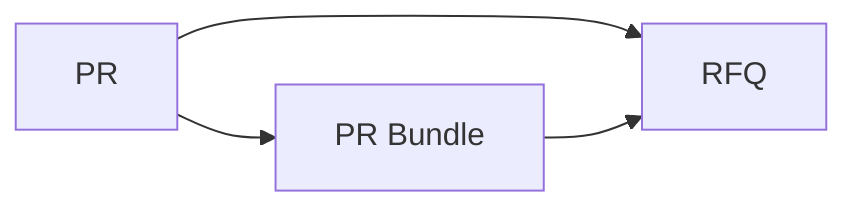
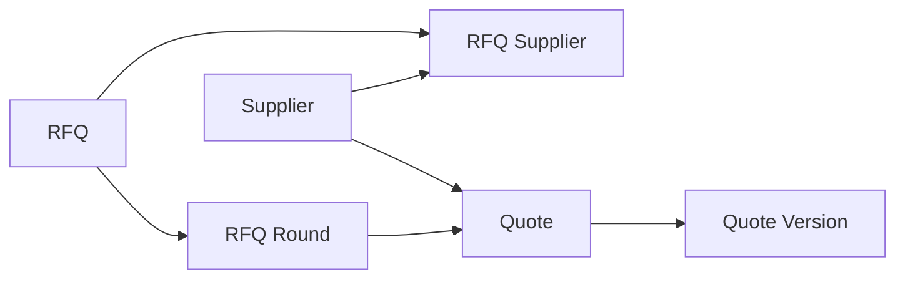
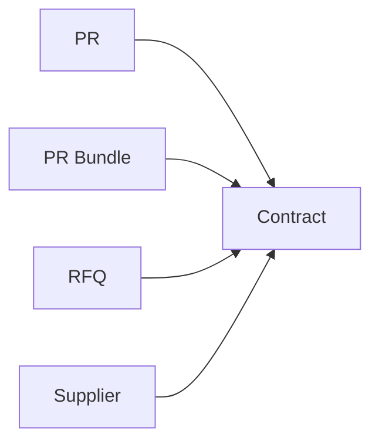

# 实体分析文档

## 一、核心实体

- Supplier：供应商
- PR：采购申请单
- PR Line：采购申请单明细
- PR Bundle：PR 合集
- PR Bundle Item：PR 合集明细，记录合集包含哪些 PR
- RFQ：询价单
- RFQ Line：询价单明细
- RFQ Supplier：询价单参与供应商
- RFQ Round：询价轮次
- Quote：供应商报价
- Quote Version：报价版本
- Quote Line：报价明细
- Contract：合同
- Contract Line：合同明细

## 二、实体关系

### 2.1 PR 与 PR 合集

- PR 与 PR Line 是一对多关系：一张采购申请单有多条申请明细。
- PR Bundle 与 PR Bundle Item 是一对多关系：一个 PR 合集包含多条合集明细。
- PR 与 PR Bundle Item 是一对多关系：一个 PR 可被记录到合集明细中。

关联字段：

- PR Line.pr_id 关联 PR.id。
- PR Bundle Item.bundle_id 关联 PR Bundle.id。
- PR Bundle Item.pr_id 关联 PR.id。

### 2.2 PR/PR 合集与 RFQ

- PR 与 RFQ 是一对多关系：一个 PR 可创建多个询价单。
- PR Bundle 与 RFQ 是一对多关系：一个 PR 合集可创建多个询价单。
- RFQ 与 RFQ Line 是一对多关系：一个询价单有多条询价明细。

关联字段：

- RFQ.source_type 表示来源类型，取值为 PR 或 PR_BUNDLE。
- RFQ.pr_id 关联 PR.id，当来源是 PR 时使用。
- RFQ.bundle_id 关联 PR Bundle.id，当来源是 PR 合集时使用。
- RFQ Line.rfq_id 关联 RFQ.id。

### 2.3 RFQ 与供应商、多轮询价

- RFQ 与 RFQ Supplier 是一对多关系：一个询价单可邀请多个供应商。
- Supplier 与 RFQ Supplier 是一对多关系：一个供应商可参与多个询价单。
- RFQ 与 RFQ Round 是一对多关系：一个询价单可有多轮报价。

关联字段：

- RFQ Supplier.rfq_id 关联 RFQ.id。
- RFQ Supplier.supplier_id 关联 Supplier.id。
- RFQ Round.rfq_id 关联 RFQ.id。

### 2.4 供应商报价

- RFQ 与 Quote 是一对多关系：一个询价单可收到多份报价。
- RFQ Round 与 Quote 是一对多关系：一个询价轮次可收到多份报价。
- Supplier 与 Quote 是一对多关系：一个供应商可提交多份报价。
- Quote 与 Quote Version 是一对多关系：一份报价可有多个版本。
- Quote Version 与 Quote Line 是一对多关系：一个报价版本有多条报价明细。

关联字段：

- Quote.rfq_id 关联 RFQ.id。
- Quote.round_id 关联 RFQ Round.id。
- Quote.supplier_id 关联 Supplier.id。
- Quote Version.quote_id 关联 Quote.id。
- Quote Line.quote_version_id 关联 Quote Version.id。

### 2.5 合同

- PR 与 Contract 是一对多关系：一个 PR 可关联多份合同。
- PR Bundle 与 Contract 是一对多关系：一个 PR 合集可关联多份合同。
- RFQ 与 Contract 是一对多关系：一个询价单可生成多份合同。
- Supplier 与 Contract 是一对多关系：一个供应商可关联多份合同。
- Contract 与 Contract Line 是一对多关系：一份合同有多条合同明细。

关联字段：

- Contract.source_type 表示来源类型，取值为 PR 或 PR_BUNDLE。
- Contract.pr_id 关联 PR.id，当来源是 PR 时使用。
- Contract.bundle_id 关联 PR Bundle.id，当来源是 PR 合集时使用。
- Contract.rfq_id 关联 RFQ.id。
- Contract.supplier_id 关联 Supplier.id。
- Contract Line.contract_id 关联 Contract.id。

## 三、简单关系图

### 3.1 采购来源主线



### 3.2 供应商报价主线



### 3.3 合同生成主线



## 四、明细关系边界

明细只归属自己的单据，不做跨单据明细关联。

```text
PR Line 只关联 PR
RFQ Line 只关联 RFQ
Quote Line 只关联 Quote Version
Contract Line 只关联 Contract
```
